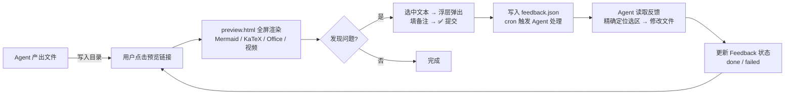
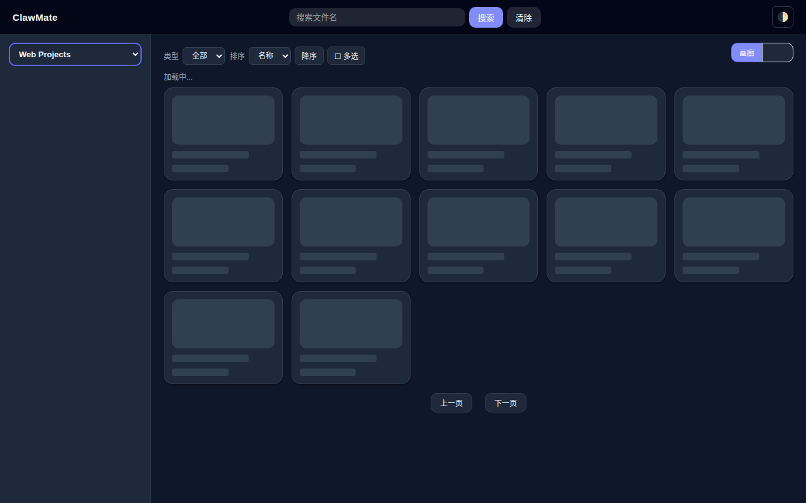
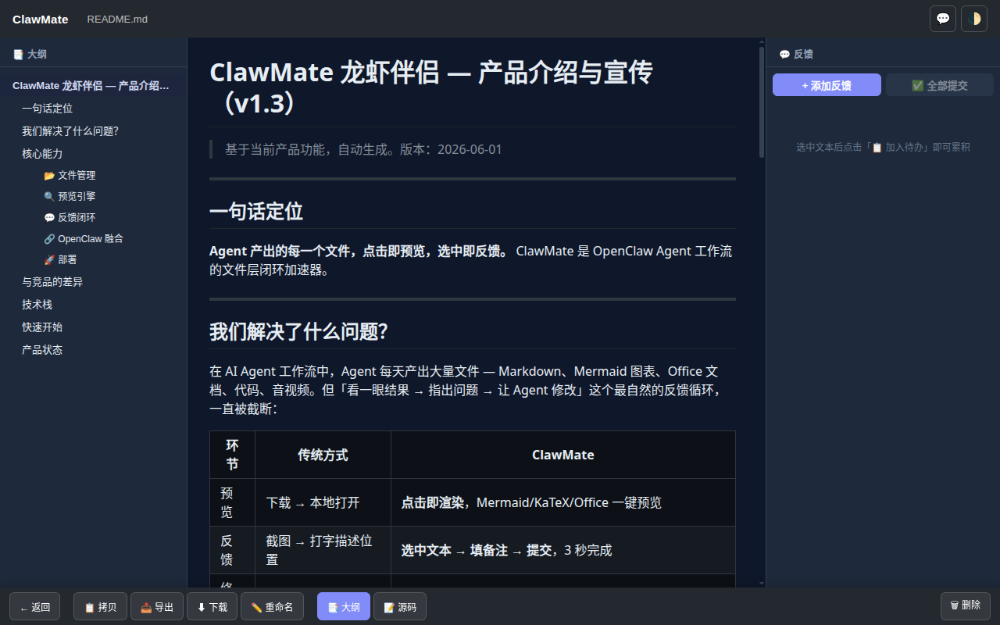
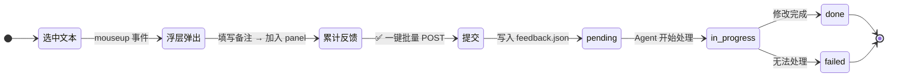

# ClawMate 🦞

> Agent 产出的每一个文件，点击即预览，选中即反馈。

[](LICENSE)

---

## 📸 核心工作流



| Step 1: 选中文本 | Step 2: 填写备注 | Step 3: 提交完成 |
|:---:|:---:|:---:|
| 在预览页选中任意文本<br>浮层自动弹出 | 在 textarea 中输入修改建议<br>可累积多条反馈 | 一键批量提交到 feedback.json<br>cron 即时唤醒 Agent 处理 |

| 文件浏览 | Markdown 预览 |
|:---:|:---:|
|  |  |

---

## 我们解决了什么问题？

在 AI Agent 工作流中，Agent 每天产出大量文件 — Markdown、Mermaid 图表、Office 文档、代码、音视频。但「看一眼结果 → 指出问题 → 让 Agent 修改」这个最自然的反馈循环，一直被截断：

| 环节 | 传统方式 | ClawMate |
|------|---------|----------|
| 预览 | 下载 → 本地打开 | **点击即渲染**，Mermaid/KaTeX/Office 一键预览 |
| 反馈 | 截图 → 打字描述位置 | **选中文本 → 填备注 → 提交**，3 秒完成 |
| 修改 | Agent 盲猜用户意图 | **精准位置 + 选区内容直送 Agent**，零歧义 |
| 循环 | 反复切换工具 | **preview → feedback → agent → 修改 → 再预览** 全在一屏 |

---

## 核心能力

### 📂 文件管理
- 多项目白名单目录，浏览器直接管理
- 画廊/列表双视图，类型过滤、排序、搜索
- 批量打包下载、拖拽上传、删除确认

### 🔍 预览引擎
- **Markdown**：Mermaid 图表 + KaTeX 公式 + 代码语法高亮 + 大纲导航
- **HTML**：独立渲染预览 + 实时编辑，与 Markdown 并列为 Agent 产出两大核心格式
- **Office**：ONLYOFFICE 浏览/编辑双模式，编辑自动回写保存
- **PDF**：ONLYOFFICE 优先，自动降级 pdf.js
- **音视频**：内嵌播放器 + SRT 字幕面板，自动解析字幕文件，支持时间轴同步、字幕内容浏览与编辑改进
- **代码/文本**：JSON/XML/GPX/KML 语法高亮 + 编辑模式
- **图片**：全屏渲染 + 工具栏

### 💬 反馈闭环 🔑 核心差异化

这是 ClawMate 与其他文件管理器**最根本的区别**。不只是预览文件，而是将用户的每一个反馈精确送达 Agent，形成闭环修改链路。

**完整的反馈生命周期**：



**关键能力**：
- **选中文本 → 3 秒反馈**：在 preview.html 中选中文本，浮层自动弹出，填备注即可提交
- **精确选区定位**：选区内容 + 文件路径直达 Agent，零歧义，不用「第几段第几行」描述
- **批量累积**：可连续选中多个位置，统一提交，不用反复切换
- **feedback.json 托管**：所有反馈持久化在项目文件中，可追溯、可检索
- **cron 即时触发**：提交后 Agent 立即被唤醒处理，不等待定时轮询
- **四态流转**：pending → in_progress → done/failed，每步状态可查
- **cron 定时轮询兜底**：每 6 小时自动检查，不遗漏任何反馈

**feedback.json 格式**：
```json
{
  "root": "webprojects",
  "project": "clawmate",
  "updated": "2026-06-01 12:51:37",
  "last_id": 29,
  "items": [
    {
      "id": "FD-CM-0004",
      "status": "done",
      "file": "clawmate/README.md",
      "note": "突出这部分功能，这是核心",
      "content": "💬 反馈闭环\\n选中文本...",
      "updated": "2026-06-01 12:51:37",
      "result": "README.md 反馈闭环章节已重写"
    }
  ]
}
```

**Agent 处理流程**：
```
cron 检查 → GET /feedback/list?status=pending → pending > 0
→ 逐条处理 → 定位文件/选区 → AI 理解备注 → 修改 → /feedback/update done
→ 无法处理 → /feedback/update failed
```

### 🔗 OpenClaw 融合

ClawMate 通过 OpenClaw Cron Job 机制实现反馈的自动处理。每个 root 配置对应一个独立的 cron job（每 6 小时执行），提交 feedback 后立即触发执行，实现近乎实时的响应。

#### Slash Commands
- `/clawmate preview` — 生成直达 preview.html 链接
- `/clawmate list` — 查看反馈列表（支持状态/文件/日期过滤）
- `/clawmate do` — 自动处理所有待处理反馈
- `/clawmate do #FD-CM-xxxx` — 处理指定反馈

### 🚀 部署
- curl 一行命令本地启动，与 OpenClaw 同主机运行
- Systemd Daemon 安装，开机自启
- GitHub Actions CI 自动构建发布

---

## 与竞品的差异

| | FileBrowser | Alist | **ClawMate** |
|---|:---:|:---:|:---:|
| Mermaid 图表渲染 | ❌ | ❌ | ✅ |
| KaTeX 公式渲染 | ❌ | ❌ | ✅ |
| ONLYOFFICE 编辑 | ❌ | ❌ | ✅ |
| 音视频 + SRT | ❌ | ❌ | ✅ |
| Agent 工作流集成 | ❌ | ❌ | ✅ |
| 选中反馈闭环 | ❌ | ❌ | ✅ |
| 维护状态 | 已停更 | 活跃 | 活跃开发中 |
| 许可证 | Apache 2.0 | AGPL 3.0 | MIT |

---

## 技术栈

| 层 | 选型 |
|----|------|
| 后端 | FastAPI (Python)，1134 行 |
| 前端 | Vanilla JS + CSS，14万行预览引擎 + 9.5万行业务逻辑 |
| Markdown | marked + highlight.js + mermaid v11 + KaTeX |
| Office | ONLYOFFICE Document Server，JWT HS256 安全集成 |
| 部署 | curl 本地启动 + Systemd Daemon + GitHub Actions |

---

## 快速开始

```bash
# 1. 准备配置
cp config.example.json config.json
# 编辑 config.json，填入你的目录路径

# 2. 安装依赖并启动
pip install -r requirements.txt
python3 server.py &

# 3. 或使用 curl 一键启动（配合 systemd daemon）
# 详见下方部署章节
```

打开 `http://localhost:5533/clawmate/`，选择项目目录，点击文件即可预览。

> **注意**：ClawMate 依赖与 OpenClaw 在同一主机上运行（cron job 机制）。Docker 部署方案暂未提供，当前仅支持本地直接启动。

---

## 部署形态

### Systemd Service 模板占位符说明

仓库根目录下的 `clawmate.service.system` 是 system-level 部署的 **systemd unit 模板**，含有占位符，不能直接被 systemd 解析。部署到具体机器前必须先 `sed` 替换占位符。

| 占位符 | 含义 | 默认建议值 | 影响的字段 |
|--------|------|-----------|-----------|
| `__CLAWMATE_DIR__` | ClawMate 安装根目录 | `/opt/clawmate` | `WorkingDirectory`、`Environment=CLAWMATE_CONFIG`、`ReadWritePaths`（共 3 处） |
| `__CLAWMATE_USER__` | 运行用户名 | `clawmate` | `User=` |
| `__CLAWMATE_GROUP__` | 运行用户组 | `clawmate` | `Group=` |
| `__CLAWMATE_PORT__` | 监听端口 | `5533` | `Environment=CLAWMATE_PORT` |

**部署到新路径的 sed 单命令示例**（部署到 `/opt/clawmate`，用户 `clawmate`，端口 `5533`）：

```bash
sed -e "s|__CLAWMATE_DIR__|/opt/clawmate|g" \
    -e "s|__CLAWMATE_USER__|clawmate|g" \
    -e "s|__CLAWMATE_GROUP__|clawmate|g" \
    -e "s|__CLAWMATE_PORT__|5533|g" \
    clawmate.service.system > /tmp/clawmate.service
sudo cp /tmp/clawmate.service /etc/systemd/system/clawmate.service
sudo systemctl daemon-reload && sudo systemctl enable --now clawmate
```

> **当前部署形态**：dev sandbox 缺交互 sudo，实际跑的是 **user-level** service（`~/.config/systemd/user/clawmate.service`，`loginctl linger openclaw` 已开启，开机自启就绪），**不是** system-level。本模板供未来切回 system-level 使用。

---

## 产品状态

| 维度 | 状态 |
|------|:--:|
| 核心文件管理 | ✅ v1.0 |
| 预览引擎（Markdown/Office/音视频/代码） | ✅ v1.3 |
| ONLYOFFICE 编辑链路 | ✅ v1.3 |
| 反馈闭环（选中→提交→Agent处理） | ✅ v1.3 |
| Daemon 部署 | ✅ |
| Slash Commands 集成 | ✅ v1.1 |
| 移动端响应式 | ✅ v1.2 |

---

*ClawMate — 让 Agent 的输出不再是一次性的，而是可以不断打磨的作品。*
