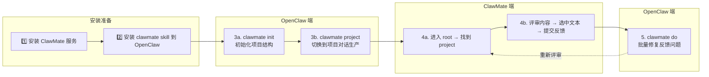
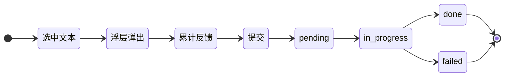
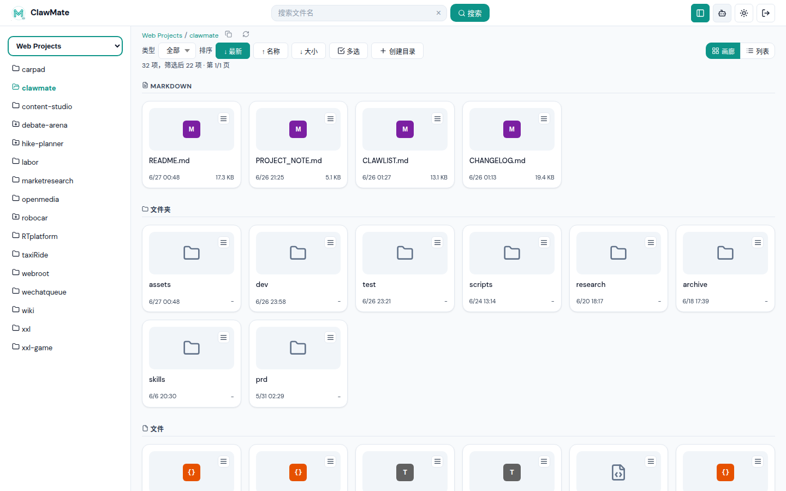
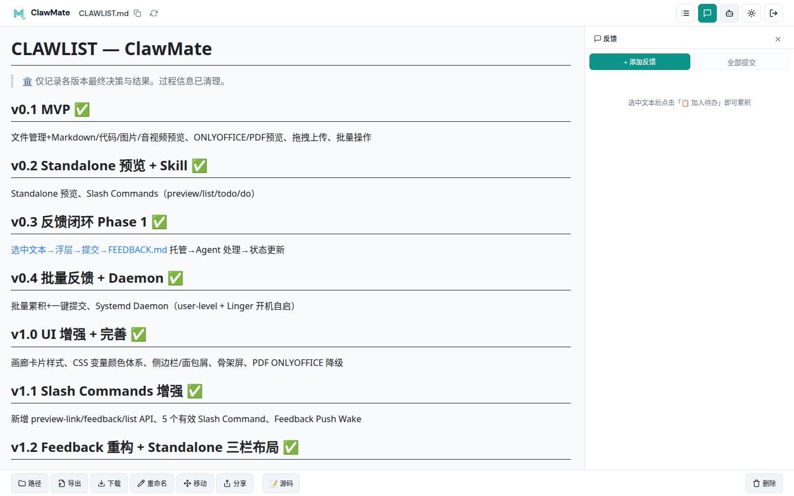
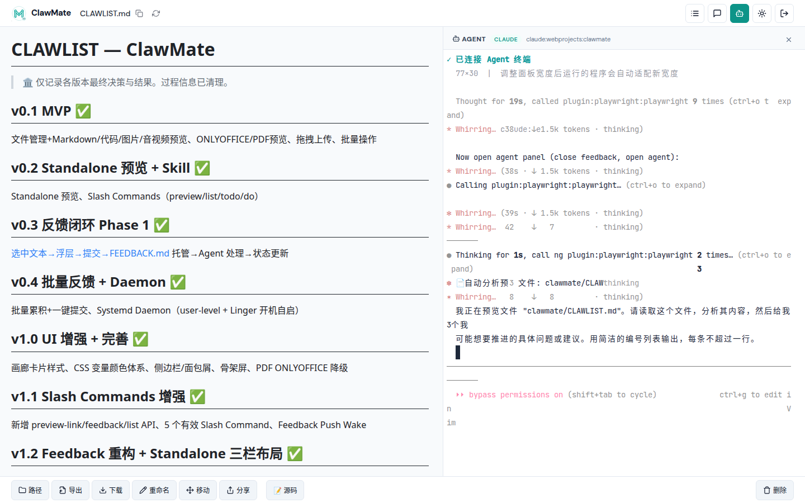
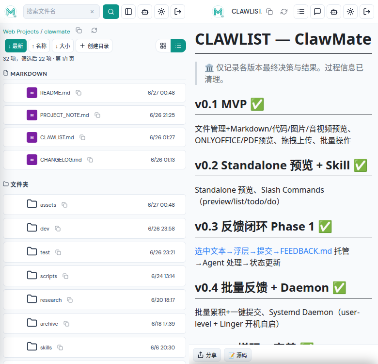
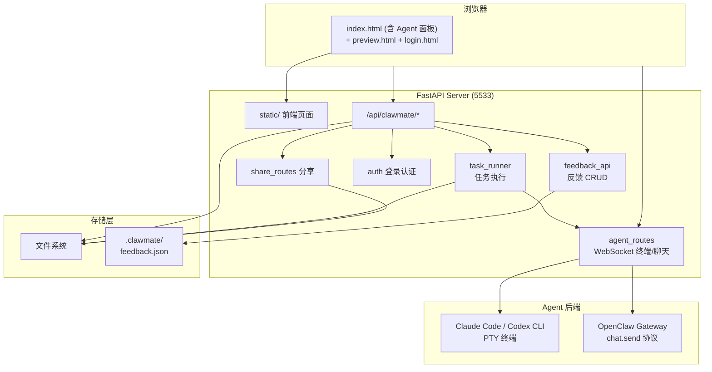

<p align="center">
  
</p>

# ClawMate

> Agent 产出的每一个文件，点击即预览，选中即反馈。

<!-- ALL-CLAWMATE-BADGES:START -->
[](LICENSE)
<!-- ALL-CLAWMATE-BADGES:END -->

ClawMate 是一个面向 AI Agent 工作流的**文件管理 → 预览发现问题 → 即时反馈 → Agent 自动修改**工具。

支持 **Claude Code**、**Codex** 和 **OpenClaw** 三后端 Agent 终端，在文件浏览器中直接与 AI 对话。

## 为什么需要 ClawMate？

在使用 OpenClaw 等 AI Agent 的过程中，会产生大量待发布的文稿、待实施的方案、以及大量的代码文件。
通常 OpenClaw 以摘要方式告知用户结果，但详细的文档必须要进行评审。传统的评审方式，你需要拷贝访问 → 修改内容复制粘贴 → 编写改进建议 → 与 Agent 交互澄清做计划，过程繁杂冗长且容易失真。

ClawMate 的解法是：

- **在线管理 Agent 产出**，Agent 生成文件时直接返回可点击的预览链接，直接进行内容评审。
- **即时交互反馈**：预览时发现问题 → 直接选中文本 → 填写备注 → 提交 → Agent 自动修改，无需跳出工作流
- **评审、反馈、修订闭环**，不需要在多个窗口间来回切换，拷贝粘贴。
- **不仅支持代码和文档**：也支持对 图片、Office 文档、音乐、视频等内容的评审与建议反馈，功能还在完善中。

## 核心工作流


---

## ClawMate + OpenClaw 协作流程

ClawMate 与 OpenClaw 配合使用，形成完整的「创建 → 评审 → 反馈 → 修复」闭环。



### 步骤详解

**1️⃣ 安装 ClawMate 服务**

```bash
# 方式：Docker / systemd / 本地启动
# 详见下方「快速开始」
docker run -d --name clawmate -p 5533:5533 clawmate:latest
```

**2️⃣ 安装 clawmate skill 到 OpenClaw**

```bash
openclaw skills install clawmate
openclaw gateway restart
```

**3️⃣ 创建项目（OpenClaw 端操作）**

a. 初始化项目结构：
```
/clawmate init [root] <project>
```
在当前 root 下建立标准项目目录（CLAWLIST.md + PROJECT_NOTE.md + research/ + prd/ + dev/ + test/）。

b. 切换到项目，开始对话生产内容：
```
/clawmate project <projectname>
```
切换到项目所属 Agent 的上下文，Agent 读取项目文件后即可围绕需求进行对话、生成文档/代码。

**4️⃣ 项目材料评审（ClawMate 端操作）**

a. 进入 ClawMate Web UI，切换到对应 root，找到项目。

b. 预览项目产出的文件，发现问题时直接选中文本 → 填写备注 → 提交反馈。支持：
- 连续选中多个位置，统一提交一次反馈
- 同一文件提交后自动进入 pending 状态
- 所有反馈汇总在 timeline 中可追溯

**5️⃣ 自动修复用户反馈（OpenClaw 端操作）**

```
/clawmate do [#ID]
```
OpenClaw 读取反馈 JSON → AI 理解选区内容 + 用户备注 → 批量修改对应文件。修改完成后状态流转：
```
pending → in_progress → done / failed
```
修复后的文件可重新进入评审环节（返回到步骤 4），形成持续迭代闭环。

---

## 核心能力

### 🏗️ 项目管理

围绕 AI Agent 工作流设计的项目全生命周期管理：

- **`/clawmate init`** — 一键初始化标准项目结构（CLAWLIST + PROJECT_NOTE + research/prd/dev/test）
- **`/clawmate plan`** — 五阶段分层计划（Phase I 初始化→II 需求澄清→III 信息收集→IV MRD→V PRD），懒加载+归档防过期
- **`/clawmate project`** — 秒级切换会话上下文，Agent 自动读取项目状态
- `.clawmate/` marker 自动识别项目边界，实现 session 隔离和多项目并行

### 🔍 全格式预览

点击即渲染，无需下载：

| 类型 | 能力 |
|------|------|
| Markdown | Mermaid / KaTeX / 语法高亮 |
| Mermaid 图表 | Ctrl+滚轮缩放 + 拖拽平移 + 底部手柄调高度 |
| Office 文档 | ONLYOFFICE 嵌入预览（编辑/只读） |
| PDF | pdf.js 预览 |
| 压缩包 | zip / tar / 7z / rar 树形展开 |
| 代码文件 | 12 种语言语法高亮 + 函数/类大纲索引 |
| JSON | pretty-print 格式化 |
| 图片 | ‹ › 导航切换 |
| 音视频 | 内嵌播放器 |

### 💬 反馈闭环 🔑 核心差异化

不只是预览文件，而是将用户的每一个反馈精确送达 Agent，形成闭环修改链路。



1. 预览页选中任意文本 → 浮动「反馈」按钮出现
2. 填写备注提交（可连续选中多个位置，统一提交）
3. 写入 `.clawmate/feedback.json` → 即时唤醒 Agent
4. Agent 读取反馈 → 精确定位选区 → AI 理解备注 → 修改文件
5. 四态流转（pending → in_progress → done/failed），全程可追溯

### 🤖 内置 Agent 面板

ClawMate 右侧面板直接运行 AI Agent，无需切换窗口：

| 后端 | 模式 | 能力 |
|------|------|------|
| **Codex** | xterm.js 终端 | 完整 CLI 操作（Read/Write/Edit/Bash），60fps PTY 输出 |
| **Claude Code** | xterm.js 终端 | 完整 CLI 操作（Read/Write/Edit/Bash），60fps PTY 输出 |
| **OpenClaw** | Markdown 聊天 | chat.send 协议，通过 Gateway 多 Agent 协作 |

反馈任务可直接注入活跃终端处理，无需额外配置 webhook。`config.json` 一键切换后端。

### 📂 文件管理

| 操作 | 能力 |
|------|------|
| 浏览 | 画廊/列表双视图，类型过滤 + 多字段排序 |
| 搜索 | 递归搜索，彩色文件类型标签快速识别 |
| 上传 | 拖拽上传 + Ctrl+V 剪切板粘贴图片 |
| 组织 | 新建目录、重命名、移动、删除（鉴权+审计日志） |
| 分享 | 24h 免登录分享链接，Markdown/Mermaid/代码/图片全格式支持 |

### 🔗 Slash Commands

在 OpenClaw 中通过斜杠命令直接操作 ClawMate：

| 命令 | 用途 |
|------|------|
| `/clawmate link <filename>` | 搜索文件生成可点击预览链接 |
| `/clawmate init [root] <project>` | 项目初始化（Phase I-V） |
| `/clawmate plan [root] <project>` | 规划/更新项目计划 |
| `/clawmate list [root_id]` | 列出 root 下所有项目 |
| `/clawmate feed [status] [project]` | 查询 feedback 列表 |
| `/clawmate do [#ID]` | 处理待处理反馈 |
| `/clawmate project <projectname>` | 切换会话到指定项目 |

> 📖 完整命令参数与用法见 [skills/clawmate/SKILL.md](skills/clawmate/SKILL.md)

---

## 截图

### 文件管理（clawmate 项目）



*画廊/列表双视图 + 搜索 + 类型过滤 + 多 root 切换*

### Markdown 预览 + 反馈面板



*左侧 Markdown 渲染 → 右侧 feedback timeline（选中文本 → 浮层 → 提交 → 追溯）*

### 内置 Agent 终端



*右侧内嵌 xterm.js PTY 终端（Claude Code / Codex），预览中直接对话修改文件*

### 移动端



*左：文件管理（上传/搜索/批量操作） 右：Markdown 预览 + 反馈提交*

## Agent 面板（三后端）

ClawMate 右侧面板内置 AI Agent 终端，支持三种后端：

| 后端 | 模式 | 交互方式 | 适用场景 |
|------|------|---------|---------|
| **Codex** | xterm.js 终端 | 完整 CLI 操作（Read/Write/Edit/Bash） | 直接文件操作、项目开发 |
| **Claude Code** | xterm.js 终端 | 完整 CLI 操作（Read/Write/Edit/Bash） | 直接文件操作、项目开发 |
| **OpenClaw** | Markdown 聊天 | 结构化消息（chat.send/history） | 通过 Gateway 与多 Agent 协作 |

切换方式：修改 `config.json` 中 `agent.backend` 为 `"claude"`、`"codex"` 或 `"openclaw"`。

Feedback 任务路由：当 PTY 终端（Claude Code / Codex）活跃时，预览页的「立刻执行」任务直接注入终端处理；否则通过 OpenClaw gateway webhook 转发。

### Claude Code 后端配置

Claude Code 模式无需额外配置，只需确保服务器上已安装并登录 Claude Code CLI：

```bash
# 安装 Claude Code
npm install -g @anthropic-ai/claude-code

# 登录认证
claude login
```

ClawMate 通过 Python `pty.spawn()` 启动 `claude`，工作目录自动设为当前浏览的 root 目录。

`config.json` 中的 Claude 模式配置：

```json
{
  "agent": {
    "backend": "claude"
  }
}
```


### Codex 后端配置

Codex 模式与 Claude Code 类似，通过 Python `pty.spawn()` 启动 Codex CLI，工作目录自动设为当前浏览的 root 目录。

```json
{
  "agent": {
    "backend": "codex",
    "env": {
      "DEEPSEEK_API_KEY": "sk-..."
    }
  }
}
```

| 字段 | 说明 | 必填 |
|------|------|------|
| `backend` | 设为 `"codex"` 启用 DeepSeek Codex 终端 | 是 |
| `env` | 透传给子进程的环境变量（如 API key） | 否 |
| `max_sessions` | 最大并发终端数（默认 10） | 否 |

Codex 与 Claude Code 共用 PTY 终端模式，`session_key` 以 `codex:` 前缀隔离，互不干扰。

### OpenClaw 后端配置

需要配置 OpenClaw Gateway 的连接信息：

```json
{
  "agent": {
    "backend": "openclaw",
    "openclaw_ws_url": "wss://your-openclaw-server:18443",
    "openclaw_token": "your-gateway-token"
  }
}
```

| 字段 | 说明 | 必填 |
|------|------|------|
| `openclaw_ws_url` | OpenClaw Gateway WebSocket 地址 | 是 |
| `openclaw_token` | Gateway 认证令牌（`openclaw.json` → `gateway.auth.token`） | 是 |

本地开发时 `openclaw_ws_url` 可设为 `ws://127.0.0.1:18789`。公网部署时使用 `wss://`。

OpenClaw 后端使用 `chat.send` / `chat.history` 协议，`sessionKey` 格式为 `agent:{agent_id}:main`，与 `config.json` 中 root 的 `agent_id` 对应。

## 架构



**核心模块**：

| 模块 | 功能 |
|------|------|
| `main.py` | FastAPI 应用入口 + 中间件 |
| `routes.py` | 文件 CRUD、搜索、预览、压缩包、移动、ONLYOFFICE |
| `feedback_api.py` | 反馈闭环 CRUD + 状态流转 |
| `agent_routes.py` | Agent WebSocket 终端（Claude Code / Codex PTY + OpenClaw 聊天） |
| `task_runner.py` | 任务执行引擎 + cron 唤醒 |
| `auth.py` | Session 认证 + local_hosts 白名单 |
| `config.py` | 类型化配置加载 + TTL 缓存 |
| `store.py` | 反馈存储引擎（纯函数接口） |
| `service.py` | 核心服务函数（文件操作、搜索、压缩包） |
| `share_routes.py` | 分享链接管理 |
| `validators.py` | 路径安全校验 |
| `js/icons.js` | SVG 图标系统 + 彩色类型标签 |

---

## 快速开始

### 方式一：Docker 部署（推荐）

```bash
# 1. 构建镜像
docker build -t clawmate:latest .

# 2. 准备配置文件
cp config.example.json config.json
# 编辑 config.json，填入你的目录路径和 OpenClaw 配置

# 3. 启动容器
docker run -d \
  --name clawmate \
  --restart unless-stopped \
  -p 5533:5533 \
  -v $(pwd)/config.json:/app/config.json:ro \
  -v /openclaw/store/data:/data \
  -e CLAWMATE_CONFIG=/app/config.json \
  clawmate:latest
```

### 方式二：本地直接启动

```bash
cp config.example.json config.json
# 编辑 config.json
python3 -m venv dev/.venv
dev/.venv/bin/pip install -r requirements.txt
cd dev && .venv/bin/python main.py
```

### 方式三：install.sh 一键部署（CLI + systemd）

```bash
sudo bash install.sh                    # 安装到当前目录
sudo bash install.sh /opt/clawmate      # 安装到指定路径
```

脚本会自动：
1. 复制 `config.example.json` 为 `config.json`（需手动编辑）
2. 安装 Python 依赖
3. 创建 systemd 服务并启用开机自启

### 与 OpenClaw 集成

在 `config.json` 中配置 OpenClaw gateway 连接：

```json
{
  "openclaw": {
    "gateway_url": "http://openclaw.lan:18789",
    "hook_token": "your-hook-token"
  }
}
```

- **同主机 Docker**：`gateway_url: http://host.docker.internal:18789`
- **同主机 CLI**：`gateway_url: http://127.0.0.1:18789`
- **跨主机**：`gateway_url: http://openclaw.lan:18789`

> ClawMate 通过 `POST {gateway_url}/hooks/agent` webhook 唤醒 Agent。需在 OpenClaw 的 `openclaw.json` 中注册 `hooks.agent` 条目（`token` 与 `config.json` 中 `hook_token` 一致）。请勿将 `hook_token` 提交到公开仓库。

---

## ClawMate Skill（OpenClaw 集成）

> 📖 完整命令定义、Phase I-V 工作流、归档机制、文档同步规范见 **[skills/clawmate/SKILL.md](skills/clawmate/SKILL.md)**

Skill 目录位于 `skills/clawmate/`，包含 `SKILL.md`（命令定义）、`_meta.json`（元数据）、`LICENSE.txt`。

### 安装

**方式一：从 ClawHub 安装（推荐）**
```bash
openclaw skills install clawmate
openclaw gateway restart
```

**方式二：本地开发（项目目录内直接链接）**
```bash
ln -sf $PWD/skills/clawmate ~/.openclaw/skills/clawmate
openclaw gateway restart
```

### 验证

```
/clawmate link README.md
```

若返回可点击预览链接，则安装成功。

Slash Commands 详见上方 [核心能力 → Slash Commands](#-slash-commands)，完整参数参考 `skills/clawmate/SKILL.md`。

---

## 配置参考

### config.json 结构

```json
{
  "roots": [
    {
      "id": "example",
      "label": "示例目录",
      "dir": "/data/example",
      "agent_id": "main"
    }
  ],
  "defaultRootId": "example",
  "port": 5533,
  "public_base_url": "http://clawmate.lan:5533",
  "max_upload_mb": 100,
  "feedback": {
    "enable_subtitle": false
  },
  "openclaw": {
    "gateway_url": "http://openclaw.lan:18789",
    "hook_token": ""
  },
  "agent": {
    "backend": "claude",
    "openclaw_ws_url": "ws://openclaw.lan:18789",
    "openclaw_token": "",
    "max_sessions": 10,
    "env": {
      "DEEPSEEK_API_KEY": ""
    }
  },
  "onlyoffice": {
    "api_js_url": "http://onlyoffice.lan/web-apps/apps/api/documents/api.js",
    "jwt_secret": "change-me-in-production",
    "mode": "edit",
    "callback_url": "https://clawmate.lan:5533/api/clawmate/onlyoffice/callback"
  },
  "auth": {
    "username": "admin",
    "password_hash": "",
    "session_ttl_minutes": 480
  }
}
```

### 认证

ClawMate 支持基于 cookie session 的登录认证。设置 `config.json` 中的 `auth.password_hash` 启用：

#### 方法一：使用 ClawMate 交互式工具（推荐）

```bash
python3 main.py --set-password
```

按提示输入密码，工具自动生成 bcrypt hash 并写入 `config.json`。

#### 方法二：手动生成 hash

使用 Python 一行命令生成 bcrypt hash：

```bash
python3 -c "import bcrypt; print(bcrypt.hashpw(b'你的密码', bcrypt.gensalt()).decode())"
```

> 示例输出：`$2b$12$XXXXXXXXXXXXXXXXXXXXXXXXXXXXXXXXXXXXXXXXXXXXXXXXXXXXXXXXXXXX`
> - `$2b$` — bcrypt 算法标识
> - `12` — 加密轮次（cost factor，默认 12）
> - 后续字符 — salt + 加密后的 hash

将生成的 hash 填入 `config.json`：

```json
{
  "auth": {
    "username": "admin",
    "password_hash": "$2b$12$..."
  }
}
```

启用认证后，所有外部访问需要先登录。`127.0.0.1` 及 `auth.local_hosts` 中的主机名/IP 自动绕过认证。

---

*ClawMate — 让 Agent 的输出不再是一次性的，而是可以不断打磨的作品。*
