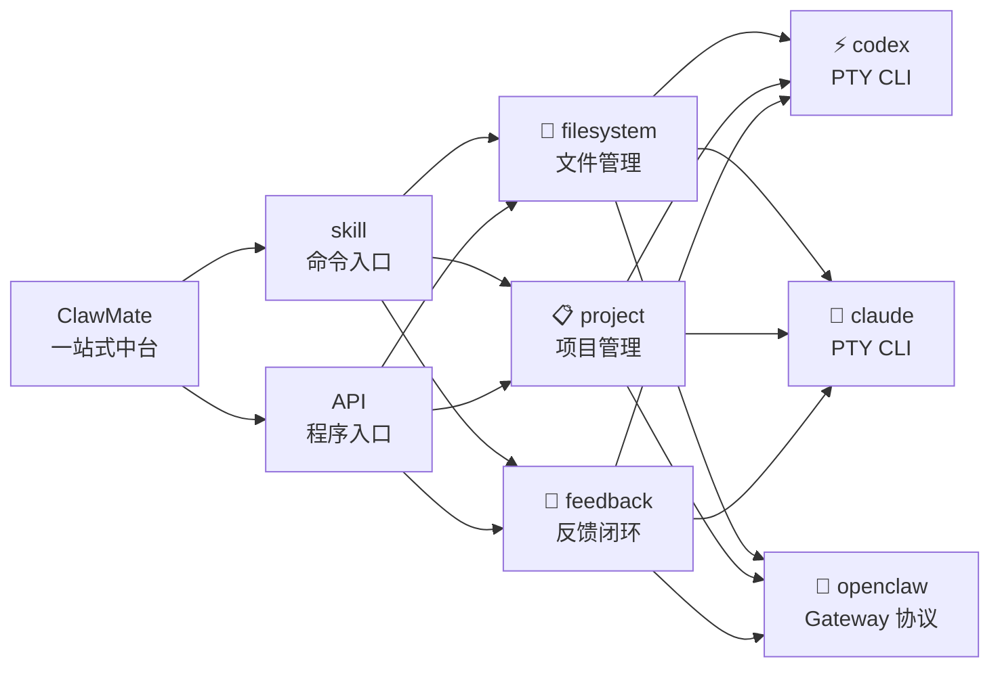
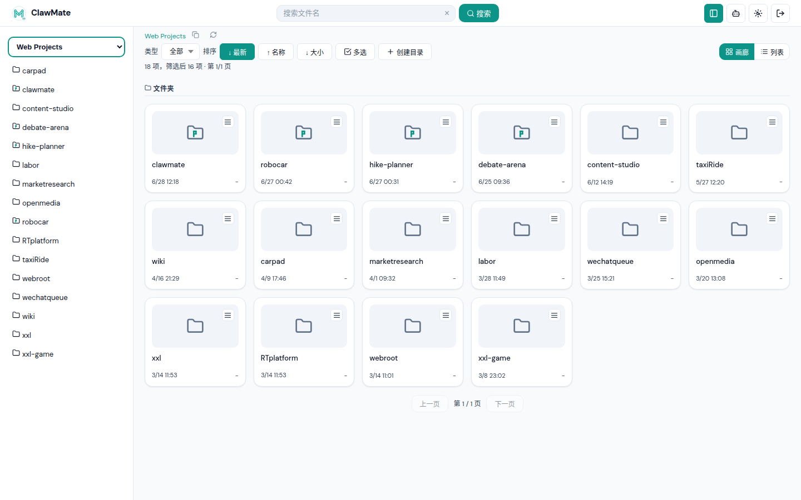
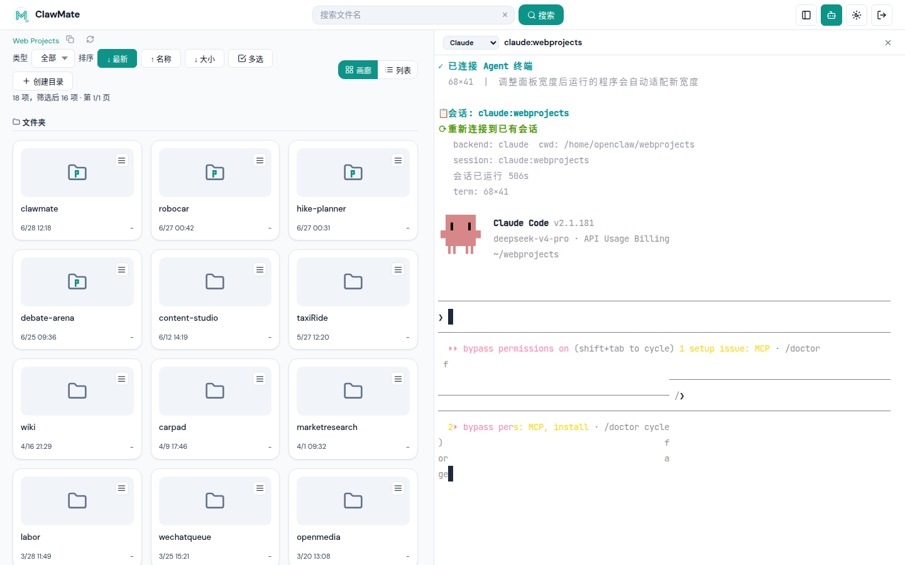
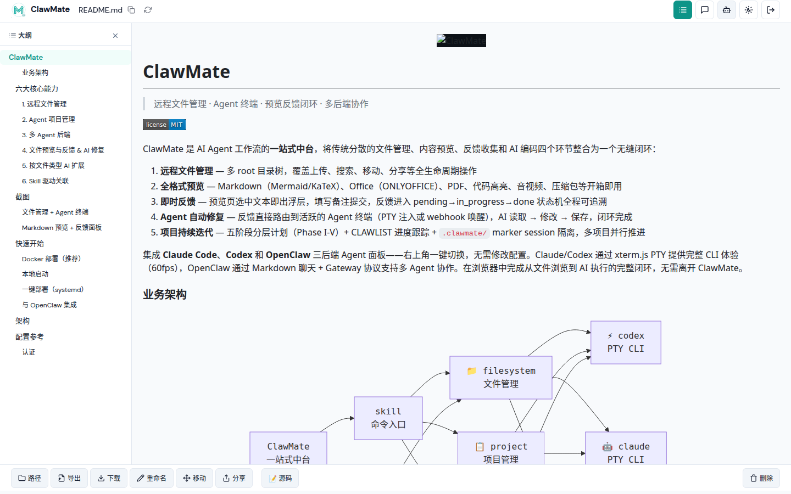
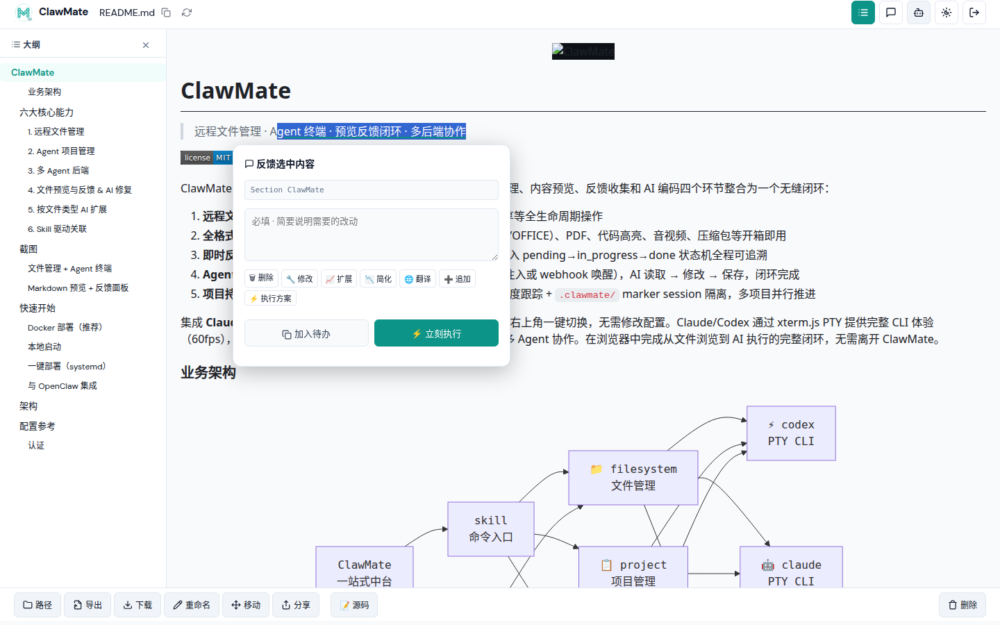
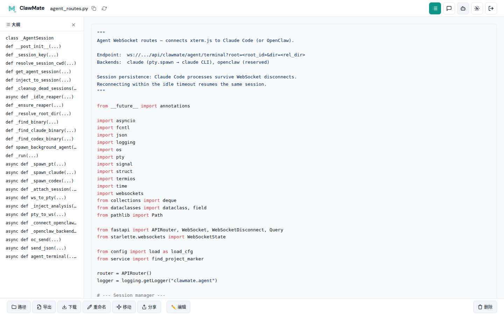
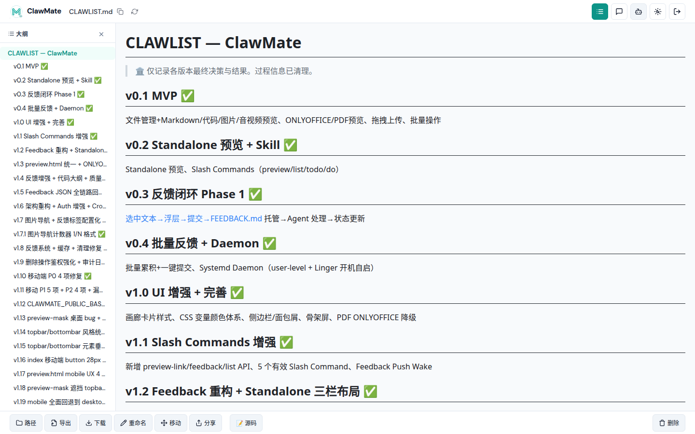
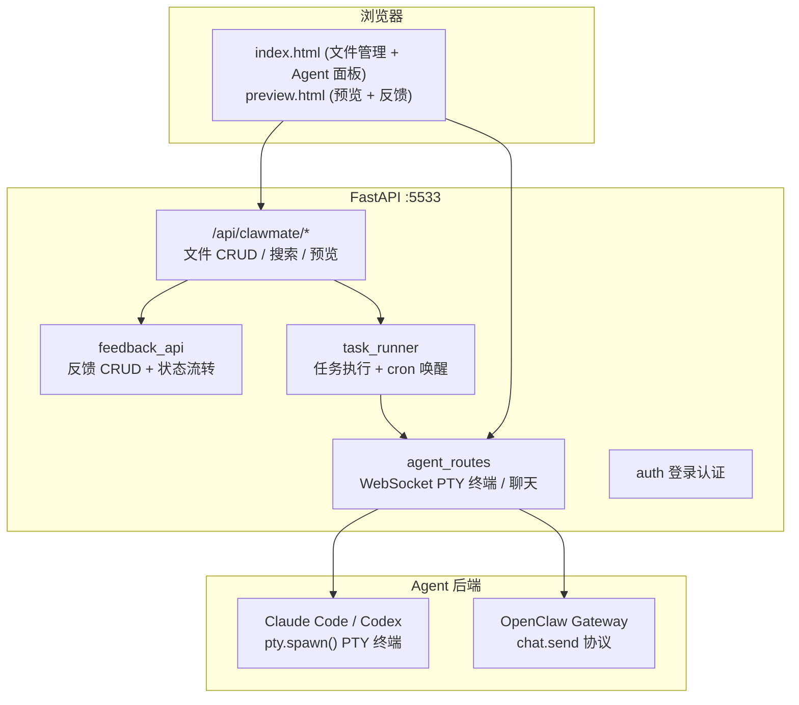

<p align="center">
  
</p>

# ClawMate

> 远程文件管理 · Agent 终端 · 预览反馈闭环 · 多后端协作

<!-- ALL-CLAWMATE-BADGES:START -->
[](LICENSE)
<!-- ALL-CLAWMATE-BADGES:END -->

ClawMate 是 AI Agent 工作流的**一站式中台**，将传统分散的文件管理、内容预览、反馈收集和 AI 编码四个环节整合为一个无缝闭环：

1. **远程文件管理** — 多 root 目录树，覆盖上传、搜索、移动、分享等全生命周期操作
2. **全格式预览** — Markdown（Mermaid/KaTeX）、Office（ONLYOFFICE）、PDF、代码高亮、音视频、压缩包等开箱即用
3. **即时反馈** — 预览页选中文本即出浮层，填写备注提交，反馈进入 pending→in_progress→done 状态机全程可追溯
4. **Agent 自动修复** — 反馈直接路由到活跃的 Agent 终端（PTY 注入或 webhook 唤醒），AI 读取 → 修改 → 保存，闭环完成
5. **项目持续迭代** — 五阶段分层计划（Phase I-V）+ CLAWLIST 进度跟踪 + `.clawmate/` marker session 隔离，多项目并行推进

集成 **Claude Code**、**Codex** 和 **OpenClaw** 三后端 Agent 面板——右上角一键切换，无需修改配置。Claude/Codex 通过 xterm.js PTY 提供完整 CLI 体验（60fps），OpenClaw 通过 Markdown 聊天 + Gateway 协议支持多 Agent 协作。在浏览器中完成从文件浏览到 AI 执行的完整闭环，无需离开 ClawMate。

### 业务架构



| 层级 | 说明 |
|------|------|
| **入口** | skill（`/clawmate ...` 命令）和 API（HTTP/WebSocket）两种方式访问 |
| **功能域** | filesystem（文件管理）、project（项目管理）、feedback（反馈闭环）三大业务模块 |
| **后端** | openclaw / codex / claude 三引擎，右上角 badge 一键切换，任一引擎可驱动任一功能 |

> 图中连线表示**主要侧重**，不是绑定。三个 badge 随时切换，同一 session 内可混合使用不同后端处理不同任务。

---

## 六大核心能力

### 1. 远程文件管理

多 root 目录树浏览，覆盖完整文件生命周期：

| 操作 | 能力 |
|------|------|
| 浏览 | 画廊/列表双视图、类型过滤、多字段排序 |
| 搜索 | 递归全文搜索，彩色文件类型标签 |
| 上传 | 拖拽上传 + Ctrl+V 剪切板粘贴图片 |
| 组织 | 新建目录、重命名、移动、删除 |
| 分享 | 24h 免登录分享链接，全格式支持 |
| 下载 | 单文件下载 + 压缩包在线解压预览 |

### 2. Agent 项目管理

围绕 AI Agent 工作流的项目全生命周期：

- **`/clawmate init`** — 一键初始化标准项目结构（CLAWLIST + PROJECT_NOTE + research/prd/dev/test）
- **`/clawmate plan`** — 五阶段分层计划（Phase I 初始化 → II 需求澄清 → III 信息收集 → IV MRD → V PRD）
- **`/clawmate project`** — 秒级切换会话上下文，Agent 自动加载项目状态
- `.clawmate/` marker 自动识别项目边界，多项目并行 + session 隔离

### 3. 多 Agent 后端

右上角一键切换后端，无需修改配置：

| 后端 | 模式 | 交互 |
|------|------|------|
| **Claude Code** | xterm.js PTY 终端 | 完整 CLI（Read/Write/Edit/Bash），60fps |
| **Codex** | xterm.js PTY 终端 | 完整 CLI（Read/Write/Edit/Bash），60fps |
| **OpenClaw** | Markdown 聊天 | chat.send 协议，Gateway 多 Agent 协作 |

Feedback 任务智能路由：PTY 活跃时直接注入终端执行，否则通过 webhook 唤醒。

### 4. 文件预览与反馈 & AI 修复

点击即渲染，选中即反馈，AI 自动修改：

**全格式预览**：

| 类型 | 能力 |
|------|------|
| Markdown | Mermaid / KaTeX / 语法高亮 / 大纲导航 |
| Mermaid 图表 | 缩放 + 拖拽平移 + 全屏展开 |
| Office 文档 | ONLYOFFICE 嵌入（编辑/只读） |
| PDF | pdf.js 预览 + 大纲跳转 |
| 压缩包 | zip / tar / 7z / rar 树形展开 |
| 代码 | 12 种语言语法高亮 + 函数/类大纲索引 |
| 图片 | ‹ › 导航切换 + 缩略图大纲 |
| 音视频 | 内嵌播放器 + 字幕同步 |

**反馈闭环**：

```
选中文本 → 浮层弹出 → 填写备注 → 提交 → pending → in_progress → done/failed
```

连续选中多个位置统一提交，反馈 timeline 全程可追溯，修改完成后可重新评审进入下一轮迭代。

### 5. 按文件类型 AI 扩展

不同文件类型触发不同的 AI 能力：

| 类型 | AI 扩展 |
|------|---------|
| 音视频 | 字幕提取（whisper） + 字幕编辑器 + 时间轴同步预览 |
| 代码 | 12 语言函数/类大纲自动索引，click-to-scroll |
| Office | ONLYOFFICE 在线编辑，保存后自动回写 |
| 压缩包 | 在线解压浏览，支持嵌套目录 |

扩展通过 `task_templates` 体系注册，新文件类型可插拔接入。

### 6. Skill 驱动关联

通过 Skill 体系联动项目、链接与 feedback：

| 命令 | 用途 |
|------|------|
| `/clawmate link <filename>` | 搜索文件生成可点击预览链接 |
| `/clawmate init [root] <project>` | 项目初始化 |
| `/clawmate plan [root] <project>` | 规划/更新项目计划 |
| `/clawmate list [root_id]` | 列出 root 下所有项目 |
| `/clawmate feed [status] [project]` | 查询 feedback 列表 |
| `/clawmate do [#ID]` | 批量处理待办反馈 |
| `/clawmate project <projectname>` | 切换会话到指定项目 |

> 📖 完整命令参数见 [skills/clawmate/SKILL.md](skills/clawmate/SKILL.md)

---

## 截图

### 文件管理



*多 root 切换 · 目录树 · 画廊/列表双视图 · 类型过滤 · 排序 · 搜索*

### 文件管理 + Agent 终端



*左侧文件浏览，右侧 Agent 终端（Claude Code / Codex PTY 或 OpenClaw 聊天）*

### Markdown 预览 · Mermaid 图表



*Markdown 渲染（含 Mermaid 流程图/架构图）· KaTeX 数学公式 · 大纲导航*

### 文本选中反馈



*选中文本 → 浮层弹出 → 填写备注 → 提交反馈 → 状态流转*

### 代码预览 · 语法高亮



*12 种语言语法高亮 · 函数/类大纲快速索引 · click-to-scroll*

### 项目管理 · CLAWLIST



*Phase I-V 分层计划 · 进度跟踪 · 多项目并行 · session 隔离*

---

## 快速开始

### Docker 部署（推荐）

```bash
docker build -t clawmate:latest .
cp config.example.json config.json
# 编辑 config.json，填入目录路径

docker run -d \
  --name clawmate \
  --restart unless-stopped \
  -p 5533:5533 \
  -v $(pwd)/config.json:/app/config.json:ro \
  -v /your/data:/data \
  clawmate:latest
```

### 本地启动

```bash
cp config.example.json config.json
python3 -m venv dev/.venv
dev/.venv/bin/pip install -r requirements.txt
cd dev && ../.venv/bin/python main.py
```

### 一键部署（systemd）

```bash
sudo bash install.sh              # 安装到当前目录
sudo bash install.sh /opt/clawmate # 安装到指定路径
```

### 与 OpenClaw 集成

```bash
openclaw skills install clawmate
openclaw gateway restart
```

在 `config.json` 中配置 gateway 连接：

```json
{
  "openclaw": {
    "gateway_url": "http://127.0.0.1:18789",
    "hook_token": "your-hook-token"
  }
}
```

---

## 架构



| 模块 | 功能 |
|------|------|
| `routes.py` | 文件 CRUD、搜索、预览、压缩包、移动 |
| `feedback_api.py` | 反馈闭环 CRUD + 四态流转 |
| `agent_routes.py` | Agent WebSocket（PTY + 聊天双模） |
| `task_runner.py` | 任务执行引擎 + cron 扫描唤醒 |
| `auth.py` | Session 认证 + local_hosts 白名单 |
| `config.py` | 类型化配置加载 + TTL 缓存 |
| `store.py` | 反馈存储引擎（纯函数接口） |
| `service.py` | 核心服务（文件操作、搜索、压缩包） |

---

## 配置参考

```json
{
  "roots": [
    {
      "id": "example",
      "label": "示例目录",
      "dir": "/data/example",
      "agent_id": "main"
    }
  ],
  "defaultRootId": "example",
  "port": 5533,
  "public_base_url": "http://clawmate.lan:5533",
  "agent": {
    "backend": "claude",
    "max_sessions": 10,
    "env": {}
  },
  "openclaw": {
    "gateway_url": "http://127.0.0.1:18789",
    "hook_token": ""
  },
  "onlyoffice": {
    "api_js_url": "http://onlyoffice.lan/web-apps/apps/api/documents/api.js",
    "mode": "edit"
  },
  "auth": {
    "username": "admin",
    "password_hash": "",
    "session_ttl_minutes": 480
  }
}
```

### 认证

```bash
# 交互式设置密码（推荐）
python3 main.py --set-password

# 或手动生成 bcrypt hash
python3 -c "import bcrypt; print(bcrypt.hashpw(b'你的密码', bcrypt.gensalt()).decode())"
```

启用后，`127.0.0.1` 及 `auth.local_hosts` 中的主机自动绕过认证。

---

*ClawMate — 让 Agent 的输出不再是一次性的，而是可以不断打磨的作品。*
