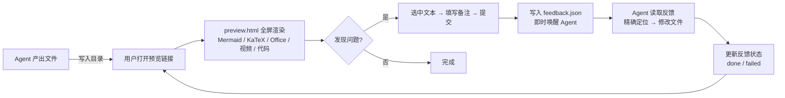
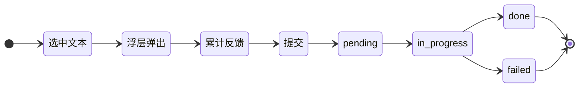
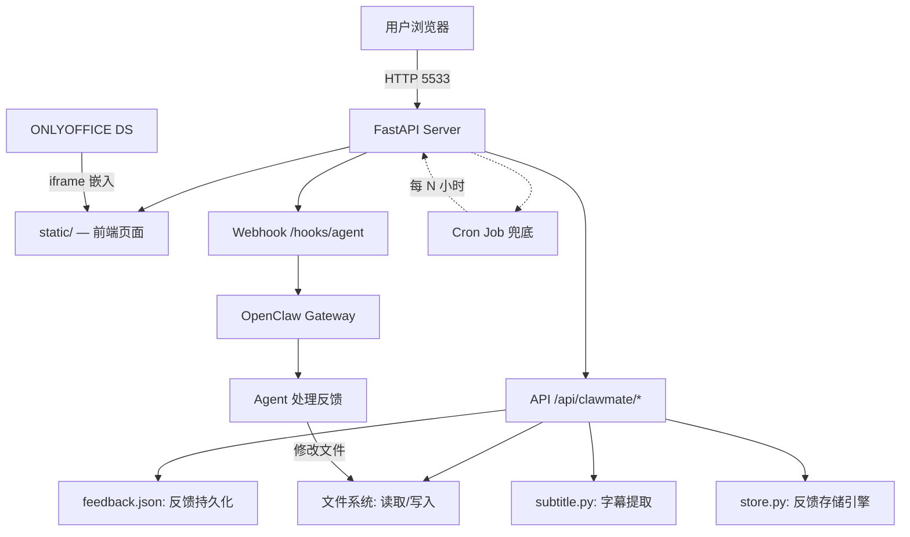

# ClawMate 🦞

> Agent 产出的每一个文件，点击即预览，选中即反馈。

[](LICENSE)

ClawMate 是一个面向 AI Agent 工作流的**文件管理 → 预览发现问题 → 即时反馈 → Agent 自动修改**工具。

## 为什么需要 ClawMate？

在使用 OpenClaw 等 AI Agent 的过程中，会产生大量待发布的文稿、待实施的方案、以及大量的代码文件。
通常 Openclaw 以摘要方式告知用户结果，但详细的文档必须要进行评审。传统的评审方式，你需要拷贝访问 → 修改内容复制粘贴 → 编写改进建议 → 与 Agent 交互澄清做计划，过程繁杂冗长且容易失真。

ClawMate 的解法是：

- **在线管理 Agent 产出**，Agent 生成文件时直接返回可点击的预览链接，直接进行内容评审。
- **即时交互反馈**：预览时发现问题 → 直接选中文本 → 填写备注 → 提交 → Agent 自动修改，无需跳出工作流
- **评审、反馈、修订闭环**，不需要在多个窗口间来回切换，拷贝粘贴。
- **不仅支持代码和文档**：也支持对 Office 文档、音乐、视频等内容的评审与建议反馈，功能还在完善中。

## 截图

| 多项目、多目录管理 | 手动添加反馈 | 创建反馈 |
|:---:|:---:|:---:|
|  |  |  |

| 反馈处理结果 | SRT 字幕提取 | SRT 字幕纠错 |
|:---:|:---:|:---:|
 |  |  |  |

## 核心工作流



---

## 核心能力

### 🔍 预览引擎
支持 10+ 种文件类型，点击即渲染，无需下载：

| 类型 | 桌面端 | 移动端 |
|------|:------:|:------:|
| Markdown（Mermaid / KaTeX / 语法高亮） | ✅ | ✅ |
| Mermaid 图表（支持 Ctrl+滚轮缩放 + 拖拽平移） | ✅ | ✅ |
| Office 文档（ONLYOFFICE 嵌入预览） | ✅ | ✅ |
| PDF | ✅（降级 pdf.js） | ✅（ONLYOFFICE） |
| HTML 源码 | ✅ 渲染/源码切换 | ✅ 语法高亮 |
| 代码文件：py/js/ts/css/go/rs 等 | ✅ 语法高亮 + 大纲 | ✅ 语法高亮 + 大纲 |
| JSON | ✅ pretty-print | ✅ pretty-print |
| 图片（支持 ‹ › 导航） | ✅ | ✅ |
| 音视频（内嵌播放器） | ✅ | ✅ |
| SRT 字幕（时间轴同步 + 编辑） | ✅ | ❌ |
| GPX/KML 轨迹文件 | ✅ 纯文本 | ✅ 纯文本 |

### 💬 反馈闭环 🔑 核心差异化

ClawMate 与其他文件管理器最根本的区别：不只是预览文件，而是将用户的每一个反馈精确送达 Agent，形成闭环修改链路。



**关键流程**：
1. 在预览页选中任意文本 → 浮动 `✏️ 反馈` 按钮出现
2. 点击按钮 → 填写备注 → 提交（可连续选中多个位置，统一提交）
3. 写入 `feedback.json` → 即时唤醒 Agent
4. Agent 读取反馈 → 精确定位选区 → AI 理解备注 → 修改文件
5. 状态流转：pending → in_progress → done / failed

**四态追踪**：每步状态可查，可追溯、可检索。

### 📂 文件管理
- 多项目白名单目录，root 切换面板
- 类型过滤（文档/代码/数据/媒体/其他）+ 排序（时间/名称/大小）
- 搜索（桌面端递归搜索，移动端输入即搜）
- 批量下载、拖拽上传、重命名、删除（含鉴权+审计日志）
- **移动端响应式**：独立 `m/` 页面，触控优化

### 🔗 OpenClaw 融合
- 提交 feedback 后即时通过 webhook 唤醒 OpenClaw Agent
- ClawMate Cron Job 定时兜底扫描（每 6/24h），防止遗漏
- Slash Commands：`/clawmate preview`、`/clawmate list`、`/clawmate do`

---

## 架构



---

## 快速开始

### Docker 部署

```bash
# 1. 准备配置文件
cd dev
cp config.example.json config.json
# 编辑 config.json，填入你的目录路径和认证信息

# 2. 启动
docker-compose up -d

# 3. 打开浏览器
open http://localhost:5533/clawmate/
```

**环境变量**：

| 变量 | 必填 | 默认值 | 说明 |
|------|:----:|--------|------|
| `CLAWMATE_PUBLIC_BASE_URL` | ✅ | — | 外部访问地址 |
| `CLAWMATE_HOOK_TOKEN` | | — | OpenClaw webhook token |
| `CLAWMATE_GATEWAY_URL` | | `http://host.docker.internal:18789` | OpenClaw Gateway |
| `CLAWMATE_ONLYOFFICE_URL` | | — | ONLYOFFICE JS URL |
| `CLAWMATE_ONLYOFFICE_JWT_SECRET` | | — | ONLYOFFICE JWT 密钥 |
| `CLAWMATE_MAX_UPLOAD_MB` | | `100` | 上传限制 |
| `CLAWMATE_ENABLE_SUBTITLE` | | `0` | 字幕提取（也可用 config.json `feedback.enable_subtitle: true`） |

**目录挂载**：
```yaml
volumes:
  - ./config.json:/app/config.json:ro    # 配置文件
  - /path/to/your/data:/data:ro          # 数据目录
```

`config.json` 中的 `roots[].dir` 需指向容器内路径（如 `/data/media`）。

### 本地直接启动

```bash
cd dev
pip install -r requirements.txt
cp config.example.json config.json
# 编辑 config.json
python3 main.py
```

### Systemd 部署

项目提供了 `clawmate.service.system` 模板，部署前需要替换占位符：

```bash
sed -e "s|__CLAWMATE_DIR__|/opt/clawmate|g" \
    -e "s|__CLAWMATE_USER__|clawmate|g" \
    -e "s|__CLAWMATE_GROUP__|clawmate|g" \
    -e "s|__CLAWMATE_PORT__|5533|g" \
    clawmate.service.system > /tmp/clawmate.service
sudo cp /tmp/clawmate.service /etc/systemd/system/clawmate.service
sudo systemctl daemon-reload && sudo systemctl enable --now clawmate
```

### 与 OpenClaw 集成

ClawMate 依赖 OpenClaw 的 cron job 机制处理反馈。在同主机运行时：

```yaml
# docker-compose environment 或 config.json
environment:
  - CLAWMATE_HOOK_TOKEN=your-token
  - CLAWMATE_GATEWAY_URL=http://host.docker.internal:18789
```

- `host.docker.internal` 是 Docker 容器访问宿主机的标准地址
- `CLAWMATE_HOOK_TOKEN` 需与 OpenClaw 配置一致

### 可选：字幕提取

字幕功能需要额外的 ML 模型依赖（~2GB）。启用方式（二选一）：

**config.json**：
```json
{
  "feedback": {
    "enable_subtitle": true,
    "tags": [...]
  }
}
```

**docker-compose**：
```yaml
environment:
  - CLAWMATE_ENABLE_SUBTITLE=1
```

安装依赖：
```bash
pip install faster-whisper
```

---

## ClawMate Skill（OpenClaw 集成）

项目中包含 OpenClaw Skill，提供以下 Slash Commands：

### `/clawmate link <filename>`
搜索文件并生成可点击的预览链接。

```markdown
[文件名]({base_url}/clawmate/preview.html?root=<root>&file=<encoded_path>)
```

### `/clawmate feed [status] [filename] [date]`
查询 feedback 列表。

```markdown
| FD-CM-042 | pending | clawmate/README.md | 补充 Docker 截图 | 2026-06-06 |
```

### `/clawmate do [#ID]`
处理待处理反馈（全部或指定 ID）。

---

## 配置参考

### config.json 结构

```json
{
  "roots": [
    {
      "id": "webprojects",
      "label": "Web Projects",
      "dir": "/home/user/webprojects",
      "agent_id": "writer"
    }
  ],
  "defaultRootId": "webprojects",
  "port": 5533,
  "public_base_url": "https://your-domain.com:5533",
  "auth": {
    "username": "admin",
    "password_hash": "$2b$12$..."
  },
  "openclaw": {
    "hook_token": "your-token",
    "gateway_url": "http://127.0.0.1:18789"
  },
  "onlyoffice": {
    "api_js_url": "https://your-office-server.com/web-apps/apps/api/documents/api.js",
    "jwt_secret": "your-jwt-secret"
  }
}
```

### 认证

ClawMate 支持基于 cookie session 的登录认证。设置 `auth.password_hash` 启用：

```bash
python3 main.py --set-password
```

启用后所有外部访问需要先登录，127.0.0.1 本地访问自动绕过。

---

## 产品状态

| 维度 | 状态 |
|------|:----:|
| 文件管理（目录浏览/排序/过滤/搜索） | ✅ v1.0 |
| Markdown 预览（Mermaid/KaTeX/语法高亮） | ✅ v1.0 |
| Mermaid 缩放（Ctrl+滚轮/按钮/拖拽） | ✅ v1.5 |
| 代码大纲（函数/类定义导航） | ✅ v1.5 |
| ONLYOFFICE Office/PDF 预览 | ✅ v1.3 |
| 图片预览 + 上一页/下一页导航 | ✅ v1.5 |
| 音视频播放 + SRT 字幕编辑 | ✅ v1.3 |
| 反馈闭环（选中→提交→Agent 处理） | ✅ v1.3 |
| 移动端适配（首页/预览/反馈/大纲） | ✅ v1.5 |
| Docker 部署 | ✅ v1.5 |
| Slash Commands 集成 | ✅ v1.1 |
| Daemon 部署（Systemd） | ✅ |

---

*ClawMate — 让 Agent 的输出不再是一次性的，而是可以不断打磨的作品。*
