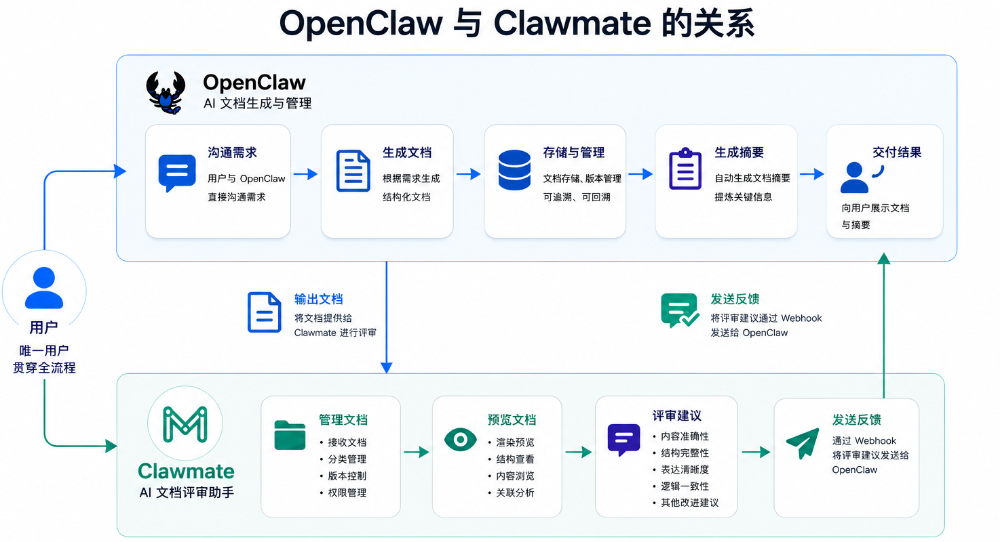
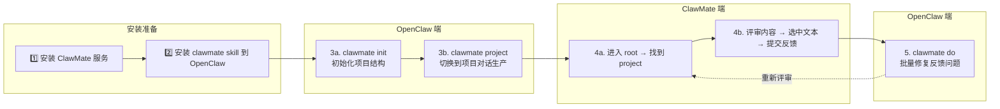
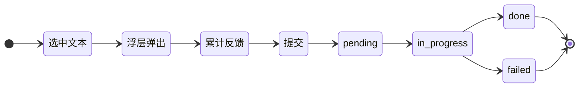
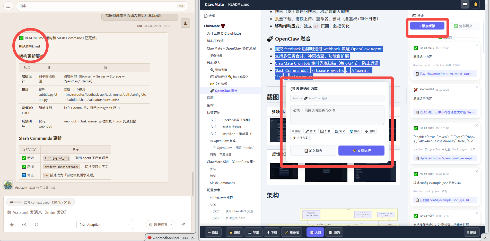
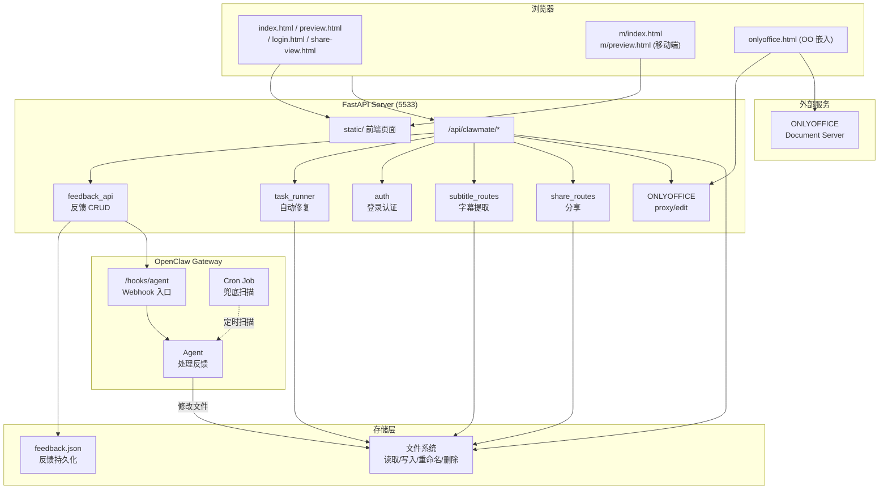

# ClawMate 🦞

> Agent 产出的每一个文件，点击即预览，选中即反馈。

[](LICENSE)

ClawMate 是一个面向 AI Agent 工作流的**文件管理 → 预览发现问题 → 即时反馈 → Agent 自动修改**工具。

## 为什么需要 ClawMate？

在使用 OpenClaw 等 AI Agent 的过程中，会产生大量待发布的文稿、待实施的方案、以及大量的代码文件。
通常 Openclaw 以摘要方式告知用户结果，但详细的文档必须要进行评审。传统的评审方式，你需要拷贝访问 → 修改内容复制粘贴 → 编写改进建议 → 与 Agent 交互澄清做计划，过程繁杂冗长且容易失真。

ClawMate 的解法是：

- **在线管理 Agent 产出**，Agent 生成文件时直接返回可点击的预览链接，直接进行内容评审。
- **即时交互反馈**：预览时发现问题 → 直接选中文本 → 填写备注 → 提交 → Agent 自动修改，无需跳出工作流
- **评审、反馈、修订闭环**，不需要在多个窗口间来回切换，拷贝粘贴。
- **不仅支持代码和文档**：也支持对 图片、Office 文档、音乐、视频等内容的评审与建议反馈，功能还在完善中。

## 核心工作流




---

## ClawMate + OpenClaw 协作流程

ClawMate 与 OpenClaw 配合使用，形成完整的「创建 → 评审 → 反馈 → 修复」闭环。



### 步骤详解

**1️⃣ 安装 ClawMate 服务**

```bash
# 方式：Docker / systemd / 本地启动
# 详见下方「快速开始」
docker run -d --name clawmate -p 5533:5533 clawmate:latest
```

**2️⃣ 安装 clawmate skill 到 OpenClaw**

```bash
openclaw skills install clawmate-skill
openclaw gateway restart
```

**3️⃣ 创建项目（OpenClaw 端操作）**

a. 初始化项目结构：
```
/clawmate init [root] <project>
```
在当前 root 下建立标准项目目录（CLAWLIST.md + PROJECT_NOTE.md + research/ + prd/ + dev/ + test/）。

b. 切换到项目，开始对话生产内容：
```
/clawmate project <projectname>
```
切换到项目所属 Agent 的上下文，Agent 读取项目文件后即可围绕需求进行对话、生成文档/代码。

**4️⃣ 项目材料评审（ClawMate 端操作）**

a. 进入 ClawMate Web UI，切换到对应 root，找到项目。

b. 预览项目产出的文件，发现问题时直接选中文本 → 填写备注 → 提交反馈。支持：
- 连续选中多个位置，统一提交一次反馈
- 同一文件提交后自动进入 pending 状态
- 所有反馈汇总在 timeline 中可追溯

**5️⃣ 自动修复用户反馈（OpenClaw 端操作）**

```
/clawmate do [#ID]
```
OpenClaw 读取反馈 JSON → AI 理解选区内容 + 用户备注 → 批量修改对应文件。修改完成后状态流转：
```
pending → in_progress → done / failed
```
修复后的文件可重新进入评审环节（返回到步骤 4），形成持续迭代闭环。

---

## 核心能力

### 🔍 预览引擎
支持 10+ 种文件类型，点击即渲染，无需下载：

| 类型 | 桌面端 | 移动端 |
|------|:------:|:------:|
| Markdown（Mermaid / KaTeX / 语法高亮） | ✅ | ✅ |
| Mermaid 图表（支持 Ctrl+滚轮缩放 + 拖拽平移） | ✅ | ✅ |
| Office 文档（ONLYOFFICE 嵌入预览） | ✅ | ✅ |
| PDF | ✅（降级 pdf.js） | ✅（ONLYOFFICE） |
| HTML 源码 | ✅ 渲染/源码切换 | ✅ 语法高亮 |
| 代码文件：py/js/ts/css/go/rs 等 | ✅ 语法高亮 + 大纲 | ✅ 语法高亮 + 大纲 |
| JSON | ✅ pretty-print | ✅ pretty-print |
| 图片（支持 ‹ › 导航） | ✅ | ✅ |
| 音视频（内嵌播放器） | ✅ | ✅ |
| SRT 字幕（时间轴同步 + 编辑） | ✅ | ❌ |
| GPX/KML 轨迹文件 | ✅ 纯文本 | ✅ 纯文本 |

### 💬 反馈闭环 🔑 核心差异化

ClawMate 与其他文件管理器最根本的区别：不只是预览文件，而是将用户的每一个反馈精确送达 Agent，形成闭环修改链路。



**关键流程**：
1. 在预览页选中任意文本 → 浮动 `✏️ 反馈` 按钮出现
2. 点击按钮 → 填写备注 → 提交（可连续选中多个位置，统一提交）
3. 写入 `feedback.json` → 即时唤醒 Agent
4. Agent 读取反馈 → 精确定位选区 → AI 理解备注 → 修改文件
5. 状态流转：pending → in_progress → done / failed

**四态追踪**：每步状态可查，可追溯、可检索。

### 📂 文件管理
- 多项目白名单目录，root 切换面板
- 类型过滤（文档/代码/数据/媒体/其他）+ 排序（时间/名称/大小）
- 搜索（桌面端递归搜索，移动端输入即搜）
- 批量下载、拖拽上传、重命名、删除（含鉴权+审计日志）
- **移动端响应式**：独立 `m/` 页面，触控优化

### 🔗 OpenClaw 融合
- 提交 feedback 后即时通过 webhook 唤醒 OpenClaw Agent
- 支持多任务合并、冲突检查、功能自扩展
- ClawMate Cron Job 定时兜底扫描（每 6/24h），防止遗漏
- Slash Commands：`/clawmate preview`、`/clawmate list`、`/clawmate do`

---

## 截图



*左侧：Agent 对话生成内容 → 右侧：ClawMate 预览 + 选中文本提交反馈 + 一键执行修复*

## 架构



**模块说明**：

| 模块 | 功能 |
|------|------|
| `main.py` | FastAPI 应用入口 + 中间件 |
| `routes.py` | 核心 API：文件 CRUD、搜索、预览、ONLYOFFICE 代理 |
| `feedback_api.py` | 反馈闭环 CRUD + 状态流转 |
| `task_runner.py` | 自动修复任务执行引擎 |
| `auth.py` | Session 登录认证 |
| `config.py` | 配置加载 |
| `store.py` | 反馈存储引擎 |
| `subtitle_routes.py` | SRT 字幕提取 API |
| `share_routes.py` | 分享链接管理 |
| `validators.py` | 路径安全校验 |
| `constants.py` | 常量定义 |

---

## 快速开始

### 方式一：Docker 部署（推荐）

```bash
# 1. 构建镜像
docker build -t clawmate:latest .

# 2. 准备配置文件
cp config.example.json config.json
# 编辑 config.json，填入你的目录路径和 OpenClaw 配置

# 3. 启动容器
docker run -d \
  --name clawmate \
  --restart unless-stopped \
  -p 5533:5533 \
  -v $(pwd)/config.json:/app/config.json:ro \
  -v /openclaw/store/data:/data \
  -e CLAWMATE_CONFIG=/app/config.json \
  clawmate:latest
```

### 方式二：本地直接启动

```bash
cp config.example.json config.json
# 编辑 config.json
python3 -m venv dev/.venv
dev/.venv/bin/pip install -r requirements.txt
cd dev && .venv/bin/python main.py
```

### 方式三：install.sh 一键部署（CLI + systemd）

```bash
sudo bash install.sh                    # 安装到当前目录
sudo bash install.sh /opt/clawmate      # 安装到指定路径
```

脚本会自动：
1. 复制 `config.example.json` 为 `config.json`（需手动编辑）
2. 安装 Python 依赖
3. 创建 systemd 服务并启用开机自启

### 与 OpenClaw 集成

在 `config.json` 中配置 OpenClaw gateway 连接：

```json
{
  "openclaw": {
    "gateway_url": "http://openclaw.lan:18789",
    "hook_token": "your-hook-token"
  }
}
```

- **同主机 Docker**：`gateway_url: http://host.docker.internal:18789`
- **同主机 CLI**：`gateway_url: http://127.0.0.1:18789`
- **跨主机**：`gateway_url: http://openclaw.lan:18789`

#### 在 OpenClaw 中配置 `/hooks/agent` 入口

ClawMate 通过 `POST {gateway_url}/hooks/agent` 向 OpenClaw 发送 webhook 唤醒 Agent 处理反馈。

你需要在 OpenClaw 的 `openclaw.json` 中注册该 hook 路由：

```json
{
  "hooks": {
    "agent": {
      "enabled": true,
      "token": "",
      "path": "/hooks",
      "allowRequestSessionKey": false,
      "allowedAgentIds": ["main"]
    }
  }
}
```

> ⚠️ `token` 字段的值必须与 `config.json` 中 `openclaw.hook_token` 的值**完全一致**，否则 webhook 会被 OpenClaw 拒绝。

`gateway_url` + `hook_token` 两者配合使用：
- `openclaw.json` 中的 `hooks.agent.token` 定义入口鉴权
- `config.json` 中的 `openclaw.hook_token` 提供调用凭证

> 🔒 请勿将 `hook_token` 提交到公开仓库。生产环境建议通过环境变量 `CLAWMATE_HOOK_TOKEN` 注入。

### 可选：字幕提取

字幕功能需要额外的 ML 模型依赖（~2GB）。启用方式（二选一）：

**config.json**：
```json
{
  "feedback": {
    "enable_subtitle": true,
    "tags": [...]
  }
}
```

**docker-compose**：
```yaml
environment:
  - CLAWMATE_ENABLE_SUBTITLE=1
```

安装依赖：
```bash
pip install faster-whisper
```

---

## ClawMate Skill（OpenClaw 集成）

Skill 目录位于 `skills/clawmate/`，包含 `SKILL.md`（命令定义）、`_meta.json`（元数据）、`LICENSE.txt`。

### 安装

**方式一：从 ClawHub 安装（推荐）**
```bash
openclaw skills install clawmate-work
openclaw gateway restart
```

**方式二：本地开发（项目目录内直接链接）**
```bash
ln -sf $PWD/skills/clawmate ~/.openclaw/skills/clawmate
openclaw gateway restart
```

### 验证

```
/clawmate link README.md
```

若返回可点击预览链接，则安装成功。

### Slash Commands

| 命令 | 用途 |
|------|------|
| `/clawmate link <filename>` | 搜索文件并生成可点击预览链接 |
| `/clawmate init [root] <project>` | 项目初始化与前期梳理（Phase I-V） |
| `/clawmate plan [root] <project>` | 规划/更新分层项目计划（CLAWLIST） |
| `/clawmate list [agent_id]` | 列出指定 agent 下所有项目 |
| `/clawmate feed [status] [filename] [date]` | 查询 feedback 列表 |
| `/clawmate do [#ID]` | 通过自动修复引擎处理待处理反馈 |
| `/clawmate project <projectname>` | 为项目切换会话上下文，开始工作 |

> 各命令的详细参数和示例见 `skills/clawmate/SKILL.md`。

---

## 配置参考

### config.json 结构

```json
{
  "roots": [
    {
      "id": "example",
      "label": "示例目录",
      "dir": "/data/example",
      "agent_id": "main"
    }
  ],
  "defaultRootId": "example",
  "port": 5533,
  "public_base_url": "http://clawmate.lan:5533",
  "max_upload_mb": 100,
  "feedback": {
    "enable_subtitle": false
  },
  "openclaw": {
    "gateway_url": "http://openclaw.lan:18789",
    "hook_token": ""
  },
  "onlyoffice": {
    "api_js_url": "http://onlyoffice.lan/web-apps/apps/api/documents/api.js",
    "jwt_secret": "change-me-in-production",
    "mode": "edit",
    "callback_url": "https://clawmate.lan:5533/api/clawmate/onlyoffice/callback"
  },
  "auth": {
    "username": "admin",
    "password_hash": "",
    "session_ttl_minutes": 480
  }
}
```

### 认证

ClawMate 支持基于 cookie session 的登录认证。设置 `config.json` 中的 `auth.password_hash` 启用：

#### 方法一：使用 ClawMate 交互式工具（推荐）

```bash
python3 main.py --set-password
```

按提示输入密码，工具自动生成 bcrypt hash 并写入 `config.json`。

#### 方法二：手动生成 hash

使用 Python 一行命令生成 bcrypt hash：

```bash
python3 -c "import bcrypt; print(bcrypt.hashpw(b'你的密码', bcrypt.gensalt()).decode())"
```

> 示例输出：`$2b$12$XXXXXXXXXXXXXXXXXXXXXXXXXXXXXXXXXXXXXXXXXXXXXXXXXXXXXXXXXXXX`
> - `$2b$` — bcrypt 算法标识
> - `12` — 加密轮次（cost factor，默认 12）
> - 后续字符 — salt + 加密后的 hash

将生成的 hash 填入 `config.json`：

```json
{
  "auth": {
    "username": "admin",
    "password_hash": "$2b$12$..."
  }
}
```

启用认证后，所有外部访问需要先登录。`127.0.0.1` 本地访问自动绕过认证。

---


---

*ClawMate — 让 Agent 的输出不再是一次性的，而是可以不断打磨的作品。*
