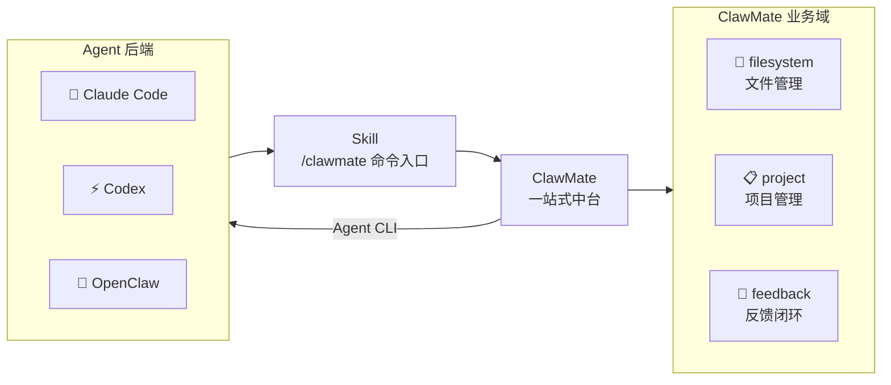
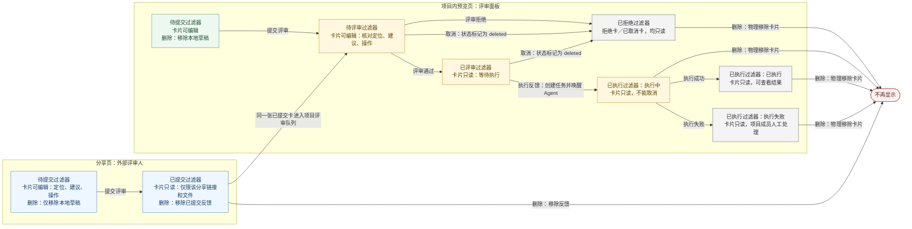
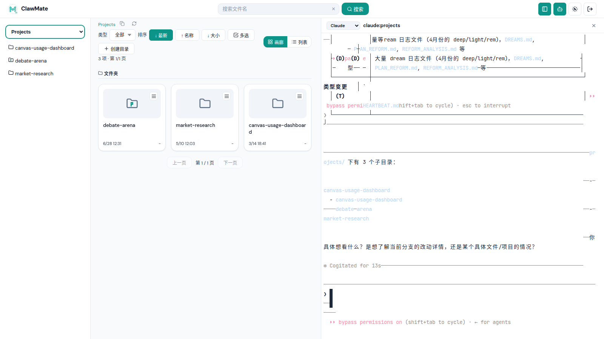
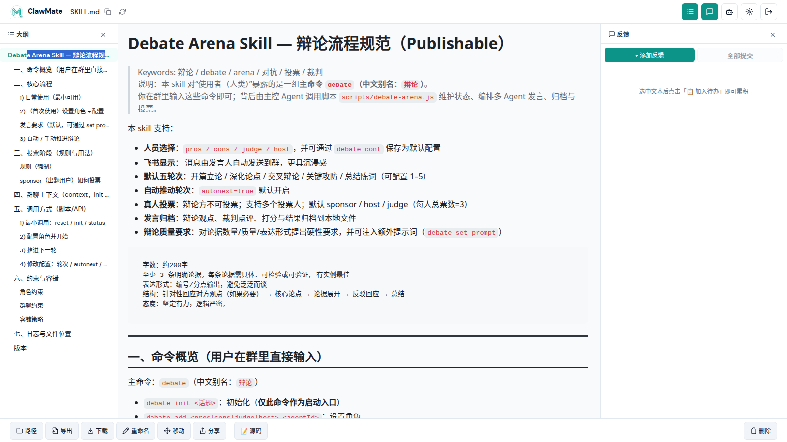
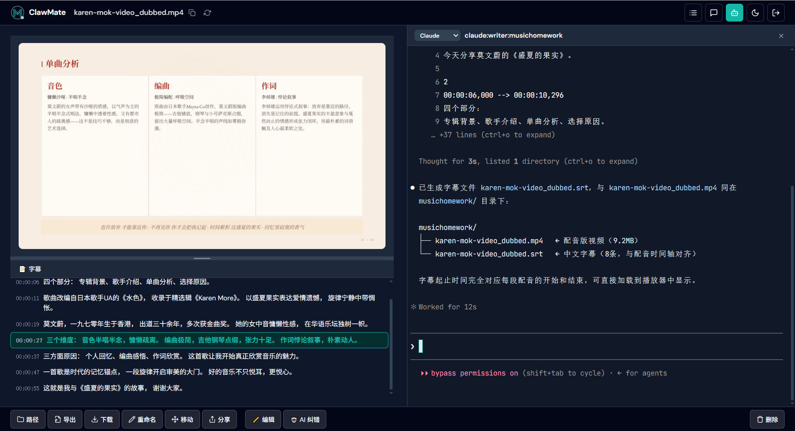
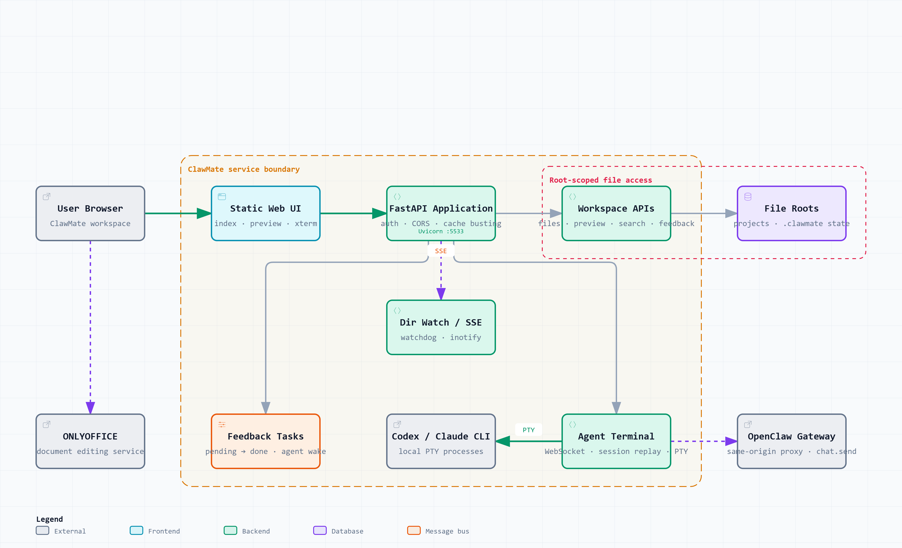

<p align="center">
  
</p>

# ClawMate

> 远程文件管理 · Agent 终端 · 预览反馈闭环 · 多后端协作

<!-- ALL-CLAWMATE-BADGES:START -->
[](LICENSE)
<!-- ALL-CLAWMATE-BADGES:END -->

ClawMate 是面向多种 Agent 工具的**一站式工作流中台**，以产出物为核心，重点承载文件管理与项目管理；Claude Code、Codex、OpenClaw 等 Agent 是可自由接入的执行工具，也是放大工作效率的能力引擎。ClawMate 将文件、项目、预览、协作和执行能力汇聚到同一个工作空间，形成“发现问题 → 发起反馈 → Agent 执行 → 回看结果”的持续迭代闭环：

1. **远程文件管理** — 以多 root 目录树为入口，覆盖上传、搜索、预览、移动、分享和下载等完整文件生命周期。
2. **项目管理能力** — 支持将普通目录快速转换为项目，并结合 Git 集成、五阶段分层计划（Phase I-V）和 CLAWLIST 进度跟踪，持续细化项目目标；支持项目隔离、会话隔离与多会话并行推进。
3. **多 Agent 集成能力** — 提供统一的 Agent 面板，支持 Claude Code、Codex 和 OpenClaw 三类后端自由切换；以项目为核心组织多 Agent 协同，支持会话历史回放。Claude/Codex 通过 xterm.js PTY 提供完整 CLI，OpenClaw 通过 Markdown 聊天与 Gateway 协议协作。
4. **全格式文档预览与编辑能力** — 开箱支持 Markdown（Mermaid/KaTeX）、Office（ONLYOFFICE）、PDF、代码高亮、图片、音视频和压缩包，并为可编辑格式提供在线修改与保存回写能力。
5. **Agent 及时交互反馈能力** — Agent 可自动识别当前项目；用户在预览页选中内容即可精确定位文件与上下文，反馈支持多任务延迟合并提交，并进入 `pending → in_progress → done/failed` 状态机；任务可直接注入活跃 PTY，或通过 webhook 唤醒 Agent。
6. **Skill 连接人与 Agent 的桥梁** — 通过 `/clawmate` Skill 在 Agent 中生成可访问的 ClawMate 链接、自动切换 ClawMate 项目，并统一调用文件、项目和反馈能力。ClawMate 与 Agent 既能深度协同，也可完全独立工作，保留灵活的使用方式。

在浏览器中，用户无需离开 ClawMate，即可完成从文件浏览、项目协作到 AI 执行和结果复核的完整闭环。

### 业务架构


```mermaid
flowchart LR
    subgraph AGENT_GROUP["Agent 后端"]
        direction LR
        CC["🤖 Claude Code"]
        CX["⚡ Codex"]
        OC["🔗 OpenClaw"]
    end

    SKILL["Skill<br/>/clawmate 命令入口"]
    CM["ClawMate<br/>一站式中台"]

    subgraph DOMAIN_GROUP["ClawMate 业务域"]
        direction LR
        FS["📁 filesystem<br/>文件管理"]
        PJ["📋 project<br/>项目管理"]
        FB["💬 feedback<br/>反馈闭环"]
    end

    AGENT_GROUP --> SKILL --> CM
    CM -->|Agent CLI| AGENT_GROUP
    CM --> DOMAIN_GROUP

```

| 层级 | 说明 |
|------|------|
| **Agent 层** | Claude Code、Codex、OpenClaw 三类 Agent，经 Skill 发起请求，并通过对应 Agent CLI 接收执行结果 |
| **Skill 层** | `/clawmate ...` 命令入口，负责把 Agent 请求转换为可执行的 ClawMate 操作 |
| **中台层** | ClawMate 统一编排 filesystem、project、feedback 三大业务域，并调度 Agent CLI 执行任务 |

> 图中连线表示能力关系，不代表后端绑定。三个 Agent 可自由切换，并通过同一 Skill 入口访问 ClawMate 的文件、项目和反馈能力。

---

## 六大核心能力

### 1. 远程文件管理

多 root 目录树浏览，覆盖完整文件生命周期：

| 操作 | 能力 |
|------|------|
| 浏览 | 画廊/列表双视图、类型过滤、多字段排序 |
| 目录监控 | watchdog/inotify 事件驱动；当前目录变更自动刷新，并对新增/修改条目打会话级「新增/已修改」标记（刷新/切目录/打开文件即消失） |
| 搜索 | 递归全文搜索，彩色文件类型标签 |
| 上传 | 拖拽上传 + Ctrl+V 剪切板粘贴图片 |
| 组织 | 新建目录、重命名、移动、删除 |
| 分享 | 24h 免登录分享链接，全格式支持 |
| 下载 | 单文件下载 + 压缩包在线解压预览 |

### 2. Agent 项目管理

围绕 AI Agent 工作流的项目全生命周期：

- **`/clawmate init`** — 一键初始化标准项目结构（CLAWLIST + PROJECT_NOTE + research/prd/dev/test）
- **`/clawmate plan`** — 五阶段分层计划（Phase I 初始化 → II 需求澄清 → III 信息收集 → IV MRD → V PRD）
- **`/clawmate project`** — 秒级切换会话上下文，Agent 自动加载项目状态
- `.clawmate/` marker 自动识别项目边界，多项目并行 + session 隔离

### 3. 多 Agent 后端

右上角一键切换后端，无需修改配置：

| 后端 | 模式 | 交互 |
|------|------|------|
| **Claude Code** | xterm.js PTY 终端 | 完整 CLI（Read/Write/Edit/Bash），60fps |
| **Codex** | xterm.js PTY 终端 | 完整 CLI（Read/Write/Edit/Bash），60fps |
| **OpenClaw** | Markdown 聊天 | chat.send 协议，Gateway 多 Agent 协作 |

**OpenClaw 细节**：浏览器经同源 `wss://…/api/clawmate/agent/openclaw` 代理连接 Gateway（协议 v4），凭证/令牌留在服务端；会话按 `root + project + 面板实例` 三级隔离，跨项目/多标签不串；并把会话工作目录钉到 `resolve_session_cwd()` 指向的项目目录，使 openclaw 的文件工具与 `pwd` 作用于所打开的项目而非默认工作区；人格从各 agent 自身工作区读取。

Feedback 任务智能路由：PTY 活跃时直接注入终端执行，否则通过 webhook 唤醒。

### 4. 文件预览

点击即渲染：

文件管理页支持一键“添加到会话”，将文件路径发送到 Agent 终端。

**全格式预览**：

| 类型 | 能力 |
|------|------|
| Markdown | Mermaid / KaTeX / 语法高亮 / 大纲导航 |
| Mermaid 图表 | 缩放 + 拖拽平移 + 全屏展开 |
| Office 文档 | ONLYOFFICE 嵌入（编辑/只读） |
| PDF | pdf.js 预览 + 大纲跳转 |
| 压缩包 | zip / tar / 7z / rar 树形展开 |
| 代码 | 12 种语言语法高亮 + 函数/类大纲索引 |
| 图片 | ‹ › 导航切换 + 缩略图大纲 |
| 音视频 | 内嵌播放器 + 字幕同步 |

### 5. 反馈评审与 AI 修复

预览页选中代码段即可通过浮动按钮创建反馈，AI 自动修改：

**反馈卡流转（按页面与过滤器）**：


```mermaid
flowchart LR
    subgraph Share[分享页：外部评审人]
        direction TB
        ShareDraft[待提交过滤器<br/>卡片可编辑：定位、建议、操作<br/>删除：仅移除本地草稿]
        ShareSubmitted[已提交过滤器<br/>卡片只读：仅限该分享链接和文件<br/>删除：移除已提交反馈]
        ShareDraft -->|提交评审| ShareSubmitted
    end

    subgraph Review[项目内预览页：评审面板]
        direction TB
        ReviewDraft[待提交过滤器<br/>卡片可编辑<br/>删除：移除本地草稿]
        Pending[待评审过滤器<br/>卡片可编辑：核对定位、建议、操作]
        Approved[已评审过滤器<br/>卡片只读：等待执行]
        Rejected[已拒绝过滤器<br/>拒绝卡／已取消卡，均只读]
        Running[已执行过滤器：执行中<br/>卡片只读，不能取消]
        Done[已执行过滤器：已执行<br/>卡片只读，可查看结果]
        Failed[已执行过滤器：执行失败<br/>卡片只读，项目成员人工处理]

        ReviewDraft -->|提交评审| Pending
        Pending -->|评审通过| Approved
        Pending -->|评审拒绝| Rejected
        Pending -->|取消：状态标记为 deleted| Rejected
        Approved -->|执行反馈：创建任务并唤醒 Agent| Running
        Approved -->|取消：状态标记为 deleted| Rejected
        Running -->|执行成功| Done
        Running -->|执行失败| Failed
    end

    ShareSubmitted -->|同一张已提交卡进入项目评审队列| Pending
    Rejected -->|删除：物理移除卡片| Removed([不再显示])
    Running -->|删除：物理移除卡片| Removed
    Done -->|删除：物理移除卡片| Removed
    Failed -->|删除：物理移除卡片| Removed
    ShareSubmitted -->|删除：移除反馈| Removed

    classDef share fill:#eef6ff,stroke:#4f82b8,color:#163b63
    classDef draft fill:#edf8f0,stroke:#4f9b68,color:#174b2c
    classDef active fill:#fff7df,stroke:#c99228,color:#5c4100
    classDef readonly fill:#f4f4f5,stroke:#71717a,color:#27272a
    classDef removed fill:#fdf2f2,stroke:#b84f4f,color:#631616
    class ShareDraft,ShareSubmitted share
    class ReviewDraft draft
    class Pending,Approved,Running active
    class Rejected,Done,Failed readonly
    class Removed removed
```

> 分享链接只绑定一个文件。外部评审人只能维护其“待提交／已提交”卡片；同一张提交后的卡会出现在项目成员的“待评审”过滤器中，但分享页不提供评审或执行操作。

**反馈闭环**：

```
待提交 → 提交评审 → 待评审 → 评审通过 → 已评审 → 执行反馈 → 执行中 → 已执行／执行失败
                              └────────────→ 评审拒绝／取消 → 已拒绝／已取消
```

连续选中多个位置统一提交，反馈 timeline 全程可追溯，修改完成后可重新评审进入下一轮迭代。

### 6. 按文件类型 AI 扩展

不同文件类型触发不同的 AI 能力：

| 类型 | AI 扩展 |
|------|---------|
| 音视频 | 字幕提取（whisper） + 字幕编辑器 + 时间轴同步预览 |
| 代码 | 12 语言函数/类大纲自动索引，click-to-scroll |
| Office | ONLYOFFICE 在线编辑，保存后自动回写 |
| 压缩包 | 在线解压浏览，支持嵌套目录 |

扩展通过 `task_templates` 体系注册，新文件类型可插拔接入。

### 7. Skill 驱动关联

通过 Skill 体系联动项目、链接与 feedback：

| 命令 | 用途 |
|------|------|
| `/clawmate link <filename>` | 搜索文件生成可点击预览链接 |
| `/clawmate init [root] <project>` | 项目初始化 |
| `/clawmate plan [root] <project>` | 规划/更新项目计划 |
| `/clawmate list [root_id]` | 列出 root 下所有项目 |
| `/clawmate feed [status] [project]` | 查询 feedback 列表 |
| `/clawmate do [#ID]` | 批量处理待办反馈 |
| `/clawmate project <projectname>` | 切换会话到指定项目 |

> 📖 完整命令参数见 [skills/clawmate/SKILL.md](skills/clawmate/SKILL.md)

---

## 截图

### 文件管理 + Agent 面板



*多 root 切换 · 项目与目录分离 · 画廊/列表双视图 · 类型过滤排序 · 右侧 Agent 终端随时唤醒*

### 预览 + 大纲 + 反馈



*左侧大纲导航 · 中间 Markdown 渲染（Mermaid/KaTeX）· 选中文本弹出反馈浮层 · 右侧 feedback panel 状态追踪 · 底部操作栏*

### 视频 + 字幕提取



*视频播放与控制 · 字幕一键提取（faster-whisper）· SRT 生成与下载*

---

## 快速开始

### Docker 部署（推荐）

```bash
docker build -t clawmate:latest .
cp config.example.json config.json
# 编辑 config.json，填入目录路径

docker run -d \
  --name clawmate \
  --restart unless-stopped \
  -p 5533:5533 \
  -v $(pwd)/config.json:/app/config.json:ro \
  -v /your/data:/data \
  clawmate:latest
```

### 本地启动

```bash
cp config.example.json config.json
python3 -m venv dev/.venv
dev/.venv/bin/pip install -r requirements.txt
cd dev && ../.venv/bin/python main.py
```

### 一键部署（systemd）

```bash
sudo bash install.sh              # 安装到当前目录
sudo bash install.sh /opt/clawmate # 安装到指定路径
```

### 与 OpenClaw 集成

```bash
openclaw skills install clawmate
openclaw gateway restart
```

在 `config.json` 中配置 gateway 连接：

```json
{
  "openclaw": {
    "gateway_url": "http://127.0.0.1:18789",
    "hook_token": "your-hook-token"
  }
}
```

---

## 系统架构

[](docs/architecture/clawmate-runtime-architecture.html)

---

## 配置参考

```json
{
  "roots": [
    {
      "id": "example",
      "label": "示例目录",
      "dir": "/data/example",
      "agent_id": "main"
    }
  ],
  "defaultRootId": "example",
  "port": 5533,
  "public_base_url": "http://clawmate.lan:5533",
  "agent": {
    "backend": "claude",
    "max_sessions": 10,
    "env": {}
  },
  "openclaw": {
    "gateway_url": "http://127.0.0.1:18789",
    "hook_token": ""
  },
  "onlyoffice": {
    "api_js_url": "http://onlyoffice.lan/web-apps/apps/api/documents/api.js",
    "mode": "edit"
  },
  "auth": {
    "username": "admin",
    "password_hash": "",
    "session_ttl_minutes": 480
  }
}
```

### 认证

```bash
# 交互式设置密码（推荐）
python3 main.py --set-password

# 或手动生成 bcrypt hash
python3 -c "import bcrypt; print(bcrypt.hashpw(b'你的密码', bcrypt.gensalt()).decode())"
```

启用后，`127.0.0.1` 及 `auth.local_hosts` 中的主机自动绕过认证。

---

*ClawMate — 让 Agent 的输出不再是一次性的，而是可以不断打磨的作品。*
