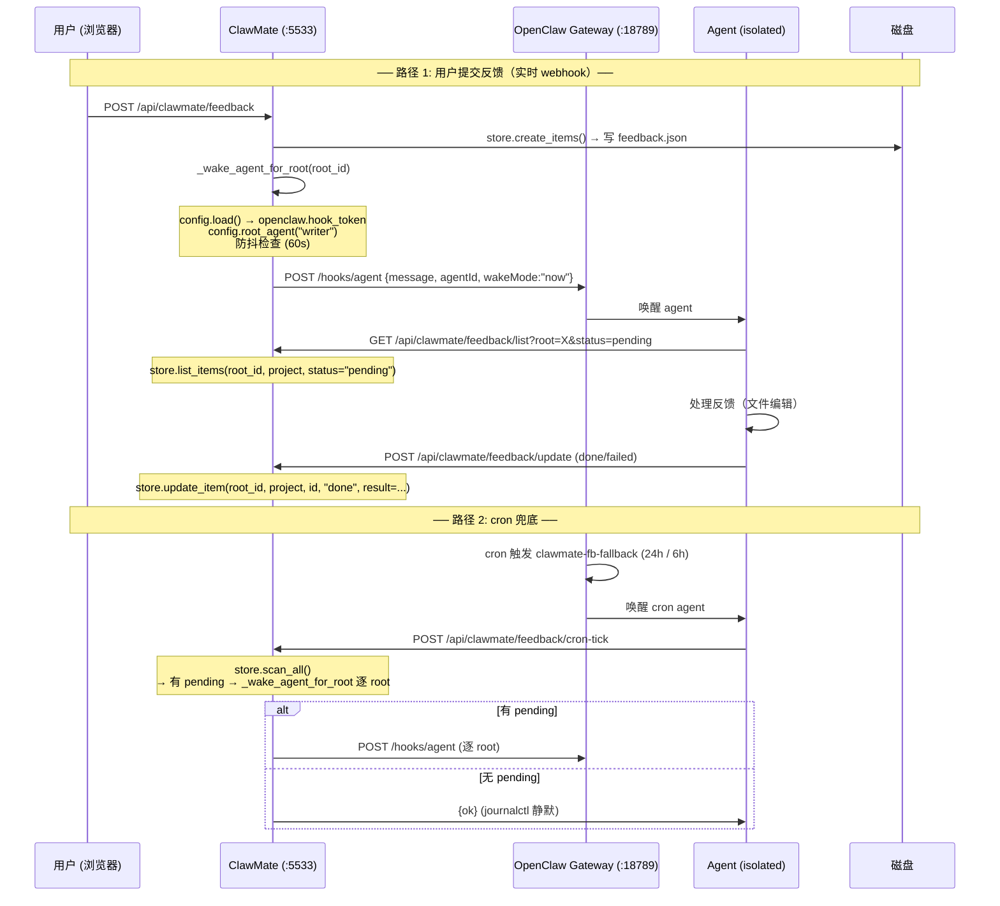

# ClawMate 反馈闭环 — 完整设计方案

> 评审稿 · 2026-06-06
> 合并自：WEBHOOK-FEEDBACK-DESIGN.md v2 + STORE-CONFIG-DESIGN.md

---

## 一、整体架构概览



**角色职责**：

| 角色 | 干的事 | 不干的事 |
|------|--------|---------|
| **ClawMate** | 持久化反馈、查 pending、唤醒 agent | 不处理反馈内容，不调 LLM |
| **OpenClaw Gateway** | 收 /hooks/agent、起 agent session | 不解析反馈内容 |
| **Agent** | 查反馈列表、编辑文件、改状态 | 直接写 feedback.json |
| **Cron** | 24h 兜底唤醒 agent | 逐条处理告、不携带反馈详情 |

---

## 二、ConfigLoader — dev/config.py

### 设计原则

- 模块级单例，TTL 60s 缓存，mtime 变化即 invalidate
- 访问路径类型化，不暴露原始 dict
- 所有现有 `cfg.get(...)` 散装读取 → 统一走 config 对象

### 类型定义

```python
# dev/config.py

from __future__ import annotations
from dataclasses import dataclass, field
from pathlib import Path
import os, json, time


@dataclass
class RootEntry:
    id: str
    label: str
    dir: str          # 绝对路径
    agent_id: str = "default"


@dataclass
class OpenClawConfig:
    gateway_url: str = "http://127.0.0.1:18789"
    hook_token: str = ""


@dataclass
class FeedbackTag:
    label: str = ""
    prompt: str = ""


@dataclass
class FeedbackConfig:
    tags: list[FeedbackTag] = field(default_factory=list)


@dataclass
class OnlyOfficeConfig:
    api_js_url: str = ""
    jwt_secret: str = ""
    mode: str = "edit"
    callback_url: str = ""


@dataclass
class AuthConfig:
    username: str = "admin"
    password_hash: str = ""
    session_ttl_minutes: int = 480


@dataclass
class AppConfig:
    roots: list[RootEntry] = field(default_factory=list)
    default_root_id: str = ""
    port: int = 5533
    max_upload_mb: int = 100
    public_base_url: str = ""
    fallback_cron_interval: str = "24h"
    openclaw: OpenClawConfig = field(default_factory=OpenClawConfig)
    feedback: FeedbackConfig = field(default_factory=FeedbackConfig)
    onlyoffice: OnlyOfficeConfig = field(default_factory=OnlyOfficeConfig)
    auth: AuthConfig = field(default_factory=AuthConfig)

    # ── 便捷方法 ──
    def root_agent(self, root_id: str) -> str:
        for r in self.roots:
            if r.id == root_id:
                return r.agent_id
        return "default"

    def root_dir(self, root_id: str) -> Path:
        for r in self.roots:
            if r.id == root_id:
                return Path(r.dir).expanduser().resolve()
        raise ValueError(f"Root not found: {root_id}")


# ── 单例 ─────────────────────────────────────────────────────────────

_CONFIG_PATH: Path | None = None
_CONFIG_CACHE: tuple[float, AppConfig] | None = None
_CONFIG_TTL: int = 60


def set_config_path(path: str | Path) -> None:
    """main.py 启动时调用（取代 setdefault CLAWMATE_CONFIG）。"""
    global _CONFIG_PATH
    _CONFIG_PATH = Path(path)


def load() -> AppConfig:
    """读 config.json，缓存 TTL 60s。"""
    global _CONFIG_CACHE
    now = time.time()
    if _CONFIG_CACHE is not None:
        loaded_at, cfg = _CONFIG_CACHE
        if now - loaded_at < _CONFIG_TTL:
            return cfg
    path = _CONFIG_PATH or Path(os.environ.get("CLAWMATE_CONFIG", "config.json"))
    raw = {}
    try:
        raw = json.loads(path.read_text(encoding="utf-8"))
    except (FileNotFoundError, json.JSONDecodeError):
        pass
    cfg = _parse_config(raw)
    _CONFIG_CACHE = (now, cfg)
    return cfg


def _parse_config(raw: dict) -> AppConfig:
    roots = [
        RootEntry(id=r.get("id",""), label=r.get("label",""),
                  dir=r.get("dir",""), agent_id=r.get("agent_id","default"))
        for r in (raw.get("roots") or []) if isinstance(r, dict) and r.get("id")
    ]
    oc = raw.get("openclaw") or {}
    fb = raw.get("feedback") or {}
    oo = raw.get("onlyoffice") or {}
    ac = raw.get("auth") or {}
    return AppConfig(
        roots=roots,
        default_root_id=raw.get("defaultRootId",""),
        port=int(raw.get("port",5533)),
        max_upload_mb=int(raw.get("max_upload_mb",100)),
        public_base_url=str(raw.get("public_base_url","")),
        fallback_cron_interval=str(raw.get("fallback_cron_interval","24h")),
        openclaw=OpenClawConfig(
            gateway_url=str(oc.get("gateway_url","http://127.0.0.1:18789")),
            hook_token=str(oc.get("hook_token","")),
        ),
        feedback=FeedbackConfig(tags=[
            FeedbackTag(label=t.get("label",""), prompt=t.get("prompt",""))
            for t in (fb.get("tags") or []) if isinstance(t, dict)
        ]),
        onlyoffice=OnlyOfficeConfig(
            api_js_url=str(oo.get("api_js_url","")),
            jwt_secret=str(oo.get("jwt_secret","")),
            mode=str(oo.get("mode","edit")),
            callback_url=str(oo.get("callback_url","")),
        ),
        auth=AuthConfig(
            username=str(ac.get("username","admin")),
            password_hash=str(ac.get("password_hash","")),
            session_ttl_minutes=int(ac.get("session_ttl_minutes",480)),
        ),
    )
```

### 迁移映射

| 旧写法 | 新写法 |
|--------|--------|
| `cfg.get("roots", [])` | `config.roots` |
| `r.get("agent_id", "default")` | `config.root_agent(root_id)` |
| `resolve_root(root_id)`（Path 建立） | `config.root_dir(root_id)` |
| `oc = cfg.get("openclaw", {})` → `oc.get("hook_token")` | `config.openclaw.hook_token` |
| `fb_cfg = cfg.get("feedback", {})` → `fb_cfg.get("tags")` | `config.feedback.tags` |
| `oo_cfg = cfg.get("onlyoffice", {})` → `oo_cfg.get("api_js_url")` | `config.onlyoffice.api_js_url` |
| `ac = cfg.get("auth", {})` → `ac.get("password_hash")` | `config.auth.password_hash` |
| `cfg.get("port", 5533)` | `config.port` |
| `cfg.get("public_base_url", "")` | `config.public_base_url` |
| ~~`cfg.get("llm", {})`~~ | 已删除（死代码，LLM 操作全部走 OpenClaw agent） |

---

## 三、FeedbackStore — dev/store.py

### 设计原则

- 纯函数集，无状态
- 输入 `(root_id, project)`，读写 `feedback.json`
- 不管理 session/auth，只做文件 I/O
- 写操作原子化（`tmp + os.replace`）

### 接口

```python
# dev/store.py

from __future__ import annotations
from pathlib import Path
from feedback_schema import FEEDBACK_STATUSES, FeedbackItem


FeedbackItem 字段定义（来自 feedback_schema.py，此处引用以保持完整）：
- id (str): FD-{abbr}-{NNNN}
- status (str): pending | in_progress | done | failed
- file (str): 相对路径
- note (str): 用户备注/指令（action 隐式编码在此）
- content (str): 选中原文
- position (str): L{startLine}-{endLine} 或媒体时间戳
- updated (str): YYYY-MM-DD HH:MM:SS
- result (str): 处理结果摘要


# ── 读 ─────────────────────────────────────────────────────────────

def list_items(
    root_id: str,
    project: str,
    status: str = "",
    file: str = "",
    since: str = "",
) -> tuple[list[FeedbackItem], int]:
    """
    列出指定 project 的反馈条目。

    Args:
        status: ""=全部 | "all"=全部 | "pending"/"done" 等
        file: 文件名模糊匹配
        since: "today" | "YYYY-MM-DD"

    Returns:
        (items[], total_pending)
    """


def status_count(root_id: str, project: str) -> dict[str, int]:
    """
    返回该 project 的 {pending, in_progress, done, failed} 计数。
    """


# ── 写 ─────────────────────────────────────────────────────────────

def create_items(
    root_id: str,
    project: str,
    file_path: str,
    selections: list[dict],
    preview_url: str = "",
) -> list[FeedbackItem]:
    """
    写入新反馈。

    selections 每项字段：
    - text (str, 必填): 选中原文 → 存到 item.content
    - note (str, 可选): 用户备注 / pst-tag data-tag → 存到 item.note
    - startLine, endLine (int, 可选): 文本选区行号 → 拼成 "L{startLine}-{endLine}" 存到 item.position
    - position (str, 可选): 媒体/office 时间戳 → 直接存到 item.position

    内部：
    - 去重（同 content + file 跳过）
    - 自增 ID: FD-{abbr}-{NNNN}
    - 原子写 feedback.json
    - journalctl INFO 日志

    Returns:
        新建的条目列表
    """


def update_item(
    root_id: str,
    project: str,
    item_id: str,
    new_status: str,
    result: str = "",
) -> FeedbackItem:
    """
    更新反馈状态。

    Raises:
        ValueError: new_status 不合法
        FileNotFoundError: feedback.json 不存在
        LookupError: item_id 不存在
    """


# ── 扫描 ──────────────────────────────────────────────────────────

class ScanResult:
    checked_roots: int = 0
    pending_total: int = 0
    pending_roots: list[str] = []
    errors: list[str] = []


def scan_all() -> ScanResult:
    """
    扫描所有 root 下所有 project 的 feedback.json。
    不抛异常（日志记录错误）。
    由 cron-tick 端点调用。
    """


def project_abbr(project: str) -> str:
    """从 project 名生成 2 字符缩写。"""
```

### 迁移映射

| 旧调用 | 新调用 |
|--------|--------|
| `_get_feedback_path(root_id, project)` | 内部实现，不暴露 |
| `_read_feedback_json(path)` | `store.list_items(root_id, project)` |
| `_filter_items(path, status, file, since)` | `store.list_items` 参数 |
| `fb_path.write_text(...)` | `store.create_items` / `store.update_item` |
| `_build_feedback_json(...)` | 内部实现 |
| `_project_abbr(project)` | `store.project_abbr(project)` |
| routes.py SRT 内联读写 | `store.create_items(...)` |
| `cleanup_old_feedback()` | **后续版本考虑**，当前不迁移 |

---

## 四、`_wake_agent_for_root` 定位与实现

### 职责

通知对应 root 的 agent 有待处理反馈。只管"按铃"。

### 实现逻辑

```python
def _wake_agent_for_root(root_id: str) -> None:
    """
    1. config.load() → openclaw.hook_token / gateway_url
    2. config.root_agent(root_id) → agent_id
    3. 防抖检查（60s 同 root 跳过）
    4. journalctl INFO 日志
    5. 后台线程 POST /hooks/agent

    message 自包含（不加载任何模板）：
      "ClawMate 反馈通知：root_id={root_id} 有待处理反馈。
       请自行 GET {base_url}/api/clawmate/feedback/list?root={root_id}&status=pending
       获取待处理列表并逐条处理。"
    """
```

### 被谁调用

| 调用方 | 时机 |
|--------|------|
| `feedback_create` (用户提交) | store.create_items 后立即调用 |
| `cron-tick` (兜底) | scan_all 扫描到某 root pending > 0 |

---

## 五、POST /api/clawmate/feedback/cron-tick

### 定位

cron 的唯一入口。响应仅 `{"ok": true}`，统计走 journalctl。

### 实现逻辑

```python
@router.post("/api/clawmate/feedback/cron-tick")
async def cron_tick():
    """
    1. store.scan_all()
    2. 有 pending → _wake_agent_for_root 逐 root
    3. journalctl INFO 日志记录
    4. 返回 {"ok": true}
    """
```

### Auth

127.0.0.1 免 auth（AuthMiddleware localhost bypass）

### 请求/响应

```json
请求: {}
响应: {"ok": true}
```

---

## 六、接口全集

### 6.1 ClawMate → OpenClaw Gateway（内部调用）

#### `POST /hooks/agent`

```json
{
  "message": "ClawMate 反馈通知：root_id=writer 有待处理反馈。\n请自行 GET http://127.0.0.1:5533/api/clawmate/feedback/list?root=writer&status=pending\n获取待处理列表并逐条处理。",
  "agentId": "writer",
  "name": "clawmate-fb-writer",
  "wakeMode": "now",
  "deliver": false
}
```

- **Auth**: `Authorization: Bearer <config.openclaw.hook_token>`
- **触发**: `_wake_agent_for_root` 内

---

### 6.2 ClawMate API（Agent / 浏览器调用）

#### `POST /api/clawmate/feedback` — 提交反馈

| 字段 | 说明 |
|------|------|
| Auth | 需 session（浏览器用户） |
| body | `{root, project, path, selections: [{text, note?, position?}]}` |
| 实现 | `store.create_items(...)` + `_wake_agent_for_root(...)` |
| response | `{ok, ids[], feedbackFile, previewUrl}` |

#### `GET /api/clawmate/feedback/list?root=X&status=pending`

| 字段 | 说明 |
|------|------|
| Auth | 127.0.0.1 免 auth |
| 实现 | `store.list_items(...)` |
| response | `{total_pending, results: [{root, project, items: [...]}]}` |

#### `POST /api/clawmate/feedback/update`

| 字段 | 说明 |
|------|------|
| Auth | 127.0.0.1 免 auth |
| body | `{root, project, id, status, result?}` |
| 实现 | `store.update_item(...)` |
| response | `{ok, id, newStatus}` |

#### `GET /api/clawmate/feedback/status?root=X&project=Y`

| 字段 | 说明 |
|------|------|
| 实现 | `store.status_count(...)` |
| response | `{feedbackFile, exists, counts: {...}, items}` |

#### `POST /api/clawmate/feedback/cron-tick` (🆕)

| 字段 | 说明 |
|------|------|
| Auth | 127.0.0.1 免 auth |
| 实现 | `store.scan_all()` + `_wake_agent_for_root` |
| response | `{"ok": true}` |

---

## 七、cron 模板

`dev/cron_template.txt` 全文：

```
执行 POST {base_url}/api/clawmate/feedback/cron-tick
其余由 ClawMate 自动处理。无 pending 时不输出。
```

注意：此模板仅用于 cron job 的 message，**不再**被 webhook 消息引用。webhook 消息直接内联在 `_wake_agent_for_root` 代码中。

---

## 八、文件变更清单

| 操作 | 文件 | 说明 |
|------|------|------|
| 新增 | `dev/config.py` | ConfigLoader 单例 + 类型化 data class |
| 新增 | `dev/store.py` | feedback CRUD 纯函数集 |
| 重写 | `dev/feedback_api.py` | 散装函数 → store.* + config.load()；message 内联；新增 cron-tick 端点 |
| 修改 | `dev/routes.py` | SRT 内联 → store.create_items()；/config → config.load() |
| 修改 | `dev/service.py` | `_load_config()` 内部改为 `config.load()` |
| 修改 | `dev/auth.py` | `config.get("auth")` → `config.load().auth` |
| 修改 | `dev/main.py` | 启动改为 `config.set_config_path()` + `config.load()` |
| 重写 | `dev/cron_template.txt` | 逐条处理告 → "call cron-tick" |
| 清理 | `dev/subtitle.py` | 删除 `correct_srt` / `_load_llm_config` / `_parse_srt` / `_build_srt`（死代码） |
| 删除 | `dev/feedback_api.py` | `_build_agent_message()` / `_load_cron_template()` / `_build_action_list()` / `_archive_feedback_items()` / `cleanup_old_feedback()` |
| 保留 | `dev/constants.py` | env 常量名仍有引用价值 |
| 保留 | `dev/feedback_schema.py` | 标准字段名定义保持权威 |

### 不做的事

- ❌ cron-tick 不配独立 token（127.0.0.1 loopback 免 auth）
- ❌ 不改 `hooks.mappings`（v1.25 已删）
- ❌ 不改 `feedback.json` 格式
- ❌ 不改 openmedia/webroot
