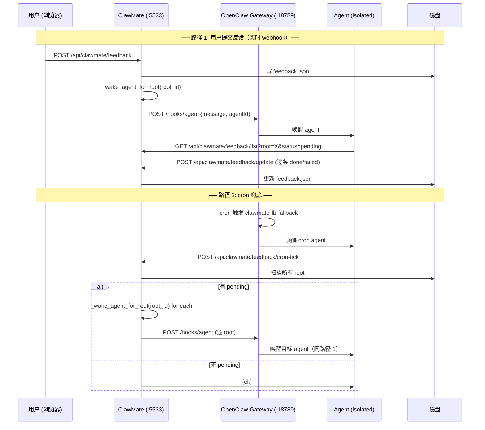

# ClawMate 反馈闭环 — Webhook 交互方案

> 评审稿 v2 · 2026-06-06
> 基于 v1.25 重构后的架构

---

## 一、整体交互流



## 二、`_wake_agent_for_root` 的定位

**职责**：通知对应 root 的 agent 有待处理反馈。

**不做的事**：
- ❌ 不携带反馈详情（agent 自行查询）
- ❌ 不加载 cron_template.txt 作为 message
- ❌ 不负责处理反馈内容本身

**做什么**：

```
输入: root_id （如 "writer"）
动作:
1. 读 config.json → 解析该 root 的 agent_id
2. 防抖检查 (60s 同 root 跳过)
3. journalctl INFO 日志记录
4. POST /hooks/agent {message, agentId, wakeMode:"now", deliver:false}
   message 内容（自包含，不依赖模板）:

   "ClawMate 反馈通知：root_id=writer 有待处理反馈。
    请自行 GET {base_url}/api/clawmate/feedback/list?root=writer&status=pending
    获取待处理列表并逐条处理，完成后 POST /update 更新状态。"
```

**message 也自包含**：不再 load cron_template.txt，不通过 `_build_agent_message` 构造。

**调用方**：
| 调用方 | 时机 |
|--------|------|
| `feedback_create` (用户提交) | 写入 feedback.json 后立即调用 |
| `cron-tick` (兜底) | 扫描到某 root 有 pending > 0 时调用 |

---

## 三、POST /api/clawmate/feedback/cron-tick

### 定位

cron 的唯一入口。cron agent 调这个端点，ClawMate 内部扫全量 root，有 pending 则唤醒对应 agent。

### Auth

127.0.0.1 免 auth（cron agent 通过 loopback 调用）

### Request

```json
{}
```

（body 当前不需要扩展字段，保留 future 兼容）

### Response

```json
{ "ok": true }
```

### 副作用

- 扫描所有 root 的 feedback.json，统计 pending
- 对有 pending 的 root 调用 `_wake_agent_for_root(root_id)`
- journalctl INFO 日志记录扫描结果（代替 response 暴露详情）

### 不做的事

- ❌ 不在 response 里返回 pending 统计（journalctl 可查）
- ❌ 不处理反馈内容本身
- ❌ 不给 cron-tick 配独立 token（127.0.0.1 loopback 免 auth 足够）

---

## 四、接口全集

### 4.1 ClawMate → OpenClaw Gateway（内部调用）

#### `POST /hooks/agent`

```json
{
  "message": "ClawMate 反馈通知：root_id=writer 有待处理反馈。
    请自行 GET http://127.0.0.1:5533/api/clawmate/feedback/list?root=writer&status=pending
    获取待处理列表并逐条处理，完成后 POST /update 更新状态。",
  "agentId": "writer",
  "name": "clawmate-fb-writer",
  "wakeMode": "now",
  "deliver": false
}
```

**触发时机**：`_wake_agent_for_root()` 内。
**Auth**: `Authorization: Bearer <config.json openclaw.hook_token>`

---

### 4.2 ClawMate API（Agent 调用，127.0.0.1 免 auth）

#### `POST /api/clawmate/feedback` — 用户提交反馈

**Auth**: 需登录 session（浏览器用户）

```json
{
  "root": "writer",
  "project": "content-studio",
  "path": "content-studio/draft.md",
  "selections": [{"text": "...", "note": "...", "position": "L20-30"}]
}
```

#### `GET /api/clawmate/feedback/list?root=writer&status=pending`

**Auth**: 127.0.0.1 免 auth

```json
{
  "total_pending": 3,
  "results": [{
    "root": "writer", "project": "content-studio",
    "items": [{"id": "FD-CS-0001", "status": "pending", "file": "...", "note": "...", "content": "...", "position": "L20-30", "updated": "...", "result": ""}]
  }]
}
```

#### `POST /api/clawmate/feedback/update`

**Auth**: 127.0.0.1 免 auth

```json
{
  "root": "writer",
  "project": "content-studio",
  "id": "FD-CS-0001",
  "status": "done",
  "result": "已按建议修改"
}
```

#### `POST /api/clawmate/feedback/cron-tick` — 兜底入口 🆕

**Auth**: 127.0.0.1 免 auth

```json
请求: {}
响应: {"ok": true}
```

---

## 五、cron 模板

`cron_template.txt` 全文：

```
执行 POST {base_url}/api/clawmate/feedback/cron-tick
其余由 ClawMate 自动处理。无 pending 时不输出。
```

---

## 六、关键变更清单

| 变更 | 文件 | 说明 |
|------|------|------|
| 新增 | `feedback_api.py` | `POST /api/clawmate/feedback/cron-tick` 端点 |
| 重写 | `feedback_api.py` | `_build_agent_message` 删除，message 改为内联字符串 |
| 重写 | `cron_template.txt` | 从逐条处理告改为 "call cron-tick" |
| 删除 | `feedback_api.py` | `_build_agent_message()` / `_load_cron_template()` / `_build_action_list()` 这些函数不再需要 |
| 验证 | — | 5533 200、18443 200 |

注意：`cron_template.txt` 仍然保留，但只用于 cron job 的 message（agent 看到后调 cron-tick），不再被 webhook 消息引用。
