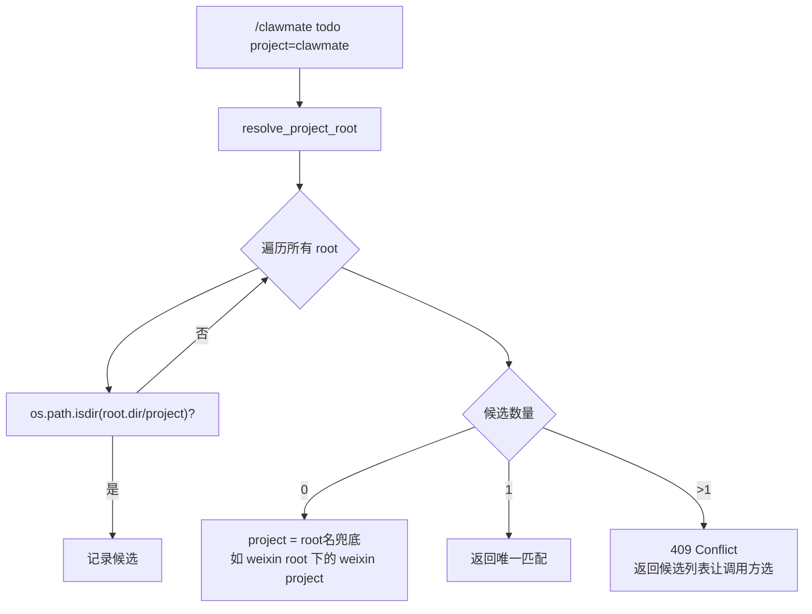
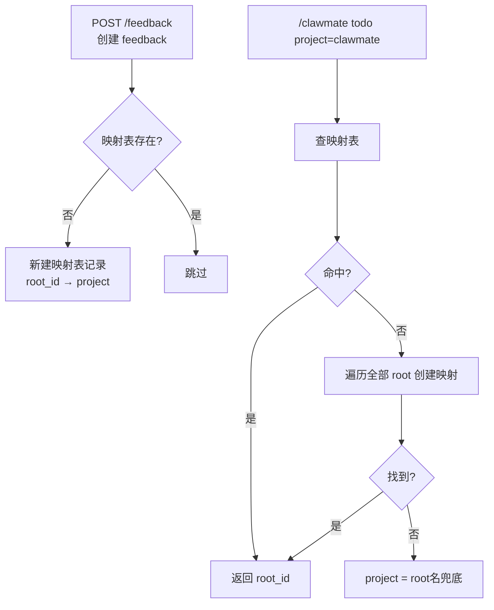

# 技术方案评审 — Feedback 接口 project 定位机制

**版本**: v1.0
**日期**: 2026-06-01
**状态**: 待决策
**背景**: CLAWLIST §待决策 — project 定位机制重构

---

## 1. 问题定义

### 1.1 现状

ClawMate 反馈系统的所有 API 强制要求同时传入 `root` 和 `project` 两个参数：

```
GET  /feedback/list?root=webprojects&project=clawmate
POST /feedback       → { root, project, path, selections }
POST /feedback/update → { root, project, id, status }
```

### 1.2 矛盾点

| 调用方 | root 来源 | 问题 |
|--------|----------|------|
| **Web 前端** | URL 参数 `?root=xxx`，始终已知 | ✅ 无问题 |
| **OpenClaw Skill** | `/clawmate todo project=clawmate` | ❌ 不知道 project 在哪个 root 下 |

Skill 调用时只有 project 名，缺少 root 参数。当前靠 agent 凭经验猜 root，无法保证正确性。

### 1.3 核心假设

> Root 目录下的**一级子目录**即为 project。

```
root=webprojects/
  ├── clawmate/     ← project "clawmate"
  ├── robocar/      ← project "robocar"
  ├── openmedia/    ← project "openmedia"
  └── ...

root=writer/
  ├── topics/       ← project "topics"
  └── projects/     ← project "projects"
```

**例外**：如果 project 名在所有 root 下都不存在对应的一级子目录，则 project = root 名（兜底，代表平铺在该 root 下的文件的反馈）。

---

## 2. 方案对比

### 方案 A：遍历查找（Traversal）



**实现**：

```python
# service.py
def resolve_project_root(project: str) -> list[dict]:
    """查找 project 对应的一级目录所在的 root。
    返回 [{root_id, root_dir, project_dir}, ...]，多个表示有歧义。"""
    results = []
    for root_id, root in _root_map().items():
        proj_dir = Path(root["dir"]) / project
        if proj_dir.is_dir():
            results.append({
                "root_id": root_id,
                "root_dir": str(Path(root["dir"])),
                "project_dir": str(proj_dir),
            })
    return results
```

**接口改造**：

| 接口 | 当前 | 改造后 |
|------|------|--------|
| `feedback/list` | `root` + `project` 必填 | `root` 可选，不传时调用 resolve |
| `feedback/` (POST) | `root` + `project` 必填 | `root` 可选 |
| `feedback/update` | `root` + `project` 必填 | `root` 可选 |

**前端改动**：`project = filePath.split('/')[0] || rootId`（已修改，无需额外改动）

---

### 方案 B：记录表（Mapping Table）



**映射表结构**（`~/.clawmate/project_map.json`）：

```json
{
  "clawmate": {
    "root_id": "webprojects",
    "root_dir": "/home/openclaw/webprojects",
    "last_seen": "2026-06-01T01:00:00+08:00"
  },
  "robocar": {
    "root_id": "webprojects",
    "root_dir": "/home/openclaw/webprojects",
    "last_seen": "2026-06-01T00:30:00+08:00"
  }
}
```

**生命周期**：

| 事件 | 操作 |
|------|------|
| 首次创建 feedback | 遍历所有 root 创建映射记录 |
| 后续查询 | 直接查表，O(1) |
| 项目移动位置 | 再次提交 feedback 时，原有记录因 `os.path.isdir` 失败，重新遍历定位并更新 |
| 项目已删除 | 查表命中但 `os.path.isdir` 失败 → 删除记录，重新遍历（可能找不到，降级兜底） |
| 定期清理 | 每次查询时校验 `os.path.isdir`，失效就清理 |

---

## 3. 多维对比

### 3.1 性能

| 指标 | 方案 A 遍历 | 方案 B 记录表 |
|------|:--:|:--:|
| 查询复杂度 | O(n) n=root 数量 | O(1) |
| 单次成本 | ~7 次 `stat()`，<1ms | 1 次文件读取，~0.5ms |
| 首次使用 | 即用 | 需遍历构建（等同方案 A） |
| root 数量 50+ 时 | O(50) ≈ 5ms | O(1)，不变 |

### 3.2 可靠性

| 指标 | 方案 A 遍历 | 方案 B 记录表 |
|------|:--:|:--:|
| 数据一致性 | 实时反映磁盘状态 | 可能滞后（移走后等下次创建才更新） |
| 维护成本 | 零状态 | 需处理映射表过期、清理 |
| 单点故障 | 无（无状态） | 映射表损坏需重建 |
| 歧义处理 | 返回候选列表 | 后写覆盖，可能丢失历史位置 |

### 3.3 复杂度

| 指标 | 方案 A 遍历 | 方案 B 记录表 |
|------|:--:|:--:|
| 新增代码量 | ~30 行 | ~80 行 |
| 接口改动 | root 参数可选化（3 个接口） | 同左 + 映射表 CRUD |
| 新增状态 | 无 | `project_map.json` 文件 |
| 前端改动 | 0 | 0 |

### 3.4 适用场景

| 场景 | 方案 A | 方案 B |
|------|:--:|:--:|
| root ≤ 20 | ✅ 最优 | 🟡 过度设计 |
| root 50~100 | 🟡 可接受 | ✅ 优势开始体现 |
| 同一 project 名多处出现 | ✅ 返回候选列表 | ❌ 表只能存一条，后写覆盖 |
| ClawMate 当前规模（7 root, ~30 project） | ✅ 推荐 | 🟡 |

---

## 4. 推荐

**当前阶段推荐方案 A（遍历查找）**，理由：

1. **成本极低**：7 个 root × 1 次 `stat()` = <1ms，用户无感知
2. **零维护**：无额外状态文件，始终与磁盘一致
3. **歧义友好**：两个 root 都有 `docs` 目录时，返回候选列表让调用方选，而非静默覆盖
4. **未来可升级**：如果 root 增长到 50+，`resolve_project_root()` 函数签名不变，内部切换为方案 B 或加缓存即可，外部调用方无需改动

---

## 5. 实施概要（方案 A）

### 5.1 后端改动

```
service.py    + resolve_project_root(project) -> list[dict]   (~15 行)
routes.py     feedback/list:    root 改为 Optional             改 3 个接口
              feedback/ (POST): root 改为 Optional
              feedback/update:  root 改为 Optional
```

### 5.2 接口行为

```
GET /feedback/list?project=clawmate
  → resolve_project_root("clawmate")
  → [{root_id: "webprojects", ...}]  ← 唯一匹配
  → 自动用 webprojects + clawmate 查询

GET /feedback/list?project=docs
  → [{root_id: "webprojects", ...}, {root_id: "projects", ...}]  ← 歧义
  → 409 Conflict + 返回候选列表

GET /feedback/list?project=unknown
  → []  ← 无匹配
  → 404 Not Found

GET /feedback/list?project=weixin
  → []  ← weixin root 下没有 "weixin" 子目录
  → 兜底：project = root名 = "weixin"，查 weixin/ 目录下的平铺文件 FEEDBACK
```

### 5.3 前端改动

无需改动（`project = filePath.split('/')[0] || rootId` 已就位）。

### 5.4 Skill 改动

`SKILL.md` 中 `/clawmate todo` 不再要求传 `root` 参数。

---

## 6. 决策记录

| 日期 | 决策人 | 结论 |
|------|--------|------|
| — | — | 待定 |

---

## 7. 参考

- CLAWLIST.md §待决策 — project 定位机制重构
- `routes.py` L500-528 — feedback/list 当前实现
- `routes.py` L970-1050 — feedback/ POST 当前实现
- `routes.py` L1090-1130 — feedback/update 当前实现
- `service.py` L143-158 — resolve_root 当前实现
