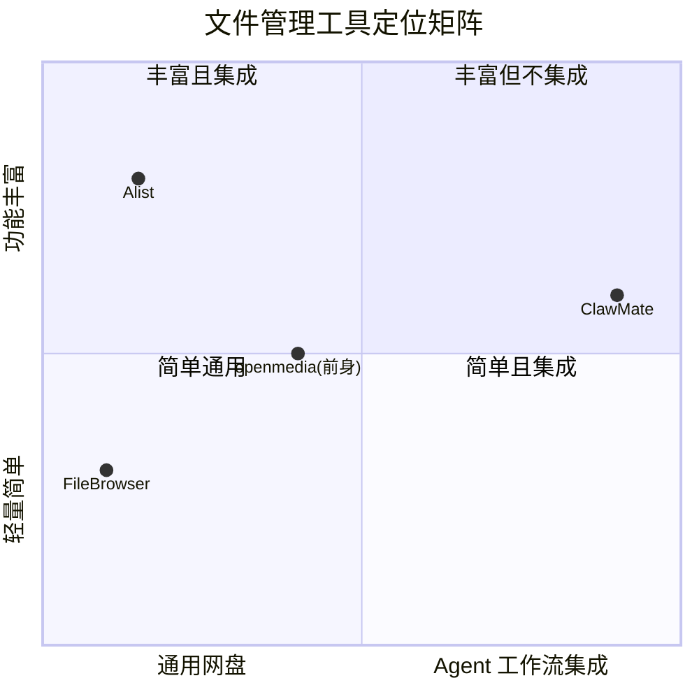
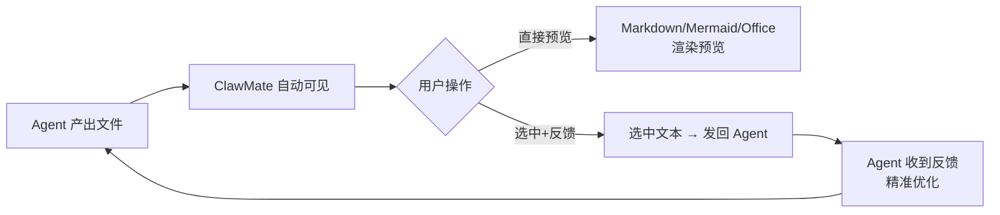
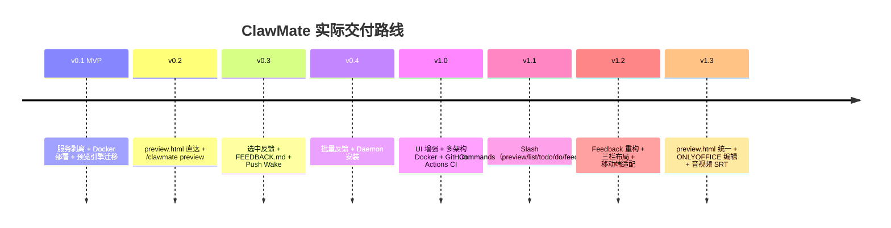

# MRD — ClawMate 龙虾伴侣

**版本**: v1.1（基于现状更新）
**更新日期**: 2026-06-01
**原始版本**: v1.0（2026-05-29）
**类型**: 研发需求 → **已交付**

> ⚠️ 2026-06-01 更新：本文档已从「设计蓝图」更新为「现状记录」。所有 P0/P1/P2 需求已交付（v1.3），额外交付了音视频 SRT、Office 编辑链路、反馈面板统一等能力。

---

## 1. 问题空间概述

### 1.1 背景

OpenClaw 已成为核心工作流引擎：agent 产出 Markdown、Mermaid 图表、GPX 轨迹、HTML 报告、JSON 数据等大量文件。但这些文件的**管理、预览、反馈**链路存在断裂：

| 环节 | ClawMate 之前 | ClawMate 之后 |
|------|--------------|--------------|
| 文件管理 | 飞书附件 / shell 操作，无可视化 | 浏览器 Web UI，画廊/列表双视图 |
| 文件预览 | 下载后本地打开 | 点击即渲染（Markdown/Mermaid/Office/音视频） |
| 反馈闭环 | 手动复制路径 → 切回聊天 → 打字 | 选中文本 → 填备注 → 提交 → Agent 自动处理 |

### 1.2 核心问题

> OpenClaw agent 产出的文件，缺少一个**直达预览 + 选中反馈**的闭环工具。 → **已解决。**

### 1.3 当前产品规模

| 维度 | 数据 |
|------|------|
| 后端代码 | 1134 行 FastAPI（routes.py） |
| 前端代码 | 14万字节预览引擎 + 9.5万字节业务逻辑 |
| CSS 样式 | 47KB 主题变量系统 |
| API 端点 | 18 个 REST 端点 |
| 部署方式 | Docker + Systemd Daemon + GitHub Actions CI |

---

## 2. 目标用户

| 用户类型 | 描述 | 核心诉求 |
|---------|------|---------|
| OpenClaw/Hermes 用户 | 强哥本人及团队 | Agent 产出后能在同一个界面预览 → 选中问题 → 发回 Agent 继续处理 |
| 潜在扩展用户 | 其他 OpenClaw 使用者 | Docker 一键部署，开箱即用 |

**用户不是「需要一个网盘」，而是「需要 Agent 工作流加速器」。**

---

## 3. 竞品分析

> 详细分析见 [research/competitor-analysis.md](research/competitor-analysis.md)

### 3.1 竞品矩阵



### 3.2 关键结论

| 竞品 | 优势 | 与 ClawMate 的差距 |
|------|------|-------------------|
| **FileBrowser** | 单二进制部署，27K ⭐ | 已停更；无 Mermaid/KaTeX 渲染；无 ONLYOFFICE |
| **Alist** | 30+ 云端存储后端，48K ⭐ | 核心价值在云盘聚合；无 Mermaid/KaTeX；AGPL 3.0 |
| **openmedia(前身)** | 成熟的预览引擎 | ClawMate 直接基座，已完全独立化并增强 |

### 3.3 空白市场

**目前没有任何工具专为 AI agent 的输入输出管理而设计。** FileBrowser 定位「任何人的个人网盘」，Alist 定位「云盘聚合器」，ClawMate 定位「OpenClaw 伴侣」—— 三者不在同一赛道竞争。

---

## 4. 用户需求

### 4.1 需求全景



### 4.2 需求优先级（交付状态）

| 优先级 | 需求 | 交付版本 | 状态 |
|--------|------|:--:|:--:|
| **P0** | 独立部署（Docker） | v0.1 | ✅ |
| **P0** | 白名单目录文件管理 | v0.1 | ✅ |
| **P0** | 渲染预览引擎 | v0.1 | ✅ |
| **P0** | 预览直达链接 | v0.2 | ✅ |
| **P1** | 选中反馈 | v0.3 | ✅ |
| **P1** | Daemon 安装 | v0.4 | ✅ |
| **P1** | 会话路由 | v1.3 | ✅ |
| **P2** | 多选 + 备注 | v1.2 | ✅ |
| **P2** | ONLYOFFICE 配置化 | v1.3 | ✅ |
| **P2** | 美观性提升 | v1.0 | ✅ |
| **P+** | 🎁 音视频 + SRT 字幕 | v1.3 | ✅ 额外交付 |
| **P+** | 🎁 ONLYOFFICE 编辑链路 | v1.3 | ✅ 额外交付 |
| **P+** | 🎁 Markdown/HTML 双模式 | v1.3 | ✅ 额外交付 |

---

## 5. 产品定义

### 5.1 产品形态

| 形态 | 说明 | 适用场景 |
|------|------|---------|
| **Docker Image** | `docker run clawmate` | 快速体验 / 服务器部署 |
| **Daemon 安装** | `curl ... \| bash` 系统级安装 | 生产环境 / 开机自启 |

### 5.2 核心架构

```mermaid
flowchart TB
    subgraph 部署层
        DOCKER[Docker Container]
        DAEMON[Systemd Daemon]
    end

    subgraph 服务层
        API[REST API<br>18 个端点]
        WEB[Web 前端<br>preview.html + Modal]
        CONFIG[config.json<br>白名单 + ONLYOFFICE]
        FB[FEEDBACK.md<br>反馈闭环中枢]
    end

    subgraph 集成层
        SKILL[OpenClaw Slash Commands<br>/clawmate preview|list|todo|do|feedback]
        WAKE[Push Wake<br>system event --mode now]
    end

    DOCKER --> API
    DAEMON --> API
    API --> WEB
    API --> CONFIG
    API --> FB
    FB --> WAKE
    WAKE --> SKILL
```

### 5.3 预览模式

| 模式 | URL 参数 | 触发方 | 形态 |
|------|---------|--------|------|
| **preview.html** | `preview.html?root=xxx&file=xxx.md` | Agent Slash Command 或 🔗 按钮 | 独立全屏页面 |
| **Modal** | `?root=xxx&dir=xxx`（点击文件） | ClawMate 内浏览 | 弹出窗口 |

### 5.4 Skill 设计

```
/clawmate preview root=<id> [file=<path>]
  → 返回 preview.html 预览链接
  → Agent 聊天中直接发送

/clawmate feedback root=<id> project=<name> file=<path> note=<text>
  → 写入 FEEDBACK.md → Push Wake 唤醒 Agent → Agent 处理

/clawmate todo root=<id> project=<name>
  → 列出待处理反馈

/clawmate do root=<id> project=<name>
  → 自动处理待处理反馈
```

---

## 6. 实施路径（实际交付）



---

## 7. 风险与假设（回顾）

### 7.1 关键假设验证

| # | 假设 | 结果 |
|---|------|:--:|
| H1 | 代码可平滑剥离为独立服务 | ✅ 已验证 |
| H2 | 用户会通过预览页选中反馈 | ✅ 已上线使用 |
| H3 | OpenClaw 会话路由 API 支持外部触发 | ✅ Push Wake 机制已集成 |

### 7.2 风险回顾

| 风险 | 实际结果 |
|------|---------|
| 与 webroot 耦合过深 | 已完全解除，独立 FastAPI 服务 |
| ONLYOFFICE Docker 部署复杂 | 已提供 config.json 配置化 + JWT 集成 |
| Skill 反馈的会话路由不可靠 | ✅ Push Wake + system event --mode now 正常工作 |

---

## 8. 成功标准（达成情况）

| 维度 | 标准 | 状态 |
|------|------|:--:|
| 部署便捷性 | 5 分钟内完成搭建 + 访问预览 | ✅ |
| 功能完整度 | 全部功能覆盖 + preview.html + 选中反馈 | ✅ |
| 预览体验 | 点击直达渲染视图，零中间操作 | ✅ |
| 反馈闭环 | 选中 → 发回 Agent，3 步完成 | ✅ |

---

## 9. 参考来源

1. [FileBrowser 项目页](https://filebrowser.org) — 2026年3月进入维护模式
2. [Alist GitHub](https://github.com/AlistGo/alist) — 48K+ ⭐，AGPL 3.0
3. openmedia 源码（~/webprojects/openmedia/） — 预览引擎基座
4. [ONLYOFFICE API 文档](https://api.onlyoffice.com/) — JWT 集成模式
5. [Phase II 需求澄清](REQUIREMENT_CLARIFICATION.md)
6. [Phase III 竞品分析](research/competitor-analysis.md)
7. [Phase III ONLYOFFICE 配置分析](research/onlyoffice-config.md)
8. [Phase III Skill 价值分析](research/openclaw-skill-value.md)
