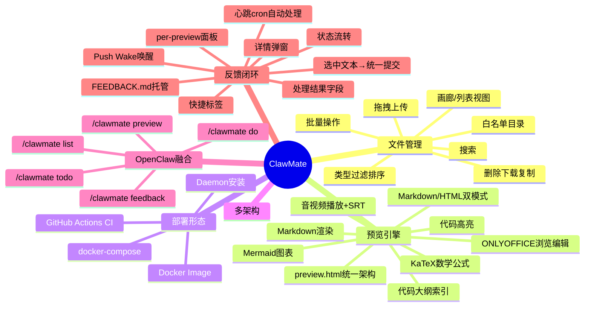
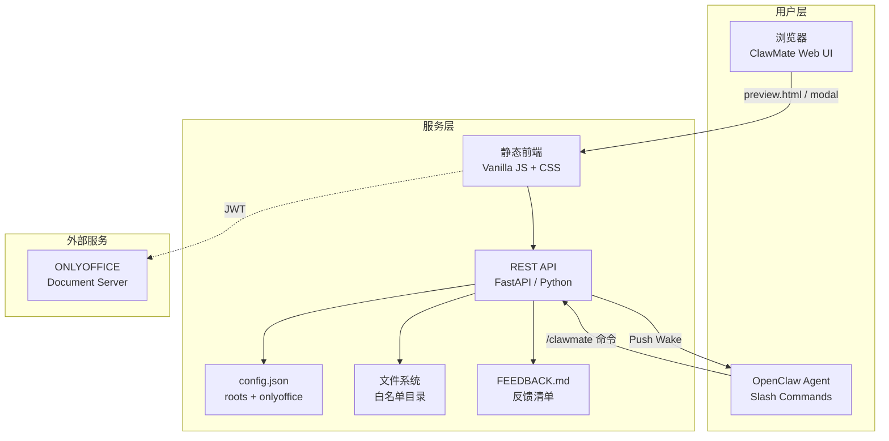
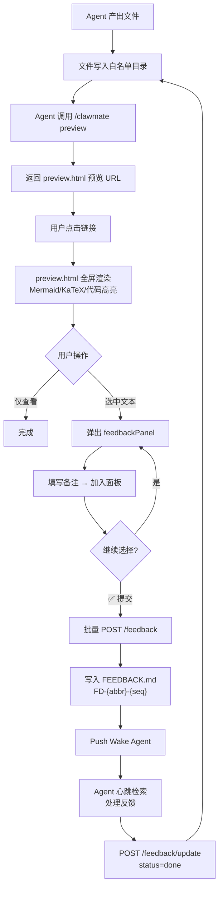

# ClawMate 龙虾伴侣 — 总 PRD

## 1. 文档信息

| 字段 | 内容 |
|-----|------|
| 产品名称 | ClawMate 龙虾伴侣 |
| 文档版本 | V1.5 |
| 编写日期 | 2026-06-05 |
| 前置文档 | [MRD](prd/MRD.md) · [需求澄清](REQUIREMENT_CLARIFICATION.md) · [竞品分析](research/competitor-analysis.md) |
| 项目类型 | 研发需求 |
| **平台支持** | **Desktop-only**（v1.19 全面回退所有 mobile 兼容设计）|

## 2. 项目背景

### 2.1 业务目标

构建独立可部署的 OpenClaw 伴侣文件管理服务。解决 Agent 产出文件的「预览→反馈→修改」闭环问题。

### 2.2 目标用户

| 用户类型 | 画像 | 核心诉求 |
|---------|------|---------|
| OpenClaw 用户 | 使用 OpenClaw agent 日常工作的个人/小团队 | Agent 产出后直接预览 → 选中问题 → 提交反馈 → Agent 处理 |
| Hermes 用户 | 其他 AI agent 框架用户 | 需要一个轻量、安全的文件管理+预览服务 |

### 2.3 核心价值主张

> **Agent 产出文件，点击即预览，选中即反馈。** ClawMate 是 Agent 工作流的文件层闭环工具。

## 3. 产品架构

### 3.1 功能架构图



### 3.2 系统架构图



## 4. 核心业务流程



## 5. 数据模型

### 5.1 config.json

```json
{
  "roots": [
    {"id": "string", "label": "string", "dir": "/absolute/path"}
  ],
  "defaultRootId": "string",
  "onlyoffice": {
    "url": "https://onlyoffice.example.com",
    "jwt_secret": "string",
    "api_js_url": "https://onlyoffice.example.com/web-apps/apps/api/documents/api.js",
    "mode": "edit",
    "callback_url": "https://clawmate.example.com/api/clawmate/onlyoffice/callback"
  },
  "public_base_url": "https://clawmate.example.com",
  "port": 5533,
  "projects": {
    "clawmate": {"abbr": "CM"}
  }
}
```

| 字段 | 类型 | 必填 | 说明 |
|------|------|:--:|------|
| `roots[].id` | string | ✅ | 唯一标识，前端/API 引用 |
| `roots[].label` | string | ✅ | 显示名称 |
| `roots[].dir` | string | ✅ | 绝对路径 |
| `defaultRootId` | string | - | 默认根目录 |
| `onlyoffice.url` | string | - | ONLYOFFICE Document Server 地址 |
| `onlyoffice.jwt_secret` | string | - | JWT 签名密钥 |
| `onlyoffice.api_js_url` | string | - | ONLYOFFICE API JS 完整 URL（前端动态加载用）|
| `onlyoffice.mode` | string | - | 默认编辑模式，"edit" 或 "view"，不配置默认 "edit" |
| `onlyoffice.callback_url` | string | - | 回调保存 URL，可覆盖默认构造值 |
| `public_base_url` | string | - | ClawMate 对外的可访问地址（生成预览链接用）|
| `port` | number | - | 监听端口，默认 5533 |
| `max_upload_mb` | number | - | 上传文件大小限制（MB），默认 100 |
| `projects` | object | - | 项目级配置，如 abbr 自定义 |

### 5.2 API 响应模型

```typescript
// 文件条目
interface Entry {
  name: string;        // 文件名
  path: string;        // 相对 root 的路径
  is_dir: boolean;     // 是否目录
  size: number;        // 字节数
  mtime: number;       // 修改时间戳
  ext: string;         // 扩展名（含点）
  mime: string;        // MIME 类型
  category: string;    // dir / image / audio / video / text / other
}

// 反馈条目
interface FeedbackItem {
  id: string;          // FD-{abbr}-{seq}
  status: string;      // pending | in_progress | done | failed
  user_note: string;   // 用户备注
  file: string;        // 文件路径
  location: string;    // 选中位置 L{start}-{end}
  content: string;     // 选区内容
  result: string;      // 处理结果摘要（仅 done/failed 时有值）
  updated: string;     // 更新时间 YYYY-MM-DD HH:MM:SS
}

// 列表响应
interface ListResponse {
  path: string;
  name: string;
  entries: Entry[];
}
```

## 6. 技术选型

| 层面 | 选择 | 理由 |
|------|------|------|
| 后端 | **FastAPI (Python)** | 快速开发，丰富的生态 |
| 前端 | **Vanilla JS + CSS** | 零框架依赖，轻量 |
| Markdown 渲染 | marked + highlight.js + mermaid v11 + KaTeX | 成熟稳定 |
| Office 预览 | ONLYOFFICE Document Server (Docker) | JWT 安全集成 |
| 配置 | JSON 文件 | 简单、版本可控 |
| 部署 | Docker（多架构）+ Systemd Daemon | 双重覆盖 |
| CI/CD | GitHub Actions | 自动化构建发布 |

## 7. API 契约

### 7.1 文件管理 API

| 方法 | 路径 | 说明 |
|------|------|------|
| GET | `/api/clawmate/config` | 公开配置（roots + defaultRootId）|
| GET | `/api/clawmate/list` | 列出目录 |
| GET | `/api/clawmate/search` | 递归搜索 |
| GET | `/api/clawmate/preview` | 文件预览（自动判断类型返回内容或下载链接）|
| GET | `/api/clawmate/preview-link` | 生成 preview.html 预览 URL |
| GET | `/api/clawmate/download` | 下载文件 |
| GET | `/api/clawmate/raw` | 原始内容（inline Content-Type）|
| GET | `/api/clawmate/batch-download` | 打包下载（zip）|
| POST | `/api/clawmate/upload` | 上传文件（multipart）|
| DELETE | `/api/clawmate/delete` | 删除文件 |
| DELETE | `/api/clawmate/delete-dir` | 删除目录 |
| GET | `/api/clawmate/onlyoffice/script-url` | ONLYOFFICE API JS URL |
| GET | `/api/clawmate/onlyoffice/config` | ONLYOFFICE 配置（含 JWT）|
| GET | `/api/clawmate/onlyoffice/file` | ONLYOFFICE 文件获取（需 token）|
| POST | `/api/clawmate/onlyoffice/callback` | ONLYOFFICE 编辑回调保存（需 JWT token）|
| POST | `/api/clawmate/save` | 文本文件原子保存（temp + os.replace）|

### 7.2 反馈 API

| 方法 | 路径 | 说明 |
|------|------|------|
| POST | `/api/clawmate/feedback` | 统一反馈创建 → FEEDBACK.md + Push Wake |
| GET | `/api/clawmate/feedback/list` | 列出反馈（status/file/since 过滤）|
| GET | `/api/clawmate/feedback/status` | 状态摘要（counts + items）|
| POST | `/api/clawmate/feedback/update` | 按 ID 更新状态（done/failed 时必须附带 `result` 参数）|

### 7.3 反馈创建请求体

```json
{
  "root": "webprojects",
  "project": "clawmate",
  "path": "clawmate/prd/MRD.md",
  "selections": [
    {
      "text": "选中的文本内容",
      "startLine": 10,
      "endLine": 12,
      "note": "建议补充示例"
    }
  ],
  "previewUrl": "https://clawmate.example.com/clawmate/preview.html?root=xxx&file=xxx.md",
  "sessionKey": "agent:work:xxx"
}
```

## 8. 预览模式规范

| 模式 | URL 参数 | 触发方 | 形态 | 用途 |
|------|---------|--------|------|------|
| **preview.html** | `preview.html?root=xxx&file=xxx.md` | Agent Slash Command 生成链接 | 独立全屏页面 | Agent 聊天中直接预览/编辑 |
| **Modal** | `?root=xxx&dir=xxx` → 点击文件 | ClawMate UI 内浏览 | 弹出窗口 | 日常文件管理 |

**preview.html 统一架构（v1.3）**：
- 统一所有预览类型到单一页面：Markdown、HTML、图片、音频/视频、Office/PDF
- 顶部品牌栏 + 文件名 + 底部工具栏
- Markdown/HTML 支持预览/编辑双模式切换
- 可编辑 Office 文档默认 edit 模式（从 config.json `onlyoffice.mode` 控制）
- Office 文件支持 ONLYOFFICE 浏览/编辑切换（编辑模式含 callbackUrl 回调保存）
- PDF 优先 ONLYOFFICE，不可用时降级 pdf.js
- 音频/视频带 SRT 字幕面板
- 底部工具栏：📋复制 📥导出PDF ⬇下载 🗑删除 ←返回
- 选中文本 → feedbackPanel（`.pst-*` 统一结构）→ 统一提交 FEEDBACK.md
- Modal 预览页右上角 🔗 Preview 按钮，新 tab 打开 preview.html

## 9. 非功能需求

### 9.1 性能

| 指标 | 目标 |
|------|------|
| API 响应时间 | ≤ 200ms（文件列表 < 500 条目）|
| Markdown 渲染 | ≤ 1s（含 Mermaid + KaTeX）|
| 内存占用 | ≤ 128MB（空闲）|

### 9.2 安全

| 要求 | 实现 |
|------|------|
| 目录越权防护 | root 白名单 + path sanitize + relative_to 校验 |
| ONLYOFFICE JWT | HS256 签名，1h TTL |
| 默认仅本地 | bind 127.0.0.1，无认证 |
| 外网暴露 | 用户自行 Nginx + basic auth |
| 配置防泄露 | config.json 含 JWT secret，加入 .gitignore |

### 9.3 兼容性

| 维度 | 范围 |
|------|------|
| 浏览器 | Chrome/Firefox/Safari/Edge 最新两个大版本 |
| 部署 | Linux x86_64 + ARM64（Docker）|
| 移动端 | 响应式适配（≤768px / ≤900px）|

## 10. 迭代规划

| 版本 | 内容 | 对应子场景 |
|------|------|-----------|
| **v0.1 MVP** | 服务剥离 + Docker 部署 + 预览引擎完整迁移 + 文件上传 | #2 #3 #4 |
| **v0.2** | standalone 预览 + clawmate_preview Skill | #5 |
| **v0.3** | 选中反馈 + FEEDBACK.md + Push Wake + 反馈查询 | #6 |
| **v0.4** | 批量反馈 + feedbackPanel 面板 + Daemon 安装 | #4 #6 |
| **v1.0** | UI 增强 + ONLYOFFICE Compose + 多架构 Docker + GitHub Actions CI + PDF 降级 | #3 #4 |
| **v1.1** | Slash Commands（preview/list/todo/do/feedback） + /preview-link + /feedback/list | #5 #6 |
| **v1.2** | Feedback 重构（统一提交/去类型化/per-preview面板） + Standalone 三栏布局 + 移动端适配 | #6 #3 |
| **v1.3** | preview.html 统一架构 + ONLYOFFICE 编辑链路 + 音视频/SRT + Markdown/HTML 双模式 + 图片工具栏 + save/rename API | #3 #6 |
| **v1.4** | 代码大纲索引 + 反馈处理结果字段 + 详情弹窗 + 多行内容完整保存 + 无后缀文本检测 + 防重复提交 + Mermaid 预览修复 + 快捷标签 + Bug 修复 | #3 #6 #1 |

## 11. 子场景 PRD 索引

| # | 子场景 | 优先级 | 文档 |
|---|--------|:--:|------|
| 1 | 总 PRD | — | 本文档 |
| 2 | 核心文件管理 | P0 | prd/sub_prd/file-management.md |
| 3 | 文件预览引擎 | P0 | prd/sub_prd/preview-engine.md |
| 4 | Docker/Daemon 部署 | P0/P1 | prd/sub_prd/deployment.md |
| 5 | OpenClaw 融合 | P1 | prd/sub_prd/openclaw-integration.md |
| 6 | 反馈闭环 🔑 | P1 | prd/sub_prd/feedback-loop.md |

---

## 附录

### A. 术语表

| 术语 | 解释 |
|------|------|
| ClawMate | 龙虾伴侣，本项目产品名 |
| Root | 白名单根目录，通过 id 引用 |
| preview.html | v1.3 统一预览架构页面，Agent 聊天链接直达，支持所有文件类型的预览和编辑 |
| Modal | 弹窗预览模式，ClawMate 内浏览点击 |
| 反馈闭环 | 预览 → 选中 → 提交 FEEDBACK.md → Push Wake → Agent 处理 → 标记完成的完整循环 |
| FEEDBACK.md | 项目级反馈清单文件，存储所有反馈条目和内联状态 |
| Push Wake | 通过 `openclaw system event --mode now` 即时唤醒 Agent |
| feedbackPanel | 选中文本后弹出的浮层面板，管理本次预览的所有未提交反馈 |
| Slash Commands | Agent 通过 `/clawmate` 开头的命令调用 ClawMate API |

### B. 参考文档

- [MRD](prd/MRD.md)
- [需求澄清](REQUIREMENT_CLARIFICATION.md)
- [竞品分析](research/competitor-analysis.md)
- [ONLYOFFICE 配置分析](research/onlyoffice-config.md)
- [Skill 价值分析](research/openclaw-skill-value.md)
- openmedia 源码（~/webprojects/openmedia/）
