# 子场景 PRD — Docker / Daemon 部署

**优先级**: P0 (Docker) / P1 (Daemon)
**依赖**: #2 核心文件管理、#3 文件预览引擎
**版本**: v1.2

## 1. 场景描述

ClawMate 以两种形态部署，覆盖不同使用场景。Docker 优先（快速体验、环境隔离、多架构支持），Daemon 补充（物理机安装、开机自启）。目标是「会 Docker 就能 5 分钟搭好」。

## 2. 部署架构

```mermaid
flowchart TB
    subgraph Docker模式
        D1[docker run clawmate] --> D2[单容器运行]
        D2 --> D3[端口映射 5533:5533]
        D3 --> D4[config.json 挂载]
        D4 --> D5[目录挂载访问文件]
    end

    subgraph Docker_Compose模式
        DC1[docker-compose up] --> DC2[clawmate + onlyoffice]
        DC2 --> DC3[内部网络互通]
    end

    subgraph Daemon模式
        S1["curl ... | bash"] --> S2[安装脚本部署]
        S2 --> S3[创建 systemd unit]
        S3 --> S4[systemctl enable --now clawmate]
        S4 --> S5[开机自启]
    end

    subgraph CI
        CI1[GitHub Actions] --> CI2[多架构构建<br>linux/amd64 + linux/arm64]
        CI2 --> CI3[推送到镜像仓库]
    end
```



## 3. 功能需求

### 3.1 Docker 镜像

| 功能编号 | 功能 | 说明 | 优先级 |
|---------|------|------|:--:|
| DP-01 | Dockerfile | 多阶段构建，Python FastAPI 应用 + 静态文件 | P0 |
| DP-02 | 环境变量配置 | `CLAWMATE_PORT` / `CLAWMATE_CONFIG` 等覆盖默认值 | P0 |
| DP-03 | 卷挂载 | config.json + 白名单目录通过 `-v` 挂载 | P0 |
| DP-04 | 多架构 | linux/amd64 + linux/arm64 | P1 |
| DP-05 | 健康检查 | `HEALTHCHECK /api/clawmate/list` | P1 |

### 3.0 Nginx 反向代理（callback 免认证）

**ONLYOFFICE 编辑保存需要 callback 路径免认证**：
```nginx
location /api/clawmate/onlyoffice/ {
    satisfy any;
    allow all;
    auth_basic off;
    proxy_pass http://127.0.0.1:5533;
}
```
> ⚠️ 如果 nginx 启用了 basic auth，必须将 `/api/clawmate/onlyoffice/` 路径单独免认证放行，否则 ONLYOFFICE 编辑保存回调会收到 401。

**Docker Run 示例**：

```bash
docker run -d \
  --name clawmate \
  -p 5533:5533 \
  -v /path/to/config.json:/app/config.json:ro \
  -v /home/openclaw:/data/openclaw:ro \
  clawmate:latest
```

### 3.2 Docker Compose（含 ONLYOFFICE）

| 功能编号 | 功能 | 说明 | 优先级 |
|---------|------|------|:--:|
| DP-06 | docker-compose.yml | clawmate + onlyoffice/documentserver 一键部署 | P1 |
| DP-07 | ONLYOFFICE JWT | 统一 `JWT_SECRET` 环境变量 | P1 |
| DP-08 | 网络隔离 | clawmate 和 onlyoffice 在同一内部网络 | P1 |

**docker-compose.yml 示例**：

```yaml
version: '3'
services:
  onlyoffice:
    image: onlyoffice/documentserver:latest
    environment:
      - JWT_ENABLED=true
      - JWT_SECRET=${ONLYOFFICE_JWT_SECRET}
    volumes:
      - onlyoffice_data:/var/www/onlyoffice/Data
    ports:
      - "8080:80"

  clawmate:
    image: clawmate:latest
    environment:
      - CLAWMATE_ONLYOFFICE_URL=https://onlyoffice.example.com
      - CLAWMATE_ONLYOFFICE_JWT_SECRET=${ONLYOFFICE_JWT_SECRET}
      - CLAWMATE_PUBLIC_BASE_URL=https://clawmate.example.com
    volumes:
      - ./config.json:/app/config.json:ro
      - /home/openclaw:/data/openclaw:ro
    ports:
      - "5533:5533"
    depends_on:
      - onlyoffice

volumes:
  onlyoffice_data:
```

### 3.3 Daemon 一行安装

| 功能编号 | 功能 | 说明 | 优先级 |
|---------|------|------|:--:|
| DP-09 | 安装脚本 | `curl -fsSL https://.../install.sh | bash` | P1 |
| DP-10 | systemd unit | `/etc/systemd/system/clawmate.service` | P1 |
| DP-11 | 开机自启 | `systemctl enable clawmate` | P1 |
| DP-12 | 配置引导 | 安装后提示编辑 config.json | P1 |
| DP-13 | 日志 | stdout → journald | P1 |

**安装流程**：

```
curl ... | bash
  → 检测系统（Linux x86_64/arm64）
  → 部署 Python 应用 + 依赖到 /opt/clawmate
  → 创建 /etc/clawmate/config.json（模板）
  → 创建 /etc/systemd/system/clawmate.service
  → systemctl daemon-reload
  → systemctl enable --now clawmate
  → ✅ 访问 http://localhost:5533
```

**实现说明**：实际后端为 Python FastAPI 应用，不是编译二进制。install.sh 负责部署源码 + venv。

### 3.4 CI/CD

| 功能编号 | 功能 | 说明 | 优先级 |
|---------|------|------|:--:|
| DP-14 | GitHub Actions | 自动化构建 + 推送镜像 | P1 |
| DP-15 | 多架构构建 | `docker buildx` linux/amd64 + linux/arm64 | P1 |
| DP-16 | 版本发布 | tag 触发自动发布 | P1 |

## 4. 配置模型

### 4.1 环境变量

| 变量 | 默认值 | 说明 |
|------|--------|------|
| `CLAWMATE_PORT` | `5533` | 监听端口 |
| `CLAWMATE_CONFIG` | `/app/config.json` (Docker) / `/etc/clawmate/config.json` (Daemon) | 配置文件路径 |
| `CLAWMATE_ONLYOFFICE_URL` | — | ONLYOFFICE Document Server 地址 |
| `CLAWMATE_ONLYOFFICE_JWT_SECRET` | — | JWT 签名密钥 |
| `CLAWMATE_PUBLIC_BASE_URL` | `http://localhost:5533` | 对外访问地址 |

### 4.2 文件结构

```
Daemon:
  /opt/clawmate/                   # 应用源码 + venv
  /etc/clawmate/config.json        # 配置
  /etc/systemd/system/clawmate.service  # systemd unit
  /var/log/clawmate/               # 日志

Docker:
  /app/main.py                     # FastAPI 入口
  /app/config.json                 # 配置（挂载）
  /app/static/                     # 前端静态文件
  /app/service.py                  # 服务层
  /app/routes.py                   # 路由层
```

## 5. 验收标准

| # | 标准 | 度量 |
|---|------|------|
| AC-1 | `docker run` 后 30s 内 `curl localhost:5533` 返回 200 | 可用性 |
| AC-2 | `docker-compose up` 后 clawmate + onlyoffice 均正常 | 集成测试 |
| AC-3 | Daemon 安装脚本一键完成，`systemctl status clawmate` 显示 active | 安装测试 |
| AC-4 | 重启后 clawmate 自动启动 | 开机自启测试 |
| AC-5 | 不挂载额外目录时，默认 root 为 media，API 返回提示 | 安全 |
| AC-6 | GitHub Actions 构建成功推送到镜像仓库 | CI 测试 |
| AC-7 | linux/arm64 镜像构建成功 | 多架构测试 |
