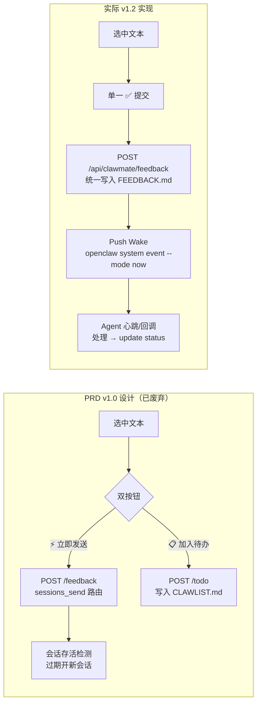

# 子场景 PRD — 反馈闭环 🔑

**优先级**: P1
**依赖**: #3 文件预览引擎、#5 OpenClaw 融合
**版本**: v1.2（已演化，与 v1.0 总 PRD 设计不同）

## 1. 场景描述

这是 ClawMate 的**核心差异化功能**。用户在预览 Agent 产出的文件时，发现问题直接选中文本、添加备注，通过单一「✅ 提交」按钮写入项目 `FEEDBACK.md`。ClawMate 通过 Push Wake 机制立即唤醒 Agent 处理，形成「发现问题 → 提交反馈 → Agent 处理 → 标记完成」的完整闭环。

## 2. 架构对比：PRD v1.0 vs 实际 v1.2



### 关键设计演化

| 维度 | PRD v1.0（废弃） | v1.2 实际 |
|------|-----------------|----------|
| 反馈存储 | 双路径：即时发送 / CLAWLIST.md | 单路径：FEEDBACK.md |
| 操作入口 | 双按钮（⚡发送 / 📋待办） | 单按钮（✅ 提交）|
| Agent 通知 | `sessions_send` 会话路由 | `openclaw system event` Push Wake |
| 会话管理 | 存活检测 + 过期开新会话 | 不管理会话（Push Wake 由 cron 心跳消费）|
| 备注策略 | 可选 | 必填（拒绝空白备注）|
| 面板绑定 | 全局单例 | per-preview 独立面板（`createFeedbackPanel` 工厂）|
| 状态管理 | 无追踪 | 四态：pending / in_progress / done / failed |

## 3. 用户流程

```mermaid
flowchart TD
    subgraph 预览层
        P1[Standalone 全屏预览] --> P2[选中文本]
        P3[Modal 弹窗预览] --> P2
    end

    P2 --> F[弹出 feedbackPanel<br>备注输入框 + ✅提交]
    F --> G{备注非空?}
    G -->|空| F
    G -->|有内容| H[加入面板列表]
    H --> I{继续选择?}
    I -->|是| P2
    I -->|提交| J[批量 POST /api/clawmate/feedback]
    J --> K[写入 FEEDBACK.md<br>格式: FD-{abbr}-{seq}]
    K --> L[Push Wake Agent]
    L --> M[清空面板 + 刷新列表]

    subgraph Agent侧
        N[心跳/cron 检测] --> O{FEEDBACK.md<br>pending > 0?}
        O -->|是| Q[读取条目]
        Q --> R[处理反馈]
        R --> S[POST /feedback/update<br>status=done]
        O -->|否| T[等待下次心跳]
    end
```

## 4. 功能需求

### 4.1 选中反馈 UI

| 功能编号 | 功能 | 说明 |
|---------|------|------|
| FB-01 | 文本选中检测 | 鼠标选中文字后弹出操作浮层，限制在 `.preview-body` / `.standalone-content` 内 |
| FB-02 | 备注输入框 | 浮层内含 textarea，必填，空白备注被拒绝并提示 |
| FB-03 | 统一提交 | 单一「✅ 提交」按钮，选中 + 备注加入面板 → 批量 POST |
| FB-04 | 面板累积 | 提交前的所有选中项显示在 feedback 面板中，支持查看/移除 |
| FB-05 | 选区内联高亮 | CSS Highlight API：选中区域在浮层存在期间持久高亮，提交后清除 |
| FB-06 | 面板点击跳转 | 点击面板中的反馈项 → 新 tab 打开 standalone 预览 + 自动定位高亮 |
| FB-07 | 关闭提醒 | standalone 页面关闭时 `beforeunload` 拦截；modal 关闭时检查 panel 是否有未提交项 |

### 4.2 Per-Preview 面板架构

| 功能编号 | 功能 | 说明 |
|---------|------|------|
| FB-08 | 工厂函数 | `createFeedbackPanel(container, context)` 为每个预览窗口创建独立面板 |
| FB-09 | standalone 面板 | 绑定 `.standalone-content`，作为三栏布局的右侧栏 |
| FB-10 | modal 面板 | 绑定 `.preview-body`，与预览内容并排显示 |

```javascript
// 伪代码
function createFeedbackPanel(container, context) {
  // container = .standalone-content 或 .preview-body
  // context = { root, project, path, rawContent }
  // 返回 { render, addItem, removeItem, destroy, hasPending, ... }
}
```

### 4.3 Standalone 三栏布局

| 功能编号 | 功能 | 说明 |
|---------|------|------|
| FB-11 | 左侧栏 | 目录树（浮动按钮 📁 展开/收起），点击目录项跳转预览 |
| FB-12 | 中间栏 | 内容预览（Markdown/图片/Office/视频...）|
| FB-13 | 右侧栏 | 当前文件 Feedback 列表（浮动按钮 💬 展开/收起，点击刷新）|
| FB-14 | 底部工具栏 | 📋复制 📥导出PDF ⬇下载 🗑删除 ←返回（暗色固定底部）|
| FB-15 | 移动端适配 | <900px 侧栏默认隐藏，浮动按钮更明显，CSS transform 过渡 |

### 4.4 Push Wake 机制

| 功能编号 | 功能 | 说明 |
|---------|------|------|
| FB-16 | 即时唤醒 | `POST /api/clawmate/feedback` 创建后调用 `openclaw system event --mode now` |
| FB-17 | 唤醒内容 | 发送 `ClawMate 新反馈: FD-XX-001` 事件文本 |
| FB-18 | 静默失败 | Push Wake 失败不影响 feedback 创建（`pass` 吞异常）|
| FB-19 | Agent 心跳 | cron job `clawmate-feedback-inbox-check` 定期检索 FEEDBACK.md |

### 4.5 反馈查询与状态管理

| 功能编号 | 功能 | 说明 |
|---------|------|------|
| FB-20 | 状态过滤 | `GET /api/clawmate/feedback/list?status=wait\|doing\|done\|failed` |
| FB-21 | 文件过滤 | `?file=黄昏` 模糊匹配文件名 |
| FB-22 | 日期过滤 | `?since=today` 或 `?since=2026-05-30` |
| FB-23 | 状态更新 | `POST /api/clawmate/feedback/update` → `{id, status}` |
| FB-24 | 状态摘要 | `GET /api/clawmate/feedback/status` → `counts + items` |
| FB-25 | 去重检查 | 同一选区不重复写入 FEEDBACK.md |

## 5. 数据/API 契约

### 5.1 统一反馈入口 `POST /api/clawmate/feedback`

```json
{
  "root": "webprojects",
  "project": "clawmate",
  "path": "clawmate/prd/MRD.md",
  "selections": [
    {
      "text": "选中的文本内容",
      "startLine": 10,
      "endLine": 12,
      "note": "这段描述不够清晰，建议补充示例"
    }
  ],
  "previewUrl": "https://clawmate.example.com/clawmate/?root=webprojects&file=...&mode=standalone",
  "sessionKey": "agent:work:xxx"
}
```

**响应**：

```json
{
  "ok": true,
  "ids": ["FD-CM-001"],
  "feedbackPath": "/home/openclaw/webprojects/clawmate/FEEDBACK.md",
  "feedbackText": "## 📋 ClawMate 反馈\n...",
  "previewUrl": "https://clawmate.example.com/clawmate/?..."
}
```

### 5.2 反馈列表 `GET /api/clawmate/feedback/list`

| 参数 | 说明 |
|------|------|
| `root` | 必填，白名单目录 id |
| `project` | 必填，项目名 |
| `status` | 可选，单值过滤 wait/doing/done/failed |
| `file` | 可选，文件名模糊匹配 |
| `since` | 默认 `today`，当天 CST 00:00；支持 `YYYY-MM-DD` 格式 |

**响应**：

```json
{
  "feedbackPath": "/home/openclaw/webprojects/clawmate/FEEDBACK.md",
  "total": 3,
  "items": [
    {
      "id": "FD-CM-001",
      "status": "pending",
      "user_note": "建议补充示例",
      "file": "clawmate/prd/MRD.md",
      "location": "L10-12",
      "content": "选中的文本内容",
      "updated": "2026-05-30 20:00:00"
    }
  ]
}
```

### 5.3 状态更新 `POST /api/clawmate/feedback/update`

```json
{
  "root": "webprojects",
  "project": "clawmate",
  "id": "FD-CM-001",
  "status": "done"
}
```

`status` 取值：`pending` | `in_progress` | `done` | `failed`

### 5.4 状态摘要 `GET /api/clawmate/feedback/status`

```json
{
  "feedbackPath": "...",
  "exists": true,
  "counts": {"pending": 2, "in_progress": 0, "done": 1, "failed": 0},
  "items": [...],
  "sessionInfo": ["- 最后活跃会话: `agent:work:xxx`"]
}
```

### 5.5 FEEDBACK.md 格式（实际）

```markdown
# 反馈清单

## 会话
- 最后活跃会话: `agent:work:xxx`
- 最后活跃时间: 2026-05-30 10:29

## FEEDBACK列表
- [待处理] #FD-CM-001
  - 用户备注：建议补充示例
  - 文件: clawmate/prd/MRD.md
  - 选中位置: L10-12
  - 选区内容: "选中的文本内容"
  - 更新: 2026-05-30 20:00:00
- [已完成] #FD-CM-002
  - 用户备注：已修复
  - 文件: clawmate/README.md
  - 更新: 2026-05-30 20:30:00
```

**ID 规则**：`FD-{project_abbr}-{seq}`，如 `FD-CM-001`（CM = ClawMate）。abbr 取项目名前两段首字母大写，可在 config.json `projects.{project}.abbr` 自定义。

**状态标记**：

| 标记 | 含义 |
|------|------|
| `[待处理]` | pending — 等待 Agent 处理 |
| `[处理中]` | in_progress — Agent 正在处理 |
| `[已完成]` | done — 处理完成 |
| `[失败]` | failed — 无法处理 |

## 6. 异常处理

| 异常场景 | 处理方式 |
|---------|---------|
| 备注为空 | 前端拦截，状态栏提示「第 N 项缺少备注」|
| 同一选区重复提交 | FEEDBACK.md 去重检查，拒绝写入 |
| Push Wake 失败 | 静默吞异常，不影响 feedback 创建 |
| 目标项目不存在 | 自动创建项目目录 + FEEDBACK.md |
| 网络断开 | 前端面板暂存，不丢数据 |
| root/project 缺失 | 422 Missing root/project |

## 7. 验收标准

| # | 标准 | 度量 |
|---|------|------|
| AC-1 | standalone 和 modal 均支持选中 → 备注 → 提交 | UI 测试 |
| AC-2 | 提交后 FEEDBACK.md 正确写入 FD-{abbr}-{seq} 格式 | API 测试 |
| AC-3 | Push Wake 触发 Agent 心跳检索 | 端到端测试 |
| AC-4 | `/feedback/list` 三参数过滤正确 | API 测试 |
| AC-5 | `/feedback/update` 状态流转正确 | API 测试 |
| AC-6 | 同一选区不重复创建条目 | 去重测试 |
| AC-7 | 三栏布局 standalone 各侧栏展开/收起正常 | UI 测试 |
| AC-8 | 关闭时有未提交反馈给出提醒 | UI 测试 |
