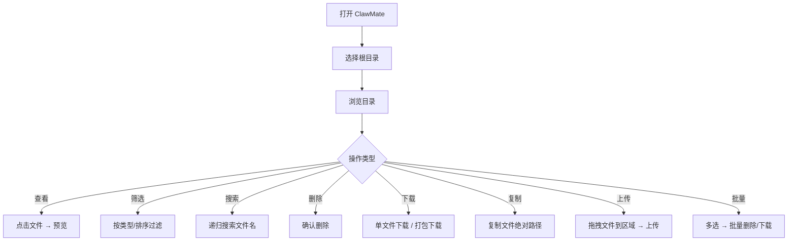

# 子场景 PRD — 核心文件管理

**优先级**: P0
**依赖**: 无（直接已实现）
**版本**: v1.2

## 1. 场景描述

ClawMate 的核心文件管理层。用户通过 Web UI 浏览、搜索、管理白名单目录中的文件。

## 2. 用户流程

## 3. 功能需求

### 3.1 白名单目录管理

| 功能编号 | 功能 | 说明 | 优先级 |
|---------|------|------|:--:|
| FM-01 | 多 root 切换 | 下拉选择已配置的根目录 | P0 |
| FM-02 | 目录浏览 | 侧边栏面包屑 + 子目录树 | P0 |
| FM-03 | URL 直达 | `?root=xxx&dir=yyy` 直接定位目录 | P0 |
| FM-04 | 安全校验 | path sanitize + relative_to 越权 403 | P0 |

### 3.2 视图与排序

| 功能编号 | 功能 | 说明 | 优先级 |
|---------|------|------|:--:|
| FM-05 | 画廊视图 | 卡片式展示，按类型分组 | P0 |
| FM-06 | 列表视图 | 表格式展示名称/大小/时间 | P0 |
| FM-07 | 类型过滤 | 全部/目录/图片/音频/文本/其他 | P0 |
| FM-08 | 排序 | 名称/时间/大小，升降序切换 | P0 |
| FM-09 | 分页 | 60 条/页，显示总数 | P0 |

### 3.3 搜索

| 功能编号 | 功能 | 说明 | 优先级 |
|---------|------|------|:--:|
| FM-10 | 递归搜索 | 搜索当前目录及所有子目录 | P0 |
| FM-11 | 搜索清除 | 一键清除搜索结果，返回目录浏览 | P0 |

### 3.4 文件操作

| 功能编号 | 功能 | 说明 | 优先级 |
|---------|------|------|:--:|
| FM-12 | 单文件下载 | 点击下载按钮触发浏览器下载 | P0 |
| FM-13 | 批量打包下载 | 多选 → 服务端打包为 zip → 下载 | P0 |
| FM-14 | 删除文件 | 二次确认后删除 | P0 |
| FM-15 | 删除目录 | 二次确认后递归删除 | P0 |
| FM-16 | 复制绝对路径 | 点击复制系统路径到剪贴板 | P0 |
| FM-17 | 拖拽上传 | 拖拽文件到主内容区 → multipart POST 上传 → 刷新目录 | P1 |

### 3.5 批量操作

| 功能编号 | 功能 | 说明 | 优先级 |
|---------|------|------|:--:|
| FM-18 | 多选复选框 | 画廊/列表视图均支持勾选 | P1 |
| FM-19 | 全选/取消全选 | 当前页全选 | P1 |
| FM-20 | 批量删除 | 多选 → 确认 → 批量删除 | P1 |
| FM-21 | 批量下载 | 多选 → 打包下载 | P1 |

## 4. 数据/API 契约

| 方法 | 路径 | 说明 |
|------|------|------|
| GET | `/api/clawmate/config` | 公开配置（roots + defaultRootId）|
| GET | `/api/clawmate/list` | 目录列表（root, dir）|
| GET | `/api/clawmate/search` | 递归搜索（root, dir, q, recursive, limit）|
| GET | `/api/clawmate/download` | 单文件下载 |
| GET | `/api/clawmate/batch-download` | 多文件打包下载（zip）|
| POST | `/api/clawmate/upload` | 文件上传（multipart form, field: file）|
| DELETE | `/api/clawmate/delete` | 删除文件 |
| DELETE | `/api/clawmate/delete-dir` | 删除目录 |

## 5. 异常处理

| 异常场景 | 处理方式 |
|---------|---------|
| root 不在白名单 | 403 Forbidden |
| path 包含 `..` 或以 `/` 开头 | 400 Bad Request |
| 目录不存在 | 404 Not Found |
| 删除文件不存在 | 404 Not Found |
| 上传文件过大 | 前端限制 + 后端返回错误 |
| 无权限访问目录 | 403 Forbidden |

## 6. 验收标准

| # | 标准 | 度量 |
|---|------|------|
| AC-1 | 现有文件管理功能全覆盖 | 功能回归测试 |
| AC-2 | 白名单外的 root 请求返回 403 | 安全测试 |
| AC-3 | 路径越权尝试（`../` `/etc/passwd`）返回 400/403 | 安全测试 |
| AC-4 | 批量选择 + 删除/下载可正常执行 | 功能测试 |
| AC-5 | 拖拽上传后目录刷新 | 功能测试 |
