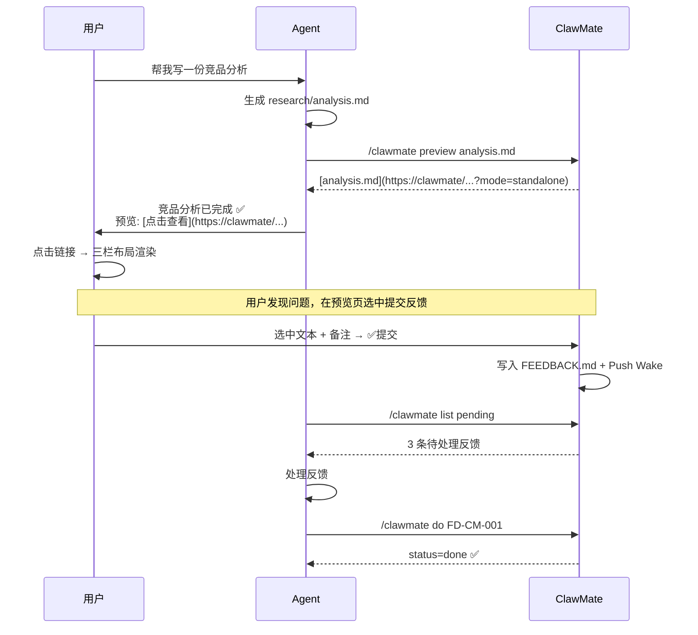

# 子场景 PRD — OpenClaw 融合

**优先级**: P1
**依赖**: #2 核心文件管理、#3 文件预览引擎
**版本**: v1.3

## 1. 场景描述

ClawMate 通过 OpenClaw Skill 提供 Slash Commands，让 Agent 能在对话中：
- 为产出文件生成可达渲染的 standalone 预览链接
- 查询项目 FEEDBACK.md 中的反馈待办
- 按 ID 更新反馈处理状态

## 2. 用户流程



## 3. 功能需求

### 3.1 Slash Commands 体系

| 命令 | 说明 | 优先级 |
|------|------|:--:|
| `/clawmate preview <filename>` | 搜索文件并生成可点击的 standalone 预览链接 | P1 |
| `/clawmate feedback` | 列出所有反馈条目（不限状态）| P1 |
| `/clawmate list [status] [file] [since]` | 按状态/文件名/日期过滤列出反馈 | P1 |
| `/clawmate todo` | `/clawmate list pending` 别名，列出待处理反馈 | P1 |
| `/clawmate do [id]` | 处理所有待办（无参）或按 ID 处理指定条目 | P1 |

### 3.2 Skill 定义

Skill 位于 `~/.openclaw/skills/clawmate/SKILL.md`，核心内容：

```markdown
---
name: clawmate
description: ClawMate 文件预览、反馈管理、任务流转
---

## 1. clawmate_preview
生成 Standalone 预览链接。必须输出 Markdown 可点击链接。
[文件名]({base_url}/clawmate/?root=webprojects&file=...&mode=standalone)

## 2. clawmate_feedback_status
GET {base_url}/api/clawmate/feedback/status?root={root}&project={project}

## 3. clawmate_feedback_process
POST {base_url}/api/clawmate/feedback/update
{"root":"webprojects","project":"clawmate","id":"FD-CM-001","status":"done"}

## 4. FEEDBACK.md 格式
- [待处理] #FD-CM-001
  - 用户备注：...
  - 文件: ...
  - 更新: ...

## Agent 处理流程
心跳 → GET /status → pending > 0
  → 读 FEEDBACK.md
  → 即时反馈 → update status=in_progress → done
  → 待办 → 排队
```

### 3.3 API 调用映射

| Slash Command | API 调用 |
|------|------|
| `/clawmate preview <file>` | `GET /api/clawmate/search?q=<file>` → `GET /api/clawmate/preview-link?root=&file=` |
| `/clawmate list [status] [file] [since]` | `GET /api/clawmate/feedback/list?root=&project=&status=&file=&since=` |
| `/clawmate todo` | `/clawmate list pending` 别名 |
| `/clawmate feedback` | `GET /api/clawmate/feedback/status?root=&project=` |
| `/clawmate do [id]` | 无参 → `/clawmate todo` 获取列表后逐个 `POST /feedback/update status=in_progress→done`<br>有参 → `POST /feedback/update {id, status}` |

### 3.4 预览链接规则注入

Agent 通过 Skill 的 system prompt 自动获取 URL 拼接规则：

```
基础 URL: {CLAWMATE_PUBLIC_BASE_URL}/clawmate/preview.html
参数:
  - root: 配置文件中的 root id
  - file: 相对于 root dir 的文件路径（URL 编码）

示例:
  https://clawmate.local/clawmate/preview.html?root=webprojects&file=clawmate%2Fprd%2FMRD.md
```

## 4. 环境变量

| 变量 | 默认值 | 说明 |
|------|--------|------|
| `CLAWMATE_PUBLIC_BASE_URL` | `http://localhost:5533` | ClawMate 对外访问地址，Skill 生成链接的基础 URL |

## 5. Skill 目录结构

```
~/.openclaw/skills/clawmate/
└── SKILL.md              # Skill 定义 + Slash Commands + URL 规则注入
```

## 6. 验收标准

| # | 标准 | 度量 |
|---|------|------|
| AC-1 | `/clawmate preview <file>` 返回正确的 standalone 链接 | 功能测试 |
| AC-2 | `/clawmate list pending` 正确过滤待处理反馈 | API 测试 |
| AC-3 | `/clawmate do FD-XX-001` 更新状态成功 | API 测试 |
| AC-4 | Agent 生成的文件描述中自动包含预览链接 | 集成测试 |
| AC-5 | 返回的 URL 在浏览器打开直接显示三栏布局渲染 | 端到端测试 |
