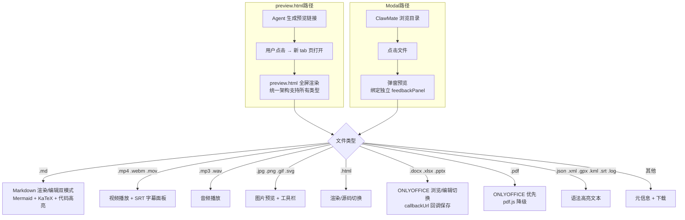

# 子场景 PRD — 文件预览引擎

**优先级**: P0
**依赖**: #2 核心文件管理
**版本**: v1.3

## 1. 场景描述

ClawMate 的预览引擎是核心差异化能力。v1.3 统一为 `preview.html` 单一架构，用户通过预览链接或浏览点击即时查看文件的渲染效果。支持 **preview.html 全屏预览**和 **modal 弹窗**两种形态，均绑定独立 feedbackPanel 支持选中反馈。

**Office 文件支持 ONLYOFFICE 浏览/编辑双模式切换**，编辑模式下通过 callbackUrl 回调自动保存回原文件。

## 2. 用户流程



## 3. 功能需求

### 3.1 Markdown 渲染 + 编辑双模式（v1.3）

| 功能编号 | 功能 | 说明 |
|---------|------|------|
| PE-01 | Mermaid 图表渲染 | v11 UMD build，`mermaid.run()` 官方 API |
| PE-02 | KaTeX 数学公式 | 行内 + 块级公式渲染 |
| PE-03 | 代码语法高亮 | highlight.js，暗色模式下 hljs 颜色与 Modal 统一 |
| PE-04 | 目录自动生成 | 根据标题层级生成 TOC |
| PE-05 | 代码块复制按钮 | 一键复制代码块内容 |
| PE-06 | 外部链接新标签页 | 防止预览页跳转丢失 |
| PE-07 | 暗色/亮色主题 | 跟随 ClawMate 主题设置 |
| PE-08 | Markdown 编辑模式 | 预览/编辑互斥切换，编辑区语法高亮 |
| PE-09 | 大纲模式 | 根据标题层级生成大纲导航 |

### 3.2 文本文件预览

| 功能编号 | 功能 | 说明 |
|---------|------|------|
| PE-10 | JSON 格式化显示 | 语法高亮 + 格式化 |
| PE-11 | XML/GPX/KML | 语法高亮显示 |
| PE-12 | HTML 渲染/源码切换 | 默认渲染 HTML 页面；可切换到源码页语法高亮，暗色与 Modal 统一 |
| PE-13 | Bash/conf/log 等 | 语法高亮显示 |
| PE-14 | 大文件处理 | >1MB 截断显示前 64KB + 提示 |
| PE-15 | SRT 字幕 | 普通文本预览（pre 标签显示原始内容）|

**支持的文本扩展名**（后端 + 前端统一）：

```
.txt .md .markdown .mdx .json .csv .log
.py .js .ts .tsx .jsx .html .css
.yaml .yml .ini .toml .xml .gpx .kml
.conf .env .sh .bat .ps1 .sql .r
.go .java .c .cpp .h .hpp .vue .srt
```

### 3.3 图片预览

| 功能编号 | 功能 | 说明 |
|---------|------|------|
| PE-16 | 图片预览 | jpg/png/gif/svg 全屏渲染 |
| PE-17 | 图片工具栏 | 下载/删除/反馈操作 |

### 3.4 视频/音频预览（v1.3 新增 SRT 面板）

| 功能编号 | 功能 | 说明 |
|---------|------|------|
| PE-18 | 视频播放器 | 支持 .mp4 .webm .mov，内置播放控件 |
| PE-19 | 视频下载 | 播放器旁提供下载按钮 |
| PE-20 | 音频播放器 | 支持 .mp3 .wav，内置播放控件 |
| PE-21 | SRT 字幕面板 | 音视频文件关联同名 .srt 时，显示可滚动字幕面板 |

### 3.5 ONLYOFFICE 集成（v1.3 新增编辑模式）

| 功能编号 | 功能 | 说明 |
|---------|------|------|
| PE-22 | Office 文件浏览 | .docx .xlsx .pptx view-only |
| PE-23 | Office 文件编辑 | 浏览/编辑切换按钮，edit 模式下 `editorConfig.mode: "edit"` |
| PE-24 | 编辑回调保存 | `callbackUrl` → `POST /api/clawmate/onlyoffice/callback`，JWT 校验 + safe_path + 覆盖写入 |
| PE-25 | PDF 预览 | ONLYOFFICE 可用时用其预览；不可用时降级为 pdf.js iframe + 下载链接 |
| PE-26 | JWT 安全 | config 签名 HS256 + 1h TTL |
| PE-27 | 无 ONLYOFFICE 降级 | Office 文件提供下载链接 + 提示 |
| PE-28 | ONLYOFFICE URL 配置化 | config.json 的 `onlyoffice.api_js_url` 指定 API JS 地址 |
| PE-29 | ONLYOFFICE 嵌套预览 | ONLYOFFICE 页面通过 `onlyoffice.html` iframe 嵌入 preview.html |
| PE-30 | `GET /api/clawmate/onlyoffice/script-url` | 前端动态检测 ONLYOFFICE 是否可达 |

### 3.6 preview.html 统一架构（v1.3）

| 功能编号 | 功能 | 说明 |
|---------|------|------|
| PE-31 | 统一页面 | `preview.html?root=xxx&file=xxx.md` 替代旧的 standalone 模式 |
| PE-32 | 类型自动适配 | 根据文件类型自动加载对应渲染器（Markdown/图片/视频/Office/文本）|
| PE-33 | 顶部品牌栏 | ClawMate 品牌 + 文件名 |
| PE-34 | 底部工具栏 | 📋复制 📥导出PDF ⬇下载 🗑删除 ←返回 |
| PE-35 | 选中反馈 | 绑定独立 feedbackPanel，选中 → 备注 → ✅提交 |
| PE-36 | 编辑按钮（Office） | 非 PDF Office 文件显示 ✏️编辑/📖浏览切换 |

### 3.7 Modal 模式

| 功能编号 | 功能 | 说明 |
|---------|------|------|
| PE-37 | 弹窗预览 | 点击文件弹出预览窗口 |
| PE-38 | 最大化/还原 | 预览窗口全屏切换 |
| PE-39 | 选中反馈 | Modal 内绑定独立 feedbackPanel |
| PE-40 | PDF 降级 | pdf.js iframe 嵌入预览 |

## 4. 数据/API 契约

| 方法 | 路径 | 说明 |
|------|------|------|
| GET | `/api/clawmate/preview` | 返回文件预览内容（自动判断类型）|
| GET | `/api/clawmate/raw` | 返回文件原始内容（inline Content-Type）|
| GET | `/api/clawmate/preview-link` | 生成完整 preview.html 预览 URL |
| GET | `/api/clawmate/onlyoffice/script-url` | 返回 ONLYOFFICE API JS URL |
| GET | `/api/clawmate/onlyoffice/config?mode=view\|edit` | ONLYOFFICE 配置（含 JWT + callbackUrl）|
| GET | `/api/clawmate/onlyoffice/file` | ONLYOFFICE 文件获取（需 JWT token）|
| POST | `/api/clawmate/onlyoffice/callback` | ONLYOFFICE 编辑回调保存（需 JWT token）|
| POST | `/api/clawmate/save` | 文本文件原子保存 `{root, path, content}` |

### /preview-link 响应

```json
{
  "url": "https://clawmate.example.com/clawmate/preview.html?root=webprojects&file=clawmate%2Fprd%2FMRD.md",
  "root": "webprojects",
  "file": "clawmate/prd/MRD.md"
}
```

### ONLYOFFICE 编辑回调流程

```
用户点 ✏️编辑 → onlyoffice.html?mode=edit 加载
  → 后端返回 config.editorConfig.mode="edit" + callbackUrl
  → 用户编辑 → ONLYOFFICE 自动保存
  → POST callbackUrl {status:2, url:"http://onlyoffice/..."}
  → 回调端点下载文件 → safe_path 覆盖写入原文件
  → 返回 {error:0}
```

## 5. 前端路由规范

| 路由 | 形态 | 说明 |
|------|------|------|
| `/clawmate/?root=x&dir=y` | Modal | 目录浏览，点击文件弹窗 |
| `/clawmate/preview.html?root=x&file=path/to/file.md` | 全屏 | preview.html 统一渲染 |

## 6. 异常处理

| 异常场景 | 处理方式 |
|---------|---------|
| 文件不存在 | 404 + 提示 |
| Mermaid 渲染失败 | 静默失败，图表区域显示为空 |
| ONLYOFFICE 不可达 | PDF 降级为 pdf.js；Office 文件降级为下载链接 |
| ONLYOFFICE 编辑回调失败 | 返回 `{error:1}` 给 ONLYOFFICE，不损坏原文件 |
| 大文件 (>64KB 文本) | 截断显示前 64KB + 提示 |
| JWT 过期 | 返回 403，用户刷新页面重新获取 |

## 7. 验收标准

| # | 标准 | 度量 |
|---|------|------|
| AC-1 | Markdown 文件含 Mermaid 图表渲染正确 | 测试 ≥5 种图表类型 |
| AC-2 | KaTeX 行内 + 块级公式渲染正确 | 测试 ≥10 个公式 |
| AC-3 | Office 文件可切换编辑模式并保存 | 端到端测试（编辑→保存→重开验证）|
| AC-4 | preview.html 链接正确渲染所有文件类型 | 新 tab 页，内容正确 |
| AC-5 | 无 ONLYOFFICE 时 Office/PDF 有降级方案 | 不报错，显示下载链接 |
| AC-6 | 音视频播放正常，SRT 字幕面板显示 | 测试 .mp4 + .srt |
| AC-7 | Markdown 编辑模式语法高亮正确 | 切换后 hljs 正常 |
| AC-8 | HTML 文件渲染/源码切换正常 | 按钮可用，暗色 hljs 正确 |
