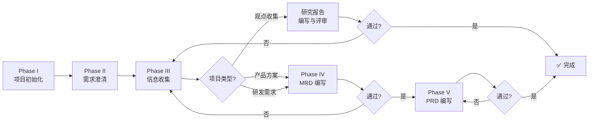

# ClawMate Skill

> ⚠️ **安全说明** — 使用本 Skill 前，请在对话上下文中通过 `memory` 或 `MEMORY.md` 配置 `CLAWMATE_URL`（默认 `http://localhost:5533`）。
> 
> - **不要将 CLAWMATE_URL 指向不受信的主机**。数据传输目标由此 URL 决定，请确保是你信任的服务。
> - **所有操作均在本地目录和 ClawMate 服务之间完成**，不向任何第三方发送数据。
> - `init`/`plan` 会创建目录、写入文件并初始化 Git，执行前会展示路径并等待你确认。
> - 本 Skill 使用 `exec curl` 调用本地 API（`web_fetch` 的 SSRF 保护会拦截 localhost 请求）。

---

## 功能概览

| 命令 | 功能 | 状态 |
|------|------|:----:|
| `clawmate list [root_id]` | 列出指定 root（默认当前 root）下所有项目 | ✅ |
| `clawmate link <filename>` | 搜索文件生成可点击预览链接 | ✅ |
| `clawmate init [root] <project>` | 项目初始化与前期梳理（Phase I-V），默认 root 为 defaultRootId | ✅ |
| `clawmate plan [root] <project>` | 规划/更新分层项目计划（CLAWLIST） | ✅ |
| `clawmate feed [status] [project] [filename] [date]` | 查询 feedback 列表 | ✅ |
| `clawmate do [feedback_id]` | 处理待处理 feedback | ✅ |
| `clawmate project <projectname>` | 切换 agent 上下文到指定项目，读取顶层介绍 | ✅ |

---

## 推荐 Skill 依赖（按工作流阶段）

基于 work agent SOP，各阶段推荐调用的 skill：

| 阶段 | 任务 | 推荐 Skill | 说明 |
|------|------|-----------|------|
| **Phase III** | 深度调研 | `academic-deep-research` | 行业分析、竞品研究 |
| **Phase III** | 快速查证 | `web_search` / `tavily_search` | 事实数据、最新动态 |
| **Phase III** | 技术评估 | `cto-advisor` | 技术可行性、方案对比 |
| **Phase IV** | MRD 编写 | `business-writing` | 商业文档写作 |
| **Phase V** | PRD 编写 | `prd-writer` | 产品需求文档 |
| **Phase V** | 图表绘制 | `mermaid-diagrams` | 流程图/架构图 |
| **研发** | 代码开发 | `github` / `gh-issues` | 代码管理、Issue 跟踪 |
| **研发** | 测试验证 | `healthcheck` | 服务健康检查 |
| **全部** | 任务管理 | `clawlist` | 树形 TODO + 进度跟踪 |
| **全部** | 知识沉淀 | `memory` / `wiki-maintainer` | 经验归档、知识库更新 |

> ⚠️ **可用性说明**：上表中部分 Skill（如 `academic-deep-research`、`cto-advisor`、`business-writing`、`prd-writer`、`healthcheck`、`clawlist`、`wiki-maintainer` 等）为推荐搭配但需单独安装，使用前请先确认已在环境中可用（`openclaw skills list`）。`mermaid-diagrams` 对应内置 `mermaid:*` 系列 Skill。
>
> **调用原则**：每个阶段优先使用对应 skill，不重复造轮子。skill 调用后需将结论写回 PROJECT_NOTE.md。

---

## 1. clawmate link

OpenClaw 编写文件并保存后，使用 `/clawmate link {filename}` 搜索文件并生成 Markdown 可点击预览链接。

**步骤**：
1. 调用 `/api/clawmate/link`（一步完成搜索 + 链接生成）：
   ```bash
   curl -s "{CLAWMATE_URL}/api/clawmate/link?q={关键词}&root={root}&ext={扩展名}" 2>/dev/null
   ```
   如需限定文件类型，传 `ext` 参数（如 `ext=md` 只搜索 Markdown）；模糊匹配时简化搜索词（如去空格、取核心词）重试
2. 从响应中的 `results[].preview_url` 直接获取完整预览链接
3. 输出 Markdown 可点击链接 `[filename](url)`

**正确输出**：
```markdown
[CLAWLIST.md](https://example.com/clawmate/preview.html?root=webprojects&file=clawmate%2FCLAWLIST.md)
```

**错误输出**（禁止）：
```
https://example.com/clawmate/preview.html?root=webprojects&file=clawmate/CLAWLIST.md   ← 裸 URL
~/webprojects/clawmate/CLAWLIST.md                                                       ← 裸路径
```

**多结果处理**：模糊匹配到多个文件时，列出所有匹配项，每项生成独立预览链接。

---

## 2. clawmate init

基于 **skill project** 五阶段框架，在 ClawMate 管理的目录中创建项目并进行前期梳理。

### 项目类型

Phase I 确认三种类型之一，决定后续全流程和目录结构：

| 类型 | 目录 | 流程 | 产出 |
|------|------|------|------|
| **观点收集** | research/ collect/ | I→II→III→研究报告 | 结构化研究报告 |
| **产品方案** | + prd/ | I→II→III→IV(MRD)→V(PRD) | MRD + PRD |
| **研发需求** | + prd/ dev/ test/ | I→II→III→IV(MRD)→V(PRD) | MRD + PRD + 可运行系统 |

### 命令签名

```
clawmate init [root] <project>
```

- `root`: 可选，指定 ClawMate root_id（默认使用 config.json 的 `defaultRootId`）
- `project`: 项目名称

## 3. clawmate plan

规划或更新项目计划（CLAWLIST）。

### 命令签名

```
clawmate plan [root] <project>
```

- `root`: 可选，指定 ClawMate root_id（默认使用 config.json 的 `defaultRootId`）
- `project`: 项目名称

### 功能说明

1. 读取项目根目录的 CLAWLIST.md（如不存在则创建模板）
2. 使用 `curl -s "{CLAWMATE_URL}/api/clawmate/list?root={root}&marker_filter=true"` 列出项目，确认目标项目是否存在
3. 读取 PROJECT_NOTE.md 了解当前阶段
4. 更新 CLAWLIST.md：
   - 检查当前阶段，标记已完成项
   - 按阶段结构（Phase I-V）列出未完成任务
   - 如有 dev/test/research 子目录，生成对应汇总条目
5. 输出更新后的计划摘要

### 目录约定

- **默认路径**：`{root_dir}/{项目名}/`（root_dir 由 root_id 解析）
- **源码目录**：统一使用 `dev/`

### 全流程概览



### Phase I：项目初始化

**步骤 0：确认项目路径 + 询问项目类型**（必须先执行）

```markdown
## 🏗️ 确认项目路径

项目将创建在以下路径：
`{root_dir}/{project}/`

请确认：
1. 目标 root 是否正确（{root} → {root_dir}）
2. 项目名是否正确
3. 路径无误后回复「确认」，否则指定新的路径
```

```markdown
## 🏗️ 请确认项目类型

这个项目属于哪一种？
1. **观点收集** — 纯文档/研究输出，无需 MRD/PRD
2. **产品方案** — 需要 MRD + PRD 的产品规划
3. **研发需求** — 需要开发 + 测试的完整工程
```

**步骤 1：创建目录结构**

确认类型后立即创建：

```bash
# 观点收集
mkdir -p {项目根路径}/{.clawmate,research,collect}

# 产品方案
mkdir -p {项目根路径}/{.clawmate,research,collect,prd}

# 研发需求
mkdir -p {项目根路径}/{.clawmate,research,collect,prd,dev,test}
```

> **`.clawmate/` marker 作用**：ClawMate 服务通过此目录识别 project 边界，实现 session 隔离和 Agent Panel 项目切换。每个 project 必须包含此目录。

**步骤 2：创建核心文档 + 归档机制**

> **关键原则**：所有文档必须有明确的「更新触发器」和「归档边界」，避免过期信息堆积。
> 
> **硬性规则**：每次保存文档到磁盘后，必须生成 ClawMate 可点击预览链接并回复给用户。
> 链接格式：`[文件名]({base_url}/clawmate/preview.html?root={root}&file={relative_path})`
> 使用 `curl -s "{CLAWMATE_URL}/api/clawmate/link?q={关键词}&root={root}"` 一步完成搜索 + 链接生成，从响应的 `results[].preview_url` 获取完整链接。

**活跃文档（始终加载）**：
- **CLAWLIST.md**（项目级 — 总览）— 管理所有非研发、测试的项目进展（Phase I-V），并包含研发级/测试级/研究级 CLAWLIST 的整体进展简要汇总（分组体现）
- **CLAWLIST.md**（研发级 — 明细，可选）— 研发需求项目在 `dev/` 下创建，管理开发任务明细
- **CLAWLIST.md**（研究级 — 明细，可选）— 放在 `research/` 下，管理研究计划与进度（替代独立的 RESEARCH_PLAN.md）
- **CLAWLIST.md**（测试级 — 明细，可选）— 放在 `test/` 下，管理测试任务明细
- **PROJECT_NOTE.md** — 产品决策唯一来源 + 信息架构规则

**归档文档（按需加载，详见「懒加载机制」）**：
- **archive/** — 统一归档目录（项目根目录下），包含已完成/过期的研究、方案、迭代记录、废弃 PRD

> **硬性规则**：所有归档必须放在 `archive/` 根目录下，严禁在子目录中创建 archive/（如 `prd/archive/`、`research/done/` 等）。

**归档触发条件**：
| 场景 | 归档源 | 归档目标 | 示例 |
|------|--------|---------|------|
| 研究主题已实施 | `research/{主题}/` | `archive/research/2026-06-{主题}/` | 技术选型完成后归档 |
| PRD 迭代 | `prd/PRD.md` | `archive/prd-versions/PRD-v1.2-YYYY-MM-DD.md` | PRD v1.3 评审通过后 |
| 决策过期 | `PROJECT_NOTE.md` 旧条目 | `archive/decisions/YYYY-MM-DD-{主题}.md` | 技术方案变更 |
| 迭代结束 | `CLAWLIST.md` 已完成项 | `archive/iterations/sprint-{N}-YYYY-MM-DD.md` | Sprint 复盘完成 |
| 需求取消 | `prd/sub_prd/{场景}.md` | `archive/prd-versions/cancelled/{场景}-v{版本}.md` | 明确取消开发 |

**归档命名规范**：`archive/{类别}/YYYY-MM-{主题}/` 或 `archive/{类别}/YYYY-MM-DD-{简述}.md`，确保可检索。

**CLAWLIST.md 模板（项目级 — 总览）**：
```markdown
# CLAWLIST — {项目名}（项目级 — 总览）

> 本项目级 CLAWLIST 管理所有非研发、测试的项目进展，并汇总各分组的简要状态。
> 明细任务分别在 dev/、test/、research/ 的 CLAWLIST 中管理。

## Phase I 项目初始化
- [x] 确认项目类型
- [x] 创建目录结构
- [x] 初始化 Git

## Phase II 需求澄清
- [ ] 目的确认
- [ ] 服务对象（三类）
- [ ] 输出物清单
- [ ] 评价标准
- [ ] 工作范围

## Phase III 信息收集
- [ ] 识别信息需求
- [ ] 生成研究计划 → [research/CLAWLIST.md](research/CLAWLIST.md)
- [ ] 执行研究
- [ ] 用户确认

## Phase IV MRD 编写（产品方案/研发需求）
- [ ] 市场概述
- [ ] 目标市场
- [ ] 竞品分析
- [ ] 用户需求
- [ ] 商业价值
- [ ] 市场策略
- [ ] 风险与假设
- [ ] 用户评审通过

## Phase V PRD 编写（产品方案/研发需求）
- [ ] 总 PRD
- [ ] 子场景 PRD: {场景1}
- [ ] 用户评审通过

## 研发进展汇总（明细见 dev/CLAWLIST.md）
- [ ] 架构设计 → [dev/CLAWLIST.md](dev/CLAWLIST.md)
- [ ] 核心功能开发
- [ ] 接口联调
- [ ] 单元测试覆盖

## 测试进展汇总（明细见 test/CLAWLIST.md）
- [ ] 集成测试 → [test/CLAWLIST.md](test/CLAWLIST.md)
- [ ] 回归验证
- [ ] 性能测试

## 研究进展汇总（明细见 research/CLAWLIST.md）
- [ ] 技术选型 → [research/CLAWLIST.md](research/CLAWLIST.md)
- [ ] 竞品分析
- [ ] 用户调研
```

**CLAWLIST.md 模板（研发级 — 明细）**：
```markdown
# CLAWLIST — {项目名}（研发级 — 明细）

> 本文件只放研发任务明细。项目总览和跨组协调在项目根目录的 CLAWLIST.md 中管理。

## 架构
- [ ] 技术选型确认
- [ ] 核心架构设计
- [ ] 接口契约定义

## 开发
- [ ] 功能模块 A
- [ ] 功能模块 B
- [ ] 单元测试覆盖

## 联调
- [ ] 接口联调
- [ ] 端到端验证
```

**CLAWLIST.md 模板（研究级 — 明细）**：
```markdown
# CLAWLIST — {项目名}（研究级 — 明细）

> 本文件替代独立的 RESEARCH_PLAN.md，管理所有研究主题和进度。
> 项目总览在项目根目录的 CLAWLIST.md 中管理。

## 进行中
- [ ] 技术选型：数据库方案对比
  - [x] MySQL 调研
  - [x] PostgreSQL 调研
  - [ ] 性能基准测试
- [ ] 竞品分析：xxx 产品
  - [ ] 功能矩阵
  - [ ] 用户体验报告

## 已完成（归档后从本列表移除）
- [x] 市场调研报告 → 已归档到 archive/research/2026-06-市场调研/
```

**CLAWLIST.md 模板（测试级 — 明细）**：
```markdown
# CLAWLIST — {项目名}（测试级 — 明细）

> 本文件只放测试任务明细。项目总览在项目根目录的 CLAWLIST.md 中管理。

## 测试计划
- [ ] 集成测试方案设计
- [ ] 测试用例编写

## 执行中
- [ ] API 接口测试
- [ ] 前端兼容性测试

## 报告
- [ ] 测试报告 v1.0
```

### PROJECT_NOTE.md 价值与使用规范 + 文档同步规则

> **PROJECT_NOTE.md 是产品决策的唯一来源**。所有后续决策必须能在其中找到依据。

#### 使用规范
1. **决策时引用**：做任何决策前先检查 PROJECT_NOTE.md
2. **变更时更新**：方向、假设、服务对象变化时立即更新
3. **评审时对照**：Phase IV/V 评审时检查 MRD/PRD 一致性
4. **交接时必读**：新成员首先阅读

#### 文档同步规则（防止过期）

**触发器 → 同步动作**矩阵：

| 触发事件 | CLAWLIST | PROJECT_NOTE.md | PRD/MRD | 归档 |
|---------|----------|-----------------|---------|------|
| 需求变更 | ✅ 更新 TODO | ✅ 记录决策 | ⚠️ 评估是否需更新 | — |
| 技术选型变更 | ✅ 标记完成 | ✅ 记录决策 + 理由 | — | ✅ 旧方案归档 |
| PRD 评审通过 | ✅ 标记完成 | — | ✅ 定稿 | ✅ 旧版本归档 |
| 功能开发完成 | ✅ 标记完成 | — | ✅ 更新验收状态 | — |
| Bug 修复 | ✅ 添加/关闭 | — | — | — |
| 迭代结束 | ✅ 关闭迭代 | ✅ 记录复盘 | — | ✅ 迭代记录归档 |

> **硬性规则**：任何文档超过 2 周未更新 → 进入「过期审查」，标记在 CLAWLIST 中，确认是否归档或更新。

#### 懒加载机制（信息分层）

**首次加载（必须）**：
```
1. PROJECT_NOTE.md      ← 最新决策（≤ 50 行摘要 + 关键决策表）
2. CLAWLIST.md（项目级） ← 当前阶段未完成任务
```

**按需加载（延迟）**：
```
3. CLAWLIST.md（研发级）  ← 仅当进入开发阶段
4. prd/PRD.md            ← 仅当需要查看详细需求
5. research/             ← 仅当需要背景信息
6. archive/              ← 仅当需要历史决策
```

**加载优先级**：
- 🔴 P0：PROJECT_NOTE.md（关键决策表）
- 🟡 P1：CLAWLIST 当前阶段未完成项
- 🟢 P2：详细 PRD / 研究文档
- ⚪ P3：archive 历史记录

**实现方式**：
- 在 PROJECT_NOTE.md 顶部维护「当前焦点」摘要（≤ 20 行）
- CLAWLIST.md 按阶段分节，仅展开当前阶段
- archive/ 目录独立，默认不加载
- 大文件（> 100KB）拆分为子文件，按需读取

**PROJECT_NOTE.md 模板**：
```markdown
# {项目名} 产品笔记

## 当前焦点（≤ 20 行，每次会话首先阅读）
- **当前阶段**: {Phase X}
- **本周目标**: {一句话}
- **阻塞项**: {如有}
- **关键决策**: {最近 3 条}

## 项目简介
{项目描述}

## 项目方向（只写一次，变更时更新）
- **要解决的核心问题**: {一句话}
- **目标用户/受众**: {谁用这个项目}
- **预期成果**: {最终产出什么}
- **项目类型**: 观点收集 / 产品方案 / 研发需求

## 关键决策（所有决策必须记录）
| 日期 | 决策 | 理由 | 影响 |
|------|------|------|------|
| YYYY-MM-DD | {决策内容} | {为什么} | {影响范围} |

## 开发规范（研发需求项目）
- 代码风格：{规范}
- 测试要求：{覆盖率}
- 文档要求：{必须更新哪些文档}

## 核心架构
{架构图 + 说明}

## 常见问题与修复
| 问题 | 原因 | 修复 | 日期 |
|------|------|------|------|
| {问题} | {原因} | {修复} | {日期} |

## 关键代码模式
{可复用的代码模式 / 设计模式}
```

**步骤 3：初始化 Git**

```bash
cd {项目根路径}
git init
git config user.email "openclaw@openclaw.ai"
git config user.name "OpenClaw"
```

.gitignore 模板：
```
node_modules/ .npm/ .pnpm-store/
__pycache__/ *.py[cod] .venv/ venv/ .env*
*.log logs/
.DS_Store Thumbs.db
.vscode/ .idea/
dist/ build/
```

首次提交：`git add -A && git commit -m "Initial commit: {项目名}"`

### Phase II：需求澄清

五项必问：

1. **目的** — 要达成什么目标？解决什么问题？
2. **服务对象**（三类必覆盖）：
   - 产品用户：最终使用者是谁？使用场景？
   - 项目管理人员：谁负责推进、验收、决策？
   - 领导/汇报对象：需要向谁汇报？汇报形式？
3. **输出物** — 最终交付什么？文档/代码/设计/报告/演示文稿？
4. **评价标准** — 按服务对象分层确认
5. **工作范围** — 是否需要开发？是否需要测试？

**产出**：PROJECT_NOTE.md「需求澄清记录」章节（更新）

### Phase III：信息收集

1. **识别信息需求**：从 Phase II 推导研究主题
2. **生成研究计划**：`research/CLAWLIST.md`
3. **执行研究**：调用 `academic-deep-research` / `web_search` / `cto-advisor`
4. **提示用户补充**
5. **用户确认**「信息充分，可以进入 Phase IV」

### Phase IV：MRD 编写与评审（产品方案/研发需求）

**MRD 内容框架**：

| # | 章节 | 内容 |
|---|------|------|
| 1 | **市场概述** | 市场规模、增长趋势、关键驱动因素 |
| 2 | **目标市场** | 细分市场定义、目标用户画像 |
| 3 | **竞品分析** | 主要竞品、差异化定位、竞争格局图 |
| 4 | **用户需求** | 痛点分析、需求优先级、使用场景 |
| 5 | **商业价值** | 商业模式、收入预期、投资回报 |
| 6 | **市场策略** | 进入策略、定价、推广路径 |
| 7 | **风险与假设** | 关键假设、主要风险、缓解措施 |

**评审检查单**：
- 核心目标一致性（映射回 Phase II 目标）
- 市场数据有出处、可溯源
- 三类服务对象全覆盖
- 竞品分析覆盖主要对手
- 商业逻辑可解释、可验证
- 风险识别 + 缓解措施

### Phase V：PRD 编写与评审（产品方案/研发需求）

**执行步骤**：
1. 确认 PRD 结构（总 PRD + 子场景 PRD）
2. 编写总 PRD → `prd/PRD.md`
3. 逐条编写子场景 PRD → `prd/sub_prd/{场景名}.md`
4. 每个子场景：编写 → 评审 → 修改 → 通过

**PRD 评审检查单**：
- 目标用户与 Phase II 服务对象一致
- 功能完整性覆盖所有输出物
- 流程闭环（核心流程 + 异常路径）
- 验收标准可度量
- Mermaid 图表正确

### 项目目录结构

**观点收集**：
```
{项目名}/
├── .clawmate/               ← marker 目录（session 隔离 & project 识别）
├── CLAWLIST.md
├── PROJECT_NOTE.md          ← 含「需求澄清记录」+「信息架构规则」
├── research/
│   └── CLAWLIST.md            ← 研究计划与进度
└── collect/
```

**产品方案**：
```
{项目名}/
├── .clawmate/               ← marker 目录（session 隔离 & project 识别）
├── CLAWLIST.md
├── PROJECT_NOTE.md          ← 含「需求澄清记录」+「信息架构规则」
├── research/
│   └── CLAWLIST.md            ← 研究计划与进度
├── collect/
└── prd/
    ├── MRD.md
    ├── PRD.md
    └── sub_prd/
```

**研发需求**：
```
{项目名}/
├── .clawmate/               ← marker 目录（session 隔离 & project 识别）
├── CLAWLIST.md              ← 项目级总览：Phase I-V + 研发/测试/研究进展汇总
├── PROJECT_NOTE.md          ← 产品决策唯一来源 + 信息架构规则（顶部「当前焦点」）
├── research/                ← 研究目录
│   ├── CLAWLIST.md          ← 研究计划与进度（替代 RESEARCH_PLAN.md）
│   └── {主题}/
├── collect/                 ← 收集素材
├── prd/
│   ├── MRD.md               ← 当前版本
│   ├── PRD.md               ← 当前版本
│   └── sub_prd/             ← 当前子场景
├── dev/                     ← 源码
│   ├── main.py
│   ├── requirements.txt
│   └── ...
├── test/                    ← 测试（与源码严格分离）
│   ├── CLAWLIST.md          ← 测试级：测试任务明细
│   ├── reports/             ← 测试报告
│   ├── results/             ← 测试结果、日志、截图
│   └── scripts/             ← 测试脚本
├── archive/                 ← 统一归档目录（根目录，严禁子目录建 archive/）
│   ├── research/
│   │   └── 2026-06-技术选型/
│   ├── decisions/
│   │   └── 2026-06-10-数据库选型.md
│   ├── iterations/
│   │   └── sprint-1.md
│   └── prd-versions/
│       └── PRD-v1.2-2026-05-20.md
└── .gitignore
```

#### 测试目录隔离规则（硬性）

> **测试工作结果必须存放在 test/ 目录，严禁与源码混放。**

| 内容 | 正确位置 | 错误位置 |
|------|---------|---------|
| 测试报告 | `test/reports/` | `dev/reports/` ❌ |
| 测试结果/日志 | `test/results/` | `dev/logs/` ❌ |
| 测试脚本 | `test/scripts/` | `dev/scripts/` ❌ |
| 测试截图 | `test/results/screenshots/` | `dev/` ❌ |
| 测试计划/CLAWLIST | `test/CLAWLIST.md` | `dev/CLAWLIST.md` ❌ |

**理由**：
- 源码目录（dev/）只放代码和配置文件
- 测试目录独立便于 CI/CD 打包时排除
- 测试历史归档在 archive/iterations/，不污染源码

**目录结构**：
```
{项目名}/
├── .clawmate/               ← marker 目录
├── CLAWLIST.md              ← 项目级总览
├── PROJECT_NOTE.md          ← 产品决策唯一来源 + 信息架构规则
├── research/                ← 研究目录
│   ├── CLAWLIST.md          ← 研究计划与进度（替代 RESEARCH_PLAN.md）
│   └── {主题}/
├── collect/
├── prd/
│   ├── MRD.md
│   ├── PRD.md
│   └── sub_prd/
├── dev/                     ← 源码
│   ├── main.py
│   └── ...
├── test/                    ← 测试（与源码严格分离）
│   ├── CLAWLIST.md          ← 测试级：测试任务明细
│   ├── reports/             ← 测试报告
│   ├── results/             ← 测试结果、日志
│   └── scripts/             ← 测试脚本
├── archive/                 ← 统一归档目录（根目录）
│   ├── research/
│   ├── decisions/
│   ├── iterations/
│   └── prd-versions/
└── .gitignore
```

### Git 提交规范

| 时机 | 类型 | 格式 |
|------|------|------|
| 新功能 | `feat:` | `feat: 添加xxx功能` |
| Bug 修复 | `fix:` | `fix: 修复xxx问题` |
| 文档 | `docs:` | `docs: 更新xxx文档` |
| 重构 | `refactor:` | `refactor: 重构xxx` |
| 测试 | `test:` | `test: 添加xxx测试` |
| 杂项 | `chore:` | `chore: 更新依赖` |

### 图表规范

所有文档图表使用 **Mermaid 语法**，禁止截图替代。

---

## 4. clawmate feed

查询 feedback 列表，支持过滤。

**参数**：
- `status`: `pending` / `in_progress` / `done` / `failed`（默认全部）
- `project`: 项目名称过滤（可选）
- `filename`: 文件名模糊匹配（可选）
- `date`: `today` 或 `YYYY-MM-DD`（默认 `today`）

**步骤**：
1. 查询 feedback（使用 exec curl）：
   ```bash
   curl -s "{CLAWMATE_URL}/api/clawmate/feedback/list?root={root}&project={project}&status={status}&file={filename}&since={date}" 2>/dev/null
   ```
2. 格式化输出：

```
| ID | 状态 | 文件 | 用户备注 | 更新时间 |
| FD-CM-042 | ⏳ pending | clawmate/README.md | 补充 Docker 截图 | 2026-06-06 20:00 |
```

**状态符号**：⏳ pending / 🔄 in_progress / ✅ done / ❌ failed

---

## 5. clawmate do

处理待处理 feedback（全部或指定 ID）。执行前会列出待处理项，用户确认后再执行。

### 全部处理
```
clawmate do
```

### 指定 ID
```
clawmate do FD-CM-042
```

**处理步骤（全部处理）**：
1. 查询所有 pending feedback：
   ```bash
   curl -s "{CLAWMATE_URL}/api/clawmate/feedback/list?status=pending" 2>/dev/null
   ```
2. 列出待处理项（ID / 文件 / 用户备注）
3. 等待用户确认是否继续处理
4. 用户确认后，对每项调用 `/api/clawmate/task/run` 执行：
   ```bash
   curl -s -X POST "{CLAWMATE_URL}/api/clawmate/task/run" -H 'Content-Type: application/json' -d '{"root":"<root>","file":"<file_path>","selections":[{"task_id":"review_modify","content":"<content>","note":"<user_note>"}]}' 2>/dev/null
   ```
该接口逐条处理：读取 feedback → 执行变更 → 标记 done/failed。

**硬约束**：
- ⚠️ 禁止直接 read .feedback.json，必须通过 API 获取结构化数据
- ⚠️ API 返回的 `item.content` 是选区原文（已解析），`item.note` 是用户备注

---

## 6. clawmate project

将当前 agent 会话上下文切换到指定项目，读取项目概况。**不是创建项目**（创建用 `clawmate init`），也**不管 session 生命周期**（session 由 ClawMate 服务的 `.clawmate/` marker 自动隔离）。

### 命令签名

```
clawmate project <projectname>
```

### 执行步骤

> **前提**：目标项目必须已通过 `clawmate init` 创建，项目根目录下存在 `.clawmate/` marker。

**步骤 1：搜索项目**

遍历 config.json 中所有 root_id，搜索项目名：

```bash
# 先获取 config.json 的 roots 列表
curl -s "{CLAWMATE_URL}/api/clawmate/config" 2>/dev/null | python3 -c "
import json, sys
cfg = json.load(sys.stdin)
for root in cfg['roots']:
    print(f\"{root['id']}|{root['dir']}\")
"
```

对每个 root 列出项目（带 `.clawmate/` marker 的目录）：
```bash
curl -s "{CLAWMATE_URL}/api/clawmate/list?root=<root_id>&marker_filter=true" 2>/dev/null | python3 -c "
import json, sys
data = json.load(sys.stdin)
for e in data.get('entries', []):
    if e.get('is_dir') and not e['name'].startswith('.'):
        print(e['name'])
"
```

若所有 root 的列表中都未找到 `<projectname>`，提示用户项目未找到。

**步骤 2：确定项目位置与 agent**

从列表结果中：
1. 确认 `<projectname>` 在目标 root 的项目列表中
2. 拼接绝对路径：`{root_dir}/{projectname}/`

**步骤 3：切换到项目**

直接在当前会话执行 compact 并读取项目文件：

```
【项目切换】切换到 <projectname> 项目。
工作目录: <project_abs_path>

请先 compact 清理上下文，然后读取 CLAWLIST.md 和 PROJECT_NOTE.md，
了解项目目标和当前状态后汇报概况。
```

**步骤 4：输出结果**

```markdown
✅ clawmate project <projectname>

当前会话已切换到 {projectname} 项目。

[CLAWLIST.md]({base_url}/clawmate/preview.html?root=<root>&file=<projectname>%2FCLAWLIST.md)
[PROJECT_NOTE.md]({base_url}/clawmate/preview.html?root=<root>&file=<projectname>%2FPROJECT_NOTE.md)
```

---

## 7. clawmate list

列出指定 root 下所有项目。默认列出当前 root 的项目，可传 root_id 查其他 root 的项目。

### 命令签名

```
clawmate list [root_id]
```

- 无参数：列出当前 root 下的所有项目
- `clawmate list writer`：列出 writer root 下的所有项目

### 执行步骤

**步骤 1：获取 config 中的 roots 列表**

```bash
curl -s "{CLAWMATE_URL}/api/clawmate/config" 2>/dev/null | python3 -c "
import json, sys
cfg = json.load(sys.stdin)
for root in cfg['roots']:
    print(f\"{root['id']}|{root['dir']}\")
"
```

**步骤 2：筛选目标 root**

根据参数筛选 roots：
- 无参数：使用当前 root
- 有参数：筛选 root_id 匹配的 root

**步骤 3：通过 API 列出带 .clawmate/ marker 的项目**

```bash
curl -s "{CLAWMATE_URL}/api/clawmate/list?root={root_id}&dir=&marker_filter=true" 2>/dev/null | python3 -c "
import json, sys
data = json.load(sys.stdin)
for e in data.get('entries', []):
    if e.get('is_dir') and not e['name'].startswith('.'):
        print(e['name'])
"
```

**步骤 4：输出结果**

按 root 分组输出表格：

```markdown
## {root_id} 的项目

| 项目 | 路径 | CLAWLIST |
|------|------|:--------:|
| project_a | {root_dir}/project_a/ | [📋]({base_url}/clawmate/preview.html?root=root_id&file=project_a%2FCLAWLIST.md) |
```

若某个项目目录下没有 CLAWLIST.md，链接标记为 `—`。

---

## 8. 文件推送规范

每次生成本地文件后，必须推送摘要 + 可点击预览链接给用户。

**模板**：
```markdown
✅ <做了什么>

[文件名]({base_url}/clawmate/preview.html?root=<root>&file=<encoded_path>)

<简短摘要，2-3 句话>
```

**链接生成规则**：
1. 确定文件所在 root
2. 计算文件相对于 root 目录的路径
3. URL 编码路径中的中文和特殊字符
4. 输出 `[文件名]({base_url}/clawmate/preview.html?root=<root>&file=<encoded_path>)`

**正确示例**：
```markdown
✅ 测试报告已生成

[测试报告-v1.3.md](https://example.com/clawmate/preview.html?root=webprojects&file=clawmate%2Ftest%2Ftest-report-v1.3.md)

- 通过率：49/52 (94%)
- 3 个问题均为预期行为
```

---

## 9. 归档机制与懒加载（核心设计原则）

### 9.1 为什么需要归档

> **经验规律**：项目推进 3 个月后，未归档的文档量通常膨胀 3-5 倍，导致模型加载大量过期信息，干扰当前决策。

**归档目标**：
- 保证活跃目录下只有「当前有效」信息
- 历史信息可检索，但不默认加载
- 减少模型上下文中的干扰项

### 9.2 归档触发条件（明确边界）

| 场景 | 归档源 | 归档目标 | 触发条件 |
|------|--------|---------|---------|
| 研究完成 | `research/{主题}/` | `archive/research/YYYY-MM-{主题}/` | 方案已实施或已否决 |
| PRD 迭代 | `prd/PRD.md` | `archive/prd-versions/PRD-v{X.Y}-YYYY-MM-DD.md` | 新版本评审通过 |
| 决策变更 | `PROJECT_NOTE.md` 旧条目 | `archive/decisions/YYYY-MM-DD-{主题}.md` | 决策被新决策覆盖 |
| 迭代结束 | `CLAWLIST.md` 已完成项 | `archive/iterations/sprint-{N}-YYYY-MM-DD.md` | Sprint 复盘完成 |
| 需求取消 | `prd/sub_prd/{场景}.md` | `archive/prd-versions/cancelled/{场景}-v{版本}.md` | 明确取消开发 |

**归档检查点**：
- 超过 2 周未更新的文档 → 标记「待审查」→ 确认归档或更新

### 9.3 懒加载机制（信息分层）

**第一层：会话初始化（必须加载，≤ 30 行）**
```
1. PROJECT_NOTE.md「当前焦点」摘要
2. CLAWLIST.md 当前阶段未完成项
```

**第二层：任务执行时（按需加载）**
```
3. 具体 PRD 子场景（仅涉及当前任务）
4. 相关研究文档（仅涉及当前决策）
5. CLAWLIST.md 研发级任务（仅开发阶段）
```

**第三层：历史回溯（显式请求时加载）**
```
6. archive/ 目录（用户问「为什么当初选 A 不选 B」时）
7. 旧版本 PRD（用户问「这个需求什么时候改的」时）
```

**加载控制原则**：
- 默认不加载 > 100KB 的文件
- 默认不加载 archive/ 目录
- 大文件拆分：PRD > 100KB 时拆为 `PRD-core.md` + `sub_prd/`
- 摘要前置：每个大文件顶部 20 行必须是「快速理解摘要」

### 9.4 归档命名规范

```
archive/
├── research/
│   └── 2026-06-15-数据库选型/          ← 日期-主题
│       ├── report.md
│       └── comparison.xlsx
├── decisions/
│   └── 2026-06-10-从MySQL迁移到PostgreSQL.md   ← 日期-决策简述
├── iterations/
│   └── 2026-Q2-sprint-3.md             ← 季度-sprint编号
└── prd-versions/
    └── PRD-v1.2-2026-05-20.md          ← 文件名-版本-日期
```

> ⚠️ **严禁**在 `prd/`、`research/`、`dev/` 等子目录中创建 `archive/` 或 `done/` 子目录。所有归档统一在根目录 `archive/` 下。

### 9.5 文档同步检查清单

每次开发迭代结束后执行：

```markdown
## 文档同步检查

- [ ] CLAWLIST.md：已完成项已勾选，新增项已添加
- [ ] PROJECT_NOTE.md：如有决策变更，已记录
- [ ] PRD.md：如有功能变更，已同步更新
- [ ] research/：已实施方案已归档到 archive/research/
- [ ] prd/sub_prd/：已取消/已合并场景已归档
- [ ] 过期文档（> 2 周未更新）：已审查并标记状态
```

> **硬性规则**：未通过文档同步检查，不得进入下一阶段。
