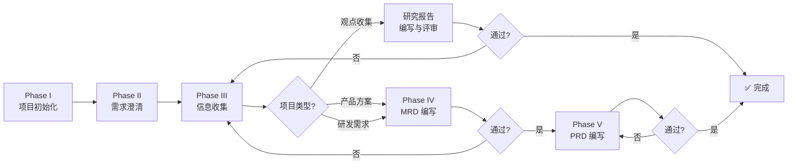

# ClawMate Skill

> ⚠️ {base_url} 需要由你根据 ClawMate 服务端的实际访问地址指定，由服务端 config.json 的 public_base_url 配置决定。
> 内部 API 调用（cron job / agent 处理）使用 http://localhost:5533 绕过 nginx basic auth（此地址不受 {base_url} 影响）。

---

## 功能概览

| 命令 | 功能 | 状态 |
|------|------|:----:|
| `clawmate link <filename>` | 搜索文件生成可点击预览链接 | ✅ |
| `clawmate project [root] <projectname>` | 项目初始化与前期梳理（Phase I-V），默认 root 为 defaultRootId | ✅ |
| `clawmate feed [status] [project] [filename] [date]` | 查询 feedback 列表 | ✅ |
| `clawmate do [feedback_id]` | 处理待处理 feedback | ✅ |

---

## 推荐 Skill 依赖（按工作流阶段）

基于 work agent SOP，各阶段推荐调用的 skill：

| 阶段 | 任务 | 推荐 Skill | 说明 |
|------|------|-----------|------|
| **Phase III** | 深度调研 | `academic-deep-research` | 行业分析、竞品研究 |
| **Phase III** | 快速查证 | `web_search` / `tavily_search` | 事实数据、最新动态 |
| **Phase III** | 技术评估 | `cto-advisor` | 技术可行性、方案对比 |
| **Phase IV** | MRD 编写 | `business-writing` | 商业文档写作 |
| **Phase V** | PRD 编写 | `prd-writer` | 产品需求文档 |
| **Phase V** | 图表绘制 | `mermaid-diagrams` | 流程图/架构图 |
| **研发** | 代码开发 | `github` / `gh-issues` | 代码管理、Issue 跟踪 |
| **研发** | 测试验证 | `healthcheck` | 服务健康检查 |
| **全部** | 任务管理 | `clawlist` | 树形 TODO + 进度跟踪 |
| **全部** | 知识沉淀 | `memory` / `wiki-maintainer` | 经验归档、知识库更新 |

> **调用原则**：每个阶段优先使用对应 skill，不重复造轮子。skill 调用后需将结论写回 PROJECT_NOTE.md。

---

## 1. clawmate link

OpenClaw 编写文件并保存后，使用 `/clawmate link {filename}` 搜索文件并生成 Markdown 可点击预览链接。

**步骤**：
1. `GET {base_url}/api/clawmate/search?q={filename}&root={root}`
2. 匹配到文件后，构造 `{base_url}/clawmate/preview.html?root={root}&file={encoded_path}`
3. 输出 Markdown 可点击链接 `[filename](url)`

**正确输出**：
```markdown
[CLAWLIST.md](https://example.com/clawmate/preview.html?root=webprojects&file=clawmate%2FCLAWLIST.md)
```

**错误输出**（禁止）：
```
https://example.com/clawmate/preview.html?root=webprojects&file=clawmate/CLAWLIST.md   ← 裸 URL
~/webprojects/clawmate/CLAWLIST.md                                                       ← 裸路径
```

**多结果处理**：模糊匹配到多个文件时，列出所有匹配项，每项生成独立预览链接。

---

## 2. clawmate project

基于 **skill project** 五阶段框架，在 ClawMate 管理的目录中创建项目并进行前期梳理。

### 项目类型

Phase I 确认三种类型之一，决定后续全流程和目录结构：

| 类型 | 目录 | 流程 | 产出 |
|------|------|------|------|
| **观点收集** | research/ collect/ | I→II→III→研究报告 | 结构化研究报告 |
| **产品方案** | + prd/ | I→II→III→IV(MRD)→V(PRD) | MRD + PRD |
| **研发需求** | + prd/ dev/ test/ | I→II→III→IV(MRD)→V(PRD) | MRD + PRD + 可运行系统 |

### 命令签名

```
clawmate project [root] <projectname> [--local]
```

- `root`: 可选，指定 ClawMate root_id（默认使用 config.json 的 `defaultRootId`）
- `projectname`: 项目名称
- `--local`: 可选，创建为专有项目（`./projects/{name}/`，不对外访问）

### 目录约定

- **默认路径**：`{root_dir}/{项目名}/`（root_dir 由 root_id 解析）
- **专有路径**：`./projects/{项目名}/`（不对外访问，需显式指定 `--local`）
- **源码目录**：新项目推荐 `src/`（Python 标准），存量项目保持 `dev/`

### 全流程概览



### Phase I：项目初始化

**步骤 0：询问项目类型**（必须先执行）

```markdown
## 🏗️ 请确认项目类型

这个项目属于哪一种？
1. **观点收集** — 纯文档/研究输出，无需 MRD/PRD
2. **产品方案** — 需要 MRD + PRD 的产品规划
3. **研发需求** — 需要开发 + 测试的完整工程
```

**步骤 1：创建目录结构**

确认类型后立即创建：

```bash
# 观点收集
mkdir -p {项目根路径}/{research,collect}

# 产品方案
mkdir -p {项目根路径}/{research,collect,prd}

# 研发需求（新项目推荐 src/，存量保持 dev/）
mkdir -p {项目根路径}/{research,collect,prd,src,test}
# 或 mkdir -p {项目根路径}/{research,collect,prd,dev,test}
```

**步骤 2：创建核心文档**

- **CLAWLIST.md**（项目级）— 管理 Phase I-V 前期梳理进度
- **CLAWLIST.md**（研发级，可选）— 研发需求项目在 `src/` 或 `dev/` 下创建，管理开发任务
- **PROJECT_NOTE.md** — 产品决策唯一来源（见下文「PROJECT_NOTE.md 价值」）

**CLAWLIST.md 模板（项目级）**：
```markdown
# CLAWLIST — {项目名}（项目级）

## Phase I 项目初始化
- [x] 确认项目类型
- [x] 创建目录结构
- [x] 初始化 Git

## Phase II 需求澄清
- [ ] 目的确认
- [ ] 服务对象（三类）
- [ ] 输出物清单
- [ ] 评价标准
- [ ] 工作范围

## Phase III 信息收集
- [ ] 识别信息需求
- [ ] 生成研究计划
- [ ] 执行研究
- [ ] 用户确认

## Phase IV MRD 编写（产品方案/研发需求）
- [ ] 市场概述
- [ ] 目标市场
- [ ] 竞品分析
- [ ] 用户需求
- [ ] 商业价值
- [ ] 市场策略
- [ ] 风险与假设
- [ ] 用户评审通过

## Phase V PRD 编写（产品方案/研发需求）
- [ ] 总 PRD
- [ ] 子场景 PRD: {场景1}
- [ ] 用户评审通过
```

**CLAWLIST.md 模板（研发级，研发需求项目）**：
```markdown
# CLAWLIST — {项目名}（研发级）

## 架构
- [ ] 技术选型确认
- [ ] 核心架构设计
- [ ] 接口契约定义

## 开发
- [ ] 功能模块 A
- [ ] 功能模块 B
- [ ] 单元测试覆盖

## 测试
- [ ] 集成测试
- [ ] 回归验证
- [ ] 性能测试

## 部署
- [ ] 环境配置
- [ ] 上线验证
```

### PROJECT_NOTE.md 价值与使用规范

> **PROJECT_NOTE.md 是产品决策的唯一来源**。所有后续决策（技术选型、功能取舍、优先级调整）必须能在 PROJECT_NOTE.md 中找到依据。

**使用规范**：
1. **决策时引用**：做任何产品/技术决策前，先检查 PROJECT_NOTE.md 中是否有相关记录
2. **变更时更新**：项目方向、关键假设、服务对象发生变化时，立即更新
3. **评审时对照**：Phase IV/V 评审时，检查 MRD/PRD 是否与 PROJECT_NOTE.md 一致
4. **交接时必读**：新成员进入项目时，首先阅读 PROJECT_NOTE.md

**PROJECT_NOTE.md 模板**：
```markdown
# {项目名} 产品笔记

## 项目简介
{项目描述}

## 项目方向（只写一次，变更时更新）
- **要解决的核心问题**: {一句话}
- **目标用户/受众**: {谁用这个项目}
- **预期成果**: {最终产出什么}
- **项目类型**: 观点收集 / 产品方案 / 研发需求

## 关键决策（所有决策必须记录）
| 日期 | 决策 | 理由 | 影响 |
|------|------|------|------|
| YYYY-MM-DD | {决策内容} | {为什么} | {影响范围} |

## 开发规范（研发需求项目）
- 代码风格：{规范}
- 测试要求：{覆盖率}
- 文档要求：{必须更新哪些文档}

## 核心架构
{架构图 + 说明}

## 常见问题与修复
| 问题 | 原因 | 修复 | 日期 |
|------|------|------|------|
| {问题} | {原因} | {修复} | {日期} |

## 关键代码模式
{可复用的代码模式 / 设计模式}
```

**步骤 3：初始化 Git**

```bash
cd {项目根路径}
git init
git config user.email "openclaw@openclaw.ai"
git config user.name "OpenClaw"
```

.gitignore 模板：
```
node_modules/ .npm/ .pnpm-store/
__pycache__/ *.py[cod] .venv/ venv/ .env*
*.log logs/
.DS_Store Thumbs.db
.vscode/ .idea/
dist/ build/
```

首次提交：`git add -A && git commit -m "Initial commit: {项目名}"`

### Phase II：需求澄清

五项必问：

1. **目的** — 要达成什么目标？解决什么问题？
2. **服务对象**（三类必覆盖）：
   - 产品用户：最终使用者是谁？使用场景？
   - 项目管理人员：谁负责推进、验收、决策？
   - 领导/汇报对象：需要向谁汇报？汇报形式？
3. **输出物** — 最终交付什么？文档/代码/设计/报告/演示文稿？
4. **评价标准** — 按服务对象分层确认
5. **工作范围** — 是否需要开发？是否需要测试？

**产出**：`REQUIREMENT_CLARIFICATION.md`

### Phase III：信息收集

1. **识别信息需求**：从 Phase II 推导研究主题
2. **生成研究计划**：`RESEARCH_PLAN.md`
3. **执行研究**：调用 `academic-deep-research` / `web_search` / `cto-advisor`
4. **提示用户补充**
5. **用户确认**「信息充分，可以进入 Phase IV」

### Phase IV：MRD 编写与评审（产品方案/研发需求）

**MRD 内容框架**：

| # | 章节 | 内容 |
|---|------|------|
| 1 | **市场概述** | 市场规模、增长趋势、关键驱动因素 |
| 2 | **目标市场** | 细分市场定义、目标用户画像 |
| 3 | **竞品分析** | 主要竞品、差异化定位、竞争格局图 |
| 4 | **用户需求** | 痛点分析、需求优先级、使用场景 |
| 5 | **商业价值** | 商业模式、收入预期、投资回报 |
| 6 | **市场策略** | 进入策略、定价、推广路径 |
| 7 | **风险与假设** | 关键假设、主要风险、缓解措施 |

**评审检查单**：
- 核心目标一致性（映射回 Phase II 目标）
- 市场数据有出处、可溯源
- 三类服务对象全覆盖
- 竞品分析覆盖主要对手
- 商业逻辑可解释、可验证
- 风险识别 + 缓解措施

### Phase V：PRD 编写与评审（产品方案/研发需求）

**执行步骤**：
1. 确认 PRD 结构（总 PRD + 子场景 PRD）
2. 编写总 PRD → `prd/PRD.md`
3. 逐条编写子场景 PRD → `prd/sub_prd/{场景名}.md`
4. 每个子场景：编写 → 评审 → 修改 → 通过

**PRD 评审检查单**：
- 目标用户与 Phase II 服务对象一致
- 功能完整性覆盖所有输出物
- 流程闭环（核心流程 + 异常路径）
- 验收标准可度量
- Mermaid 图表正确

### 项目目录结构

**观点收集**：
```
{项目名}/
├── CLAWLIST.md
├── PROJECT_NOTE.md
├── REQUIREMENT_CLARIFICATION.md
├── RESEARCH_PLAN.md
├── research/
└── collect/
```

**产品方案**：
```
{项目名}/
├── CLAWLIST.md
├── PROJECT_NOTE.md
├── REQUIREMENT_CLARIFICATION.md
├── RESEARCH_PLAN.md
├── research/
├── collect/
└── prd/
    ├── MRD.md
    ├── PRD.md
    └── sub_prd/
```

**研发需求（新项目推荐 src/）**：
```
{项目名}/
├── CLAWLIST.md              ← 项目级：Phase I-V 进度
├── PROJECT_NOTE.md          ← 产品决策唯一来源
├── REQUIREMENT_CLARIFICATION.md
├── RESEARCH_PLAN.md
├── research/
├── collect/
├── prd/
│   ├── MRD.md
│   ├── PRD.md
│   └── sub_prd/
├── src/                     ← 源码（推荐）或 dev/
│   ├── main.py
│   ├── requirements.txt
│   └── ...
├── test/                    ← 测试
│   └── CLAWLIST.md          ← 研发级：开发任务跟踪
└── .gitignore
```

**研发需求（存量项目保持 dev/）**：
```
{项目名}/
├── CLAWLIST.md              ← 项目级
├── PROJECT_NOTE.md
├── REQUIREMENT_CLARIFICATION.md
├── RESEARCH_PLAN.md
├── research/
├── collect/
├── prd/
│   ├── MRD.md
│   ├── PRD.md
│   └── sub_prd/
├── dev/                     ← 存量保持
│   ├── main.py
│   └── ...
├── test/
└── .gitignore
```

### Git 提交规范

| 时机 | 类型 | 格式 |
|------|------|------|
| 新功能 | `feat:` | `feat: 添加xxx功能` |
| Bug 修复 | `fix:` | `fix: 修复xxx问题` |
| 文档 | `docs:` | `docs: 更新xxx文档` |
| 重构 | `refactor:` | `refactor: 重构xxx` |
| 测试 | `test:` | `test: 添加xxx测试` |
| 杂项 | `chore:` | `chore: 更新依赖` |

### 图表规范

所有文档图表使用 **Mermaid 语法**，禁止截图替代。

---

## 3. clawmate feed

查询 feedback 列表，支持过滤。

**参数**：
- `status`: `pending` / `in_progress` / `done` / `failed`（默认全部）
- `project`: 项目名称过滤（可选）
- `filename`: 文件名模糊匹配（可选）
- `date`: `today` 或 `YYYY-MM-DD`（默认 `today`）

**步骤**：
1. `GET {base_url}/api/clawmate/feedback/list?root={root}&project={project}&status={status}&file={filename}&since={date}`
2. 格式化输出：

```
| ID | 状态 | 文件 | 用户备注 | 更新时间 |
| FD-CM-042 | ⏳ pending | clawmate/README.md | 补充 Docker 截图 | 2026-06-06 20:00 |
```

**状态符号**：⏳ pending / 🔄 in_progress / ✅ done / ❌ failed

---

## 4. clawmate do

处理待处理 feedback（全部或指定 ID）。

### 全部处理
```
clawmate do
```

### 指定 ID
```
clawmate do FD-CM-042
```

**处理步骤**：
使用 `/api/clawmate/feedback/cron-tick` 接口来执行所有未处理的 feedback 操作。
该接口内部依次处理：查询 → 标记 in_progress → 执行变更 → 标记 done/failed。

**硬约束**：
- ⚠️ 禁止直接 read feedback.json，必须通过 API 获取结构化数据
- ⚠️ API 返回的 `item.content` 是选区原文（已解析），`item.note` 是用户备注

---

## 5. 文件推送规范

每次生成本地文件后，必须推送摘要 + 可点击预览链接给用户。

**模板**：
```markdown
✅ <做了什么>

[文件名]({base_url}/clawmate/preview.html?root=<root>&file=<encoded_path>)

<简短摘要，2-3 句话>
```

**链接生成规则**：
1. 确定文件所在 root
2. 计算文件相对于 root 目录的路径
3. URL 编码路径中的中文和特殊字符
4. 输出 `[文件名]({base_url}/clawmate/preview.html?root=<root>&file=<encoded_path>)`

**正确示例**：
```markdown
✅ 测试报告已生成

[测试报告-v1.3.md](https://example.com/clawmate/preview.html?root=webprojects&file=clawmate%2Ftest%2Ftest-report-v1.3.md)

- 通过率：49/52 (94%)
- 3 个问题均为预期行为
```
