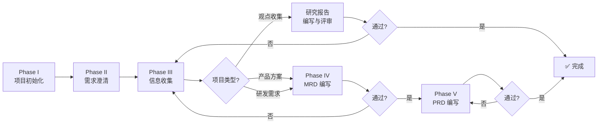

# ClawMate Skill

> ⚠️ **安全说明** — 使用本 Skill 前，请在对话上下文中通过 `memory` 或 `MEMORY.md` 配置 `CLAWMATE_URL`（默认 `http://localhost:5533`）。
> 
> - **不要将 CLAWMATE_URL 指向不受信的主机**。数据传输目标由此 URL 决定，请确保是你信任的服务。
> - **所有操作均在本地目录和 ClawMate 服务之间完成**，不向任何第三方发送数据。
> - `init`/`plan` 会创建目录、写入文件并初始化 Git，执行前会展示路径并等待你确认。
> - 本 Skill 使用 `exec curl` 调用本地 API（`web_fetch` 的 SSRF 保护会拦截 localhost 请求）。

## 参数编码约定（必须遵守）

本 Skill 的示例普遍要把**项目数据与用户 feedback 内容**拼进命令。这些值是任意文本，直接拼接会导致参数截断、shell 注入或请求体损坏。四条硬性约定：

1. **查询参数一律用 `curl -G --data-urlencode`**，不要手工拼 `?a={x}&b={y}`。搜索词、文件名、项目名都可能含 `&`、`#`、空格、中文——手工拼接会截断参数或注入额外参数（`--data-urlencode` 会自动做 percent-encoding）。
2. **JSON 请求体一律用引号 heredoc（`<<'JSON'`）+ `--data-binary @-`**，不要写进 `-d '...'`。`<<'JSON'` 关闭 shell 的全部展开，`$`、反引号、单引号、双引号都不会被解释；`-d '...'` 则会被内容里的单引号提前闭合。
3. **写进 JSON 的值必须按 JSON 规则转义**：`"` → `\"`，`\` → `\\`，换行 → `\n`。用户 feedback 内容是任意文本，不转义会破坏请求体结构。
4. **不要把 `<content>`、`<note>` 这类任意文本放进双引号 shell 字符串**（例如 `--arg content "{content}"`）。双引号内 `"`、`$`、反引号仍会被解释，等于把转义责任推给了调用方。

---

## 功能概览

| 命令 | 功能 | 状态 |
|------|------|:----:|
| `clawmate list [root_id]` | 列出指定 root（默认当前 root）下所有项目 | ✅ |
| `clawmate link <filename>` | 搜索文件生成可点击预览链接 | ✅ |
| `clawmate init [root] <project>` | 项目初始化与前期梳理（Phase I-V），默认 root 为 defaultRootId | ✅ |
| `clawmate plan [root] <project>` | 规划/更新分层项目计划（CLAWLIST） | ✅ |
| `clawmate feed [status] [project] [filename] [date]` | 查询 feedback 列表 | ✅ |
| `clawmate do [feedback_id]` | 处理待处理 feedback | ✅ |
| `clawmate project <projectname>` | 切换 agent 上下文到指定项目，读取顶层介绍 | ✅ |

---

## 1. clawmate link

OpenClaw 编写文件并保存后，使用 `/clawmate link {filename}` 搜索文件并生成 Markdown 可点击预览链接。

**步骤**：
1. 调用 `/api/clawmate/link`（一步完成搜索 + 链接生成）：
   ```bash
   curl -s -G "{CLAWMATE_URL}/api/clawmate/link" \
     --data-urlencode "q={关键词}" \
     --data-urlencode "root={root}" \
     --data-urlencode "ext={扩展名}" 2>/dev/null
   ```
   如需限定文件类型，传 `ext` 参数（如 `ext=md` 只搜索 Markdown）；模糊匹配时简化搜索词（如去空格、取核心词）重试
2. 从响应中的 `results[].preview_url` 直接获取完整预览链接
3. 输出 Markdown 可点击链接 `[filename](url)`

**正确输出**：
```markdown
[CLAWLIST.md](https://example.com/clawmate/preview.html?root=webprojects&file=clawmate%2FCLAWLIST.md)
```

**错误输出**（禁止）：
```
https://example.com/clawmate/preview.html?root=webprojects&file=clawmate/CLAWLIST.md   ← 裸 URL
~/webprojects/clawmate/CLAWLIST.md                                                       ← 裸路径
```

**多结果处理**：模糊匹配到多个文件时，列出所有匹配项，每项生成独立预览链接。

---

## 2. clawmate init

基于 **skill project** 五阶段框架，在 ClawMate 管理的目录中创建项目并进行前期梳理。

### 项目类型

Phase I 确认三种类型之一，决定后续全流程和目录结构：

| 类型 | 目录 | 流程 | 产出 |
|------|------|------|------|
| **观点收集** | docs/research/ | I→II→III→研究报告 | 结构化研究报告 |
| **产品方案** | + docs/prd/ | I→II→III→IV(MRD)→V(PRD) | MRD + PRD |
| **研发需求** | + docs/prd/ src/ tests/ | I→II→III→IV(MRD)→V(PRD) | MRD + PRD + 可运行系统 |

### 命令签名

```
clawmate init [root] <project>
```

- `root`: 可选，指定 ClawMate root_id（默认使用 config.json 的 `defaultRootId`）
- `project`: 项目名称

### Phase I：项目初始化

**步骤 0：确认项目路径 + 询问项目类型**（必须先执行）

```markdown
## 🏗️ 确认项目路径

项目将创建在以下路径：
`{root_dir}/{project}/`

请确认：
1. 目标 root 是否正确（{root} → {root_dir}）
2. 项目名是否正确
3. 路径无误后回复「确认」，否则指定新的路径
```

```markdown
## 🏗️ 请确认项目类型

这个项目属于哪一种？
1. **观点收集** — 纯文档/研究输出，无需 MRD/PRD
2. **产品方案** — 需要 MRD + PRD 的产品规划
3. **研发需求** — 需要开发 + 测试的完整工程
```

**步骤 1：创建项目目录**

确认类型后创建目录树。**先不要创建 `.clawmate/`**——它由下一步的服务创建；
若你提前建好，convert 会判定该目录「已是项目」并返回 409。

```bash
# 观点收集
mkdir -p {项目根路径}/research

# 产品方案
mkdir -p {项目根路径}/{research,prd}

# 研发需求
mkdir -p {项目根路径}/{research,prd,src,tests}
```

**步骤 2：调用 convert，一次完成项目初始化**

`POST /api/clawmate/project/convert` 是项目初始化的**唯一入口**（网页端「转换为项目」
走的也是它），一次完成四件事：

| 产物 | 说明 |
|------|------|
| `.clawmate/` marker | 项目边界；ClawMate 靠它做 session 隔离与 Agent Panel 项目切换 |
| `PROJECT_NOTE.md` / `CLAWLIST.md` / `AGENTS.md` / `.gitignore` | 基础文档，已存在则不覆盖 |
| `git init` + 作者身份 + 首次提交 | 项目自有 git 历史，**无需再手工 `git init`** |
| `project-harness/` 骨架 + `.clawmate/` 运行子目录 | 从 `project.harness_template_dir` 复制，已存在则不覆盖 |

```bash
curl -s -X POST "{CLAWMATE_URL}/api/clawmate/project/convert" \
  -H 'Content-Type: application/json' --data-binary @- 2>/dev/null <<'JSON'
{"root":"{root}","path":"{项目名}"}
JSON
```

**必须读响应中的 `governance` 字段并如实告知用户**——缺少内容时要澄清，不得静默略过：

| 现象 | 含义与动作 |
|------|------------|
| `governance.project_harness: true` | 治理骨架已就位，可继续下一步 |
| `skipped_reason: 未配置模板` | 请项目创建者在 `config.json` 设 `project.harness_template_dir`，或改用手动复制 |
| `skipped_reason: 模板缺失` | 模板路径失效，报告创建者核查 |
| `skipped_reason: 已存在` | 骨架已在，跳过即可 |
| HTTP 409 | 该目录已是项目：**不要重复初始化**；若它尚无 `project-harness/`，走方式 B 补铺 |

> **`.clawmate/` marker 作用**：ClawMate 服务通过此目录识别 project 边界，实现 session 隔离和 Agent Panel 项目切换。每个 project 必须包含此目录。

**方式 B — 手动复制模板（仅当 convert 未铺骨架、或项目已存在需补铺时）**：

```bash
cp -r {harness_template_dir}/. {项目根路径}/
```

**步骤 3：填全 project-harness 四项（必做，否则只是空壳）**

骨架只有占位符，必须在同一轮引导中逐项确认填写：

| 文件 | 填什么 |
|------|--------|
| `project-harness/manifest.yaml` | `project.id` / `name` / `owner` / `classification` / `approval_required` |
| `project-harness/workflow.yaml` | `objective` / `inputs` / `outputs` / `stages`（每阶段 `owner` + `depends_on`） |
| `project-harness/roles.yaml` | 在本项目启用的角色，逐角色填 `paths`（`read`/`write`/`deny_write`）与 `enforcement.gateway_bind` |
| `project-harness/acceptance.yaml` | 本项目验收规则；`evidence_dir: .clawmate/evidence`、`formal_reports_dir: docs/reports` |

> ⚠️ **项目不复制、不修改角色定义**。角色的职责与红线是全局唯一的（见
> `~/projects/multiagent-governance/roles/`）；项目只在 `roles.yaml` 里**引用**
> 角色并声明路径契约。详见 `docs/project-harness-onboarding.md`。
>
> ⚠️ **建项目是项目创建者（人类）的专属行为**，角色不得自行执行 `/clawmate init`
> 或铺治理骨架。

**步骤 4：创建核心文档 + 归档机制**

> **关键原则**：所有文档必须有明确的「更新触发器」和「归档边界」，避免过期信息堆积。
> 
> **硬性规则**：每次保存文档到磁盘后，必须生成 ClawMate 可点击预览链接并回复给用户。
> 链接格式：`[文件名]({base_url}/clawmate/preview.html?root={root}&file={relative_path})`（`root`/`file` 需 percent-encode，如 `clawmate%2FCLAWLIST.md`）
> 使用 `curl -s -G "{CLAWMATE_URL}/api/clawmate/link" --data-urlencode "q={关键词}" --data-urlencode "root={root}"` 一步完成搜索 + 链接生成，从响应的 `results[].preview_url` 获取完整链接（该字段已编码，直接使用）。

**活跃文档（始终加载）**：
- **CLAWLIST.md**（项目级 — 总览）— 管理所有非研发、测试的项目进展（Phase I-V），并包含研发级/测试级/研究级 CLAWLIST 的整体进展简要汇总（分组体现）
- **CLAWLIST.md**（研发级 — 明细，可选）— 研发需求项目在 `src/` 下创建，管理开发任务明细
- **CLAWLIST.md**（研究级 — 明细，可选）— 放在 `docs/research/` 下，管理研究计划与进度（替代独立的 RESEARCH_PLAN.md）
- **CLAWLIST.md**（测试级 — 明细，可选）— 放在 `tests/` 下，管理测试任务明细
- **PROJECT_NOTE.md** — 产品决策唯一来源 + 信息架构规则

**归档文档（按需加载，详见「懒加载机制」）**：
- **archive/** — 统一归档目录（项目根目录下），包含已完成/过期的研究、方案、迭代记录、废弃 PRD

> **硬性规则**：所有归档必须放在 `archive/` 根目录下，严禁在子目录中创建 archive/（如 `docs/prd/archive/`、`docs/research/done/` 等）。

**归档触发条件**：
| 场景 | 归档源 | 归档目标 | 示例 |
|------|--------|---------|------|
| 研究主题已实施 | `docs/research/{主题}/` | `archive/research/2026-06-{主题}/` | 技术选型完成后归档 |
| PRD 迭代 | `docs/prd/PRD.md` | `archive/prd-versions/PRD-v1.2-YYYY-MM-DD.md` | PRD v1.3 评审通过后 |
| 决策过期 | `PROJECT_NOTE.md` 旧条目 | `archive/decisions/YYYY-MM-DD-{主题}.md` | 技术方案变更 |
| 迭代结束 | `CLAWLIST.md` 已完成项 | `archive/iterations/sprint-{N}-YYYY-MM-DD.md` | Sprint 复盘完成 |
| 需求取消 | `docs/prd/sub_prd/{场景}.md` | `archive/prd-versions/cancelled/{场景}-v{版本}.md` | 明确取消开发 |

**归档命名规范**：`archive/{类别}/YYYY-MM-{主题}/` 或 `archive/{类别}/YYYY-MM-DD-{简述}.md`，确保可检索。

**CLAWLIST.md 模板（项目级 — 总览）**：
```markdown
# CLAWLIST — {项目名}（项目级 — 总览）

> 本项目级 CLAWLIST 管理所有非研发、测试的项目进展，并汇总各分组的简要状态。
> 明细任务分别在 src/、tests/、docs/research/ 的 CLAWLIST 中管理。

## Phase I 项目初始化
- [x] 确认项目类型
- [x] 创建目录结构
- [x] 初始化 Git

## Phase II 需求澄清
- [ ] 目的确认
- [ ] 服务对象（三类）
- [ ] 输出物清单
- [ ] 评价标准
- [ ] 工作范围

## Phase III 信息收集
- [ ] 识别信息需求
- [ ] 生成研究计划 → [docs/research/CLAWLIST.md](docs/research/CLAWLIST.md)
- [ ] 执行研究
- [ ] 用户确认

## Phase IV MRD 编写（产品方案/研发需求）
- [ ] 市场概述
- [ ] 目标市场
- [ ] 竞品分析
- [ ] 用户需求
- [ ] 商业价值
- [ ] 市场策略
- [ ] 风险与假设
- [ ] 用户评审通过

## Phase V PRD 编写（产品方案/研发需求）
- [ ] 总 PRD
- [ ] 子场景 PRD: {场景1}
- [ ] 用户评审通过

## 研发进展汇总（明细见 src/CLAWLIST.md）
- [ ] 架构设计 → [src/CLAWLIST.md](src/CLAWLIST.md)
- [ ] 核心功能开发
- [ ] 接口联调
- [ ] 单元测试覆盖

## 测试进展汇总（明细见 tests/CLAWLIST.md）
- [ ] 集成测试 → [tests/CLAWLIST.md](tests/CLAWLIST.md)
- [ ] 回归验证
- [ ] 性能测试

## 研究进展汇总（明细见 docs/research/CLAWLIST.md）
- [ ] 技术选型 → [docs/research/CLAWLIST.md](docs/research/CLAWLIST.md)
- [ ] 竞品分析
- [ ] 用户调研
```

**CLAWLIST.md 模板（研发级 — 明细）**：
```markdown
# CLAWLIST — {项目名}（研发级 — 明细）

> 本文件只放研发任务明细。项目总览和跨组协调在项目根目录的 CLAWLIST.md 中管理。

## 架构
- [ ] 技术选型确认
- [ ] 核心架构设计
- [ ] 接口契约定义

## 开发
- [ ] 功能模块 A
- [ ] 功能模块 B
- [ ] 单元测试覆盖

## 联调
- [ ] 接口联调
- [ ] 端到端验证
```

**CLAWLIST.md 模板（研究级 — 明细）**：
```markdown
# CLAWLIST — {项目名}（研究级 — 明细）

> 本文件替代独立的 RESEARCH_PLAN.md，管理所有研究主题和进度。
> 项目总览在项目根目录的 CLAWLIST.md 中管理。

## 进行中
- [ ] 技术选型：数据库方案对比
  - [x] MySQL 调研
  - [x] PostgreSQL 调研
  - [ ] 性能基准测试
- [ ] 竞品分析：xxx 产品
  - [ ] 功能矩阵
  - [ ] 用户体验报告

## 已完成（归档后从本列表移除）
- [x] 市场调研报告 → 已归档到 archive/research/2026-06-市场调研/
```

**CLAWLIST.md 模板（测试级 — 明细）**：
```markdown
# CLAWLIST — {项目名}（测试级 — 明细）

> 本文件只放测试任务明细。项目总览在项目根目录的 CLAWLIST.md 中管理。

## 测试计划
- [ ] 集成测试方案设计
- [ ] 测试用例编写

## 执行中
- [ ] API 接口测试
- [ ] 前端兼容性测试

## 报告
- [ ] 测试报告 v1.0
```

### PROJECT_NOTE.md 价值与使用规范 + 文档同步规则

> **PROJECT_NOTE.md 是产品决策的唯一来源**。所有后续决策必须能在其中找到依据。

#### 使用规范
1. **决策时引用**：做任何决策前先检查 PROJECT_NOTE.md
2. **变更时更新**：方向、假设、服务对象变化时立即更新
3. **评审时对照**：Phase IV/V 评审时检查 MRD/PRD 一致性
4. **交接时必读**：新成员首先阅读

#### 文档同步规则（防止过期）

**触发器 → 同步动作**矩阵：

| 触发事件 | CLAWLIST | PROJECT_NOTE.md | PRD/MRD | 归档 |
|---------|----------|-----------------|---------|------|
| 需求变更 | ✅ 更新 TODO | ✅ 记录决策 | ⚠️ 评估是否需更新 | — |
| 技术选型变更 | ✅ 标记完成 | ✅ 记录决策 + 理由 | — | ✅ 旧方案归档 |
| PRD 评审通过 | ✅ 标记完成 | — | ✅ 定稿 | ✅ 旧版本归档 |
| 功能开发完成 | ✅ 标记完成 | — | ✅ 更新验收状态 | — |
| Bug 修复 | ✅ 添加/关闭 | — | — | — |
| 迭代结束 | ✅ 关闭迭代 | ✅ 记录复盘 | — | ✅ 迭代记录归档 |

> **硬性规则**：任何文档超过 2 周未更新 → 进入「过期审查」，标记在 CLAWLIST 中，确认是否归档或更新。

#### 懒加载机制（信息分层）

**首次加载（必须）**：
```
1. PROJECT_NOTE.md      ← 最新决策（≤ 50 行摘要 + 关键决策表）
2. CLAWLIST.md（项目级） ← 当前阶段未完成任务
```

**按需加载（延迟）**：
```
3. CLAWLIST.md（研发级）  ← 仅当进入开发阶段
4. docs/prd/PRD.md            ← 仅当需要查看详细需求
5. docs/research/             ← 仅当需要背景信息
6. archive/              ← 仅当需要历史决策
```

**加载优先级**：
- 🔴 P0：PROJECT_NOTE.md（关键决策表）
- 🟡 P1：CLAWLIST 当前阶段未完成项
- 🟢 P2：详细 PRD / 研究文档
- ⚪ P3：archive 历史记录

**实现方式**：
- 在 PROJECT_NOTE.md 顶部维护「当前焦点」摘要（≤ 20 行）
- CLAWLIST.md 按阶段分节，仅展开当前阶段
- archive/ 目录独立，默认不加载
- 大文件（> 100KB）拆分为子文件，按需读取

**PROJECT_NOTE.md 模板**：
```markdown
# {项目名} 产品笔记

## 当前焦点（≤ 20 行，每次会话首先阅读）
- **当前阶段**: {Phase X}
- **本周目标**: {一句话}
- **阻塞项**: {如有}
- **关键决策**: {最近 3 条}

## 项目简介
{项目描述}

## 项目方向（只写一次，变更时更新）
- **要解决的核心问题**: {一句话}
- **目标用户/受众**: {谁用这个项目}
- **预期成果**: {最终产出什么}
- **项目类型**: 观点收集 / 产品方案 / 研发需求

## 关键决策（所有决策必须记录）
| 日期 | 决策 | 理由 | 影响 |
|------|------|------|------|
| YYYY-MM-DD | {决策内容} | {为什么} | {影响范围} |

> 技术细节（代码风格、测试要求、架构说明、常见问题、代码模式）不放这里——
> 归 `AGENTS.md` 与 `docs/`。本文件只保留**决策**与**当前焦点**，避免与文档重复。
```

**步骤 5：初始化 Git（通常无需手工执行）**

`convert` 已在步骤 2 完成 `git init`、作者身份与首次提交，因此**正常流程到此结束**，
不要再重复 `git init`。仅当你是对**已存在**的项目补做（当时 convert 返回 409）时，
才需要手工执行：

```bash
cd {项目根路径}
git init   # 已有 .git 时跳过
git config user.email "updatedb@qq.com"
git config user.name "OpenClaw"
git add -A && git commit -m "Initial commit: {项目名}"
```

.gitignore 模板（`convert` 未创建时才需手写）：
```
node_modules/ .npm/ .pnpm-store/
__pycache__/ *.py[cod] .venv/ venv/ .env*
*.log logs/
.DS_Store Thumbs.db
.vscode/ .idea/
dist/ build/
```

### 项目目录结构

**唯一权威结构**：

```
{项目名}/
├── .clawmate/               ← marker 目录（session 隔离 & project 识别）
│   ├── state/               ← 运行状态      （治理契约锚点，convert 自动建）
│   ├── tasks/               ← 任务实例快照   （治理契约锚点，convert 自动建）
│   ├── evidence/            ← 验收证据       （治理契约锚点，convert 自动建）
│   └── audit/               ← 审计日志       （仅项目创建者可写）
├── project-harness/         ← 治理契约（manifest / workflow / roles / acceptance）
├── docs/                    ← 正式项目文档（convert 铺骨架，_TEMPLATE_INCLUDE）
│   ├── prd/                 ← 产品方案 / 研发需求
│   │   ├── MRD.md
│   │   ├── PRD.md
│   │   └── sub_prd/
│   ├── research/            ← 研究目录（研究计划/进度 + 收集的素材与来源材料）
│   │   ├── CLAWLIST.md      ← 研究计划与进度
│   │   └── {主题}/          ← 按主题组织的材料与结论
│   └── reports/             ← 正式报告
├── CLAWLIST.md              ← 项目级总览：Phase I-V + 研发/测试/研究进展汇总
├── PROJECT_NOTE.md          ← 项目决策唯一来源（顶部「当前焦点」）
├── AGENTS.md                ← agent 操作规范
├── src/                     ← 源码
├── tests/                   ← 测试（与源码严格分离）
│   ├── CLAWLIST.md          ← 测试级：测试任务明细
│   ├── reports/             ← 测试报告
│   ├── results/             ← 测试结果、日志、截图
│   └── scripts/             ← 测试脚本
├── archive/                 ← 统一归档目录（根目录，严禁子目录建 archive/）
│   ├── research/
│   ├── decisions/
│   ├── iterations/
│   └── prd-versions/
└── .gitignore
```

**按项目类型启用**：

| 项目类型 | 启用目录 | 交付物 |
|---|---|---|
| 观点收集 | `docs/research/` | 结构化研究报告 |
| 产品方案 | + `docs/prd/` | MRD + PRD |
| 研发需求 | + `docs/prd/ src/ tests/` | MRD + PRD + 可运行系统 |

> **只建本项目用得到的目录，不预建空目录。** `.clawmate/` 的 state/tasks/evidence/audit
> 由 `convert` 建好；`sessions/`、`cache/` 等由服务按需懒创建。
> 正式报告写入 `docs/reports/`（**不是** `.clawmate/reports/`）；运行证据写入
> `.clawmate/evidence/`，二者不混用。

#### 测试目录隔离规则（硬性）

> **测试工作结果必须存放在 tests/ 目录，严禁与源码混放。**

| 内容 | 正确位置 | 错误位置 |
|------|---------|---------|
| 测试报告 | `tests/reports/` | `src/reports/` ❌ |
| 测试结果/日志 | `tests/results/` | `src/logs/` ❌ |
| 测试脚本 | `tests/scripts/` | `src/scripts/` ❌ |
| 测试截图 | `tests/results/screenshots/` | `src/` ❌ |
| 测试计划/CLAWLIST | `tests/CLAWLIST.md` | `src/CLAWLIST.md` ❌ |

**理由**：
- 源码目录（src/）只放代码和配置文件
- 测试目录独立便于 CI/CD 打包时排除
- 测试历史归档在 archive/iterations/，不污染源码

## 3. clawmate plan

规划或更新项目计划（CLAWLIST）。

### 命令签名

```
clawmate plan [root] <project>
```

- `root`: 可选，指定 ClawMate root_id（默认使用 config.json 的 `defaultRootId`）
- `project`: 项目名称

### 功能说明

1. 读取项目根目录的 CLAWLIST.md（如不存在则创建模板）
2. 使用 `curl -s -G "{CLAWMATE_URL}/api/clawmate/list" --data-urlencode "root={root}" --data-urlencode "marker_filter=true"` 列出项目，确认目标项目是否存在
3. 读取 PROJECT_NOTE.md 了解当前阶段
4. 更新 CLAWLIST.md：
   - 检查当前阶段，标记已完成项
   - 按阶段结构（Phase I-V）列出未完成任务
   - 如有 src/tests/research 子目录，生成对应汇总条目
5. 输出更新后的计划摘要

### 目录约定

- **默认路径**：`{root_dir}/{项目名}/`（root_dir 由 root_id 解析）
- **源码目录**：统一使用 `src/`（测试目录为 `tests/`，与源码严格分离）

### 全流程概览


```mermaid
flowchart LR
    A[Phase I<br>项目初始化] --> B[Phase II<br>需求澄清]
    B --> C[Phase III<br>信息收集]
    C --> D{项目类型?}
    D -->|观点收集| E[研究报告<br>编写与评审]
    D -->|产品方案| F[Phase IV<br>MRD 编写]
    D -->|研发需求| F
    E --> G{通过?}
    G -->|否| C
    G -->|是| H[✅ 完成]
    F --> I{通过?}
    I -->|否| C
    I -->|是| J[Phase V<br>PRD 编写]
    J --> K{通过?}
    K -->|否| J
    K -->|是| H
```


> **台账边界**：`CLAWLIST.md` 是**持久阶段台账**（Phase I–V、门禁、交付追踪），随项目纳入版本管理。
> **运行态任务**（进行中/待办/子任务、谁在执行）以 OpenClaw Tasks / TaskFlow 为准，不在本文件重复登记。
> 两处若冲突：阶段与门禁以 `CLAWLIST.md` 为准，任务运行态以 TaskFlow 为准。

### 阶段推进（II–V）

`plan` 只负责**阶段推进与台账维护**：确认当前阶段、更新 `CLAWLIST.md`，并在阶段门禁通过后
推进 `PROJECT_NOTE.md` 的「当前阶段」。各阶段的方法学由对应 skill 提供，本 skill 不复制其内容。

| 阶段 | 本 skill 负责的产物路径 | 方法学来源 |
|---|---|---|
| II 需求澄清 | `PROJECT_NOTE.md`「需求澄清记录」 | `discovery-process` |
| III 信息收集 | `docs/research/CLAWLIST.md`、`docs/research/{主题}/` | `deep-research` / `web_search` |
| IV MRD | `docs/prd/MRD.md` | `competitive-analysis-process` / `product-strategy-session` |
| V PRD | `docs/prd/PRD.md`、`docs/prd/sub_prd/{场景}.md` | `prd-development` / `user-story` |

**阶段门禁**：评审检查单由方法学 skill 提供。本 skill 只要求两件事——产物已落盘到上表路径，
且用户已确认——之后才在 `PROJECT_NOTE.md` 推进「当前阶段」并同步 `CLAWLIST.md`。

> **观点收集型项目**在 Phase III 结束即交付，没有 IV/V。

## 4. clawmate feed

查询 feedback 列表，支持过滤。

**参数**：
- `status`: `pending` / `in_progress` / `done` / `failed`（默认全部）
- `project`: 项目名称过滤（可选）
- `filename`: 文件名模糊匹配（可选）
- `date`: `today` 或 `YYYY-MM-DD`（默认 `today`）

**步骤**：
1. 查询 feedback（使用 exec curl）：
   ```bash
   curl -s -G "{CLAWMATE_URL}/api/clawmate/feedback/list" \
     --data-urlencode "root={root}" \
     --data-urlencode "project={project}" \
     --data-urlencode "status={status}" \
     --data-urlencode "file={filename}" \
     --data-urlencode "since={date}" 2>/dev/null
   ```
2. 格式化输出：

```
| ID | 状态 | 文件 | 用户备注 | 更新时间 |
| FD-CM-042 | ⏳ pending | clawmate/README.md | 补充 Docker 截图 | 2026-06-06 20:00 |
```

**状态符号**：⏳ pending / 🔄 in_progress / ✅ done / ❌ failed

---

## 5. clawmate do

处理待处理 feedback（全部或指定 ID）。执行前会列出待处理项，用户确认后再执行。

### 全部处理
```
clawmate do
```

### 指定 ID
```
clawmate do FD-CM-042
```

**处理步骤（全部处理）**：
1. 查询所有 pending feedback：
   ```bash
   curl -s -G "{CLAWMATE_URL}/api/clawmate/feedback/list" --data-urlencode "status=pending" 2>/dev/null
   ```
2. 列出待处理项（ID / 文件 / 用户备注）
3. 等待用户确认是否继续处理
4. 用户确认后，对每项调用 `/api/clawmate/task/run` 执行：
   ```bash
   # content / note 是用户任意文本：必须按 JSON 规则转义（" → \"，\ → \\，换行 → \n）
   # <<'JSON' 关闭 shell 全部展开，避免文本中的引号 / $ / 反引号被解释
   curl -s -X POST "{CLAWMATE_URL}/api/clawmate/task/run" \
     -H 'Content-Type: application/json' --data-binary @- 2>/dev/null <<'JSON'
{"root":"<root>","file":"<file_path>","selections":[{"task_id":"review_modify","content":"<content>","note":"<user_note>"}]}
JSON
   ```
该接口逐条处理：读取 feedback → 执行变更 → 标记 done/failed。

**硬约束**：
- ⚠️ 禁止直接 read .feedback.json，必须通过 API 获取结构化数据
- ⚠️ API 返回的 `item.content` 是选区原文（已解析），`item.note` 是用户备注

---

## 6. clawmate project

将当前 agent 会话上下文切换到指定项目，读取项目概况。**不是创建项目**（创建用 `clawmate init`），也**不管 session 生命周期**（session 由 ClawMate 服务的 `.clawmate/` marker 自动隔离）。

### 命令签名

```
clawmate project <projectname>
```

### 执行步骤

> **前提**：目标项目必须已通过 `clawmate init` 创建，项目根目录下存在 `.clawmate/` marker。

**步骤 1：搜索项目**

遍历 config.json 中所有 root_id，搜索项目名：

```bash
# 先获取 config.json 的 roots 列表
curl -s "{CLAWMATE_URL}/api/clawmate/config" 2>/dev/null | python3 -c "
import json, sys
cfg = json.load(sys.stdin)
for root in cfg['roots']:
    print(f\"{root['id']}|{root['dir']}\")
"
```

对每个 root 列出项目（带 `.clawmate/` marker 的目录）：
```bash
curl -s -G "{CLAWMATE_URL}/api/clawmate/list" --data-urlencode "root=<root_id>" --data-urlencode "marker_filter=true" 2>/dev/null | python3 -c "
import json, sys
data = json.load(sys.stdin)
for e in data.get('entries', []):
    if e.get('is_dir') and not e['name'].startswith('.'):
        print(e['name'])
"
```

若所有 root 的列表中都未找到 `<projectname>`，提示用户项目未找到。

**步骤 2：确定项目位置与 agent**

从列表结果中：
1. 确认 `<projectname>` 在目标 root 的项目列表中
2. 拼接绝对路径：`{root_dir}/{projectname}/`

**步骤 3：切换到项目**

直接在当前会话执行 compact 并读取项目文件：

```
【项目切换】切换到 <projectname> 项目。
工作目录: <project_abs_path>

请先 compact 清理上下文，然后读取 CLAWLIST.md 和 PROJECT_NOTE.md，
了解项目目标和当前状态后汇报概况。
```

**步骤 4：输出结果**

```markdown
✅ clawmate project <projectname>

当前会话已切换到 {projectname} 项目。

[CLAWLIST.md]({base_url}/clawmate/preview.html?root=<root>&file=<projectname>%2FCLAWLIST.md)
[PROJECT_NOTE.md]({base_url}/clawmate/preview.html?root=<root>&file=<projectname>%2FPROJECT_NOTE.md)
```

---

## 7. clawmate list

列出指定 root 下所有项目。默认列出当前 root 的项目，可传 root_id 查其他 root 的项目。

### 命令签名

```
clawmate list [root_id]
```

- 无参数：列出当前 root 下的所有项目
- `clawmate list writer`：列出 writer root 下的所有项目

### 执行步骤

**步骤 1：获取 config 中的 roots 列表**

```bash
curl -s "{CLAWMATE_URL}/api/clawmate/config" 2>/dev/null | python3 -c "
import json, sys
cfg = json.load(sys.stdin)
for root in cfg['roots']:
    print(f\"{root['id']}|{root['dir']}\")
"
```

**步骤 2：筛选目标 root**

根据参数筛选 roots：
- 无参数：使用当前 root
- 有参数：筛选 root_id 匹配的 root

**步骤 3：通过 API 列出带 .clawmate/ marker 的项目**

```bash
curl -s -G "{CLAWMATE_URL}/api/clawmate/list" --data-urlencode "root={root_id}" --data-urlencode "dir=" --data-urlencode "marker_filter=true" 2>/dev/null | python3 -c "
import json, sys
data = json.load(sys.stdin)
for e in data.get('entries', []):
    if e.get('is_dir') and not e['name'].startswith('.'):
        print(e['name'])
"
```

**步骤 4：输出结果**

按 root 分组输出表格：

```markdown
## {root_id} 的项目

| 项目 | 路径 | CLAWLIST |
|------|------|:--------:|
| project_a | {root_dir}/project_a/ | [📋]({base_url}/clawmate/preview.html?root=root_id&file=project_a%2FCLAWLIST.md) |
```

若某个项目目录下没有 CLAWLIST.md，链接标记为 `—`。

---

## 8. 文件推送规范

每次生成本地文件后，必须推送摘要 + 可点击预览链接给用户。

**模板**：
```markdown
✅ <做了什么>

[文件名]({base_url}/clawmate/preview.html?root=<root>&file=<encoded_path>)

<简短摘要，2-3 句话>
```

**链接生成规则**：
1. 确定文件所在 root
2. 计算文件相对于 root 目录的路径
3. URL 编码路径中的中文和特殊字符
4. 输出 `[文件名]({base_url}/clawmate/preview.html?root=<root>&file=<encoded_path>)`

**正确示例**：
```markdown
✅ 测试报告已生成

[测试报告-v1.3.md](https://example.com/clawmate/preview.html?root=webprojects&file=clawmate%2Ftest%2Ftest-report-v1.3.md)

- 通过率：49/52 (94%)
- 3 个问题均为预期行为
```

---

## 9. 归档机制与懒加载（核心设计原则）

### 9.1 为什么需要归档

> **经验规律**：项目推进 3 个月后，未归档的文档量通常膨胀 3-5 倍，导致模型加载大量过期信息，干扰当前决策。

**归档目标**：
- 保证活跃目录下只有「当前有效」信息
- 历史信息可检索，但不默认加载
- 减少模型上下文中的干扰项

### 9.2 归档触发条件（明确边界）

| 场景 | 归档源 | 归档目标 | 触发条件 |
|------|--------|---------|---------|
| 研究完成 | `docs/research/{主题}/` | `archive/research/YYYY-MM-{主题}/` | 方案已实施或已否决 |
| PRD 迭代 | `docs/prd/PRD.md` | `archive/prd-versions/PRD-v{X.Y}-YYYY-MM-DD.md` | 新版本评审通过 |
| 决策变更 | `PROJECT_NOTE.md` 旧条目 | `archive/decisions/YYYY-MM-DD-{主题}.md` | 决策被新决策覆盖 |
| 迭代结束 | `CLAWLIST.md` 已完成项 | `archive/iterations/sprint-{N}-YYYY-MM-DD.md` | Sprint 复盘完成 |
| 需求取消 | `docs/prd/sub_prd/{场景}.md` | `archive/prd-versions/cancelled/{场景}-v{版本}.md` | 明确取消开发 |

**归档检查点**：
- 超过 2 周未更新的文档 → 标记「待审查」→ 确认归档或更新

### 9.3 懒加载机制（信息分层）

**第一层：会话初始化（必须加载，≤ 30 行）**
```
1. PROJECT_NOTE.md「当前焦点」摘要
2. CLAWLIST.md 当前阶段未完成项
```

**第二层：任务执行时（按需加载）**
```
3. 具体 PRD 子场景（仅涉及当前任务）
4. 相关研究文档（仅涉及当前决策）
5. CLAWLIST.md 研发级任务（仅开发阶段）
```

**第三层：历史回溯（显式请求时加载）**
```
6. archive/ 目录（用户问「为什么当初选 A 不选 B」时）
7. 旧版本 PRD（用户问「这个需求什么时候改的」时）
```

**加载控制原则**：
- 默认不加载 > 100KB 的文件
- 默认不加载 archive/ 目录
- 大文件拆分：PRD > 100KB 时拆为 `PRD-core.md` + `docs/prd/sub_prd/`
- 摘要前置：每个大文件顶部 20 行必须是「快速理解摘要」

### 9.4 归档命名规范

```
archive/
├── docs/research/
│   └── 2026-06-15-数据库选型/          ← 日期-主题
│       ├── report.md
│       └── comparison.xlsx
├── decisions/
│   └── 2026-06-10-从MySQL迁移到PostgreSQL.md   ← 日期-决策简述
├── iterations/
│   └── 2026-Q2-sprint-3.md             ← 季度-sprint编号
└── prd-versions/
    └── PRD-v1.2-2026-05-20.md          ← 文件名-版本-日期
```

> ⚠️ **严禁**在 `docs/prd/`、`docs/research/`、`src/` 等子目录中创建 `archive/` 或 `done/` 子目录。所有归档统一在根目录 `archive/` 下。

### 9.5 文档同步检查清单

每次开发迭代结束后执行：

```markdown
## 文档同步检查

- [ ] CLAWLIST.md：已完成项已勾选，新增项已添加
- [ ] PROJECT_NOTE.md：如有决策变更，已记录
- [ ] PRD.md：如有功能变更，已同步更新
- [ ] docs/research/：已实施方案已归档到 archive/research/
- [ ] docs/prd/sub_prd/：已取消/已合并场景已归档
- [ ] 过期文档（> 2 周未更新）：已审查并标记状态
```

> **硬性规则**：未通过文档同步检查，不得进入下一阶段。
